# Trilha de Estudo — LLM, IA e Engenharia de Sistemas Inteligentes

> Conteúdo acadêmico com prática de código, focado em ferramentas e conteúdo open-source. Usa Python e/ou TypeScript quando faz sentido. Este é o mapa da versão **Acelerado** — o guia prático da trilha, um arquivo por módulo.

Esta trilha existe em 3 versões: **v1** (conteúdo original, formato checklist), **v2** (mais teórica, Clássico) e **v3** (mais prática, Acelerado — esta que você está lendo agora). Troque entre elas pelo seletor de versão no topo do site; a seção "Versões desta trilha", mais abaixo, explica cada uma em detalhe.

---

## Como esta versão funciona

Aqui você não começa pela matemática — começa implementando um LLM do zero no módulo 08, e só desce aos fundamentos (Transformers, NLP clássico, Deep Learning, ML moderno, ML clássico, programação, matemática) depois de já ter construído, com as próprias mãos, praticamente tudo que existe entre um transformer decoder-only e um sistema de IA em produção completo. A teoria não desaparece — cada módulo mantém a mesma profundidade conceitual da versão Clássico desta trilha — mas a ordem se inverte, e a seção "Projetos práticos" de cada módulo deixa de ser uma lista de bullets e vira implementação completa, com pré-requisitos explícitos e código que você realmente roda.

**A regra que torna isso possível**: nenhum módulo pode cobrar, num projeto prático, uma habilidade que um módulo anterior *nesta ordem* não tenha ensinado. Quando um projeto precisa de algo que só a versão Clássico cobre a fundo mais tarde (por exemplo, o Projeto 8.4 precisa que você saiba plotar um gráfico e rodar um loop de treino, antes do módulo formal de Deep Learning), o texto ensina isso ali mesmo, de forma direta — e aponta para onde aprofundar depois, não como pré-requisito disfarçado.

---

## Mapa dos módulos, na ordem real desta versão

```mermaid
flowchart TD
    IDX["00 · Índice"] --> M08

    subgraph TRONCO["Tronco LLM, especializações e síntese (constrói primeiro)"]
        direction LR
        M08["08<br/>Arquiteturas de LLMs"] --> M09["09<br/>Treinamento e Alinhamento"]
        M09 --> M10["10<br/>Eficiência e Inferência Local"] --> M11["11<br/>Prompt Engineering"]
        M11 --> M12["12<br/>RAG"] --> M13["13<br/>Agentes, Tools e Protocolos"]
        M13 --> M14["14<br/>Avaliação e Segurança"] --> M15["15<br/>Engenharia de Produção"]
        M15 --> M16["16<br/>Visão Computacional"] --> M17["17<br/>Aprendizado por Reforço"]
        M17 --> M18["18<br/>Multimodal"] --> M19["19<br/>Tópicos Avançados"]
        M19 --> M20["20<br/>Projetos Integradores"]
    end

    M20 --> M07

    subgraph FUNDAMENTOS["Fundamentos, do mais próximo ao mais básico (formaliza depois)"]
        direction LR
        M07["07<br/>Transformers"] --> M06["06<br/>NLP Clássico"]
        M06 --> M05["05<br/>Deep Learning"] --> M04["04<br/>ML Moderno"]
        M04 --> M03["03<br/>ML Clássico"] --> M02["02<br/>Programação e Ferramentas"]
        M02 --> M01["01<br/>Matemática"]
    end

    click M08 "08_llms_arquiteturas" "Módulo 08"
    click M09 "09_treinamento_e_alinhamento" "Módulo 09"
    click M10 "10_eficiencia_e_inferencia_local" "Módulo 10"
    click M11 "11_prompt_engineering" "Módulo 11"
    click M12 "12_rag" "Módulo 12"
    click M13 "13_agentes_tools_protocolos" "Módulo 13"
    click M14 "14_avaliacao_e_seguranca" "Módulo 14"
    click M15 "15_engenharia_producao" "Módulo 15"
    click M16 "16_visao_computacional" "Módulo 16"
    click M17 "17_aprendizado_reforco" "Módulo 17"
    click M18 "18_multimodal" "Módulo 18"
    click M19 "19_topicos_avancados" "Módulo 19"
    click M20 "20_projetos_integradores" "Módulo 20"
    click M07 "07_transformers" "Módulo 07"
    click M06 "06_nlp_classico" "Módulo 06"
    click M05 "05_deep_learning" "Módulo 05"
    click M04 "04_ml_moderno" "Módulo 04"
    click M03 "03_ml_classico" "Módulo 03"
    click M02 "02_programacao_ferramentas" "Módulo 02"
    click M01 "01_matematica" "Módulo 01"
```

### O que você constrói em cada módulo

1. **[08 — Arquiteturas de LLMs](08_llms_arquiteturas.md)**: implementa um Transformer decoder-only do zero (RMSNorm, SwiGLU, RoPE, GQA), treina até gerar texto coerente, e roda um comparativo real entre modelos abertos.
2. **[09 — Treinamento e Alinhamento](09_treinamento_e_alinhamento.mdx)**: leva esse modelo de base a instruct — SFT com LoRA, DPO, RLHF completo com reward model, continued pretraining, e reasoning RL com GRPO.
3. **[10 — Eficiência e Inferência Local](10_eficiencia_e_inferencia_local.md)**: quantiza, serve e otimiza inferência (Ollama, vLLM, speculative decoding implementado à mão) — primeiro projeto em TypeScript da trilha.
4. **[11 — Prompt Engineering](11_prompt_engineering.md)**: Chain-of-Thought, ReAct implementado sem framework, structured output, e um ataque de prompt injection funcionando de verdade, com mitigações testadas.
5. **[12 — RAG](12_rag.mdx)**: pipeline de busca e geração do zero, em Python e TypeScript, hybrid retrieval, reranking, RAGAS, e Graph RAG.
6. **[13 — Agentes, Tools e Protocolos](13_agentes_tools_protocolos.md)**: loop de agente completo, um servidor MCP real (dois SDKs), frameworks (LangGraph, CrewAI), code execution sandboxed.
7. **[14 — Avaliação e Segurança](14_avaliacao_e_seguranca.md)**: benchmarks reprodutíveis, LLM-as-judge com bias medido, red-team estruturado, primeiro contato com mechanistic interpretability.
8. **[15 — Engenharia de Produção](15_engenharia_producao.mdx)**: observability, cache semântico, deploy comparado em 3 ambientes, CI/CD com eval bloqueando merge, circuit breaker testado sob falha.
9. **[16 — Visão Computacional](16_visao_computacional.md)**: CNN vs ViT, YOLO, SAM 2, DINOv2, CLIP — visão como parte do tronco, não um anexo.
10. **[17 — Aprendizado por Reforço](17_aprendizado_reforco.md)**: Q-learning, DQN, PPO, RLHF completo revisitado com o formalismo de MDP, MCTS, Decision Transformer.
11. **[18 — Multimodal](18_multimodal.mdx)**: VLMs comparados sistematicamente, RAG multimodal com ColPali, pipeline de voz completo, agente que vê a tela de verdade.
12. **[19 — Tópicos Avançados](19_topicos_avancados.md)**: MoE, Mamba, difusão, reasoning RL com process reward models, SAE, model merging — pesquisa de fronteira, escolha 2-3 sub-tópicos.
13. **[20 — Projetos Integradores](20_projetos_integradores.md)**: 5 projetos-portfólio que somam tudo — RAG profissional, mini-LLM do zero, agente autônomo, fine-tuning especialista, sistema em produção real.
14. **[07 — Transformers](07_transformers.mdx)**: o paper original e as arquiteturas que faltavam depois do módulo 08 — encoder-only (BERT-style), encoder-decoder, cross-attention.
15. **[06 — NLP Clássico](06_nlp_classico.md)**: BPE implementado em Python puro, Word2Vec treinado do zero, TF-IDF — a origem do que você já usou como caixa-preta.
16. **[05 — Deep Learning](05_deep_learning.md)**: backprop manual sem autograd, CNN, ResNet (provando por que skip connections importam), LSTM, VAE.
17. **[04 — ML Moderno](04_ml_moderno.md)**: self-supervised learning formalizado (SimCLR do zero), transfer learning, active learning, causal inference.
18. **[03 — ML Clássico](03_ml_classico.md)**: k-Means e gradient boosting implementados do zero — o que estava por trás do XGBoost usado como caixa-preta.
19. **[02 — Programação e Ferramentas](02_programacao_ferramentas.md)**: setup reprodutível, hardware e VRAM, Python vs TypeScript formalizado.
20. **[01 — Matemática](01_matematica.md)**: a base de tudo — álgebra linear, cálculo, probabilidade, otimização — cada conceito conectado ao código que você já escreveu.

---

## Versões desta trilha

Esta trilha existe em três versões publicadas, todas cobrindo exatamente os mesmos 20 tópicos (de matemática a projetos integradores) — o que muda entre elas é o formato e a ordem de leitura, não o conteúdo. Troque entre elas a qualquer momento pelo seletor de versão no topo do site.

### v3 — Acelerado (esta versão, a atual)
Prática primeiro, teoria sob demanda. Ordem invertida: 08→20, depois 7→1 — você implementa um LLM do zero, RAG, agentes e leva um sistema à produção antes de formalizar matemática e os fundamentos de ML. A teoria de cada módulo tem a mesma profundidade da v2 (Clássico); a diferença está nos projetos práticos, que viram implementação completa — pré-requisitos explícitos e código que roda — em vez de bullets de escopo. Recomendada para quem já tem alguma bagagem técnica (mesmo fora de IA) e aprende melhor construindo primeiro, formalizando o "porquê" conforme a necessidade aparece.

### v2 — Clássico
Teoria completa antes de qualquer prática, na ordem numérica 01→20. Cada módulo traz intuição, exemplo resolvido, aplicação real e checkpoint de autoverificação antes do projeto prático — a construção "de baixo pra cima" tradicional, onde você só chega em Transformers depois de já ter internalizado matemática, programação, ML clássico/moderno e Deep Learning. Recomendada para quem está construindo a base pela primeira vez, ou prefere entender *por que* algo funciona antes de usá-lo. Acesse a [raiz da versão Clássico](/trilha-llm/v2/).

### v1 — Checklist original
A versão mais enxuta desta trilha: tópicos organizados e referências de leitura curadas, sem explicação aprofundada nem projetos guiados com código. Não é o ponto de entrada recomendado se você está começando agora — é mais útil como mapa de consulta rápida depois de já ter estudado o conteúdo em v2 ou v3, para lembrar rapidamente o que existe num tópico sem reler a versão didática inteira. Acesse a [raiz da v1](/trilha-llm/v1/).

### Qual escolher
- Nunca estudou o tema e quer entender antes de construir → **v2 (Clássico)**.
- Já tem alguma bagagem técnica e prefere aprender construindo, formalizando depois → **v3 (Acelerado)**, esta versão.
- Já domina o conteúdo e só quer consultar tópicos e referências → **v1 (Checklist)**.

---

## Convenções

- **Python**: ferramenta principal para pesquisa, treinamento, fine-tuning.
- **TypeScript**: ferramenta principal para aplicações, agentes em produção, integrações web.

---

## Quando Python é incontornável (e o que buscar em TS)

| Tarefa | Python | Equivalente/Caminho em TS |
|---|---|---|
| Treinamento from scratch | PyTorch, JAX | Não há equivalente sério → use Python |
| Fine-tuning (LoRA, QLoRA) | `peft`, `trl` | Não há equivalente → use Python |
| Pesquisa/papers | Padrão da área | Idem |
| Inferência client-side | — | `transformers.js`, ONNX Runtime Web |
| Aplicações com LLM | LangChain, LlamaIndex | `langchain.js`, `llamaindex` (TS), Vercel AI SDK |
| RAG em produção | LlamaIndex, LangChain | LlamaIndex.TS, LangChain.js |
| Agentes | LangGraph, CrewAI | LangGraph.js, Mastra |
| Vector DBs | Todos têm SDK Python | Quase todos têm SDK TS (Pinecone, Weaviate, Qdrant, Chroma) |
| Inferência local (servir) | vLLM, Ollama | Ollama tem cliente TS |
| MCP (Model Context Protocol) | SDK oficial Python | SDK oficial TS |

**Regra prática**: para **treinar/pesquisar**, Python. Para **integrar/servir/agentes em produção web**, TS é viável e às vezes superior (DX, deploy serverless, edge).

---

## Referências transversais (válidas para a trilha inteira)

### Livros canônicos (versões públicas gratuitas marcadas com `Gratuito`)

- `Gratuito` **"Mathematics for Machine Learning"** — Deisenroth, Faisal, Ong. https://mml-book.github.io/
- `Gratuito` **"Deep Learning"** — Goodfellow, Bengio, Courville. https://www.deeplearningbook.org/
- `Gratuito` **"Dive into Deep Learning"** — Zhang, Lipton, Li, Smola. https://d2l.ai/ (com código em PyTorch, MXNet, JAX, TF)
- `Gratuito` **"The Elements of Statistical Learning"** — Hastie, Tibshirani, Friedman. https://hastie.su.domains/ElemStatLearn/
- `Gratuito` **"Pattern Recognition and Machine Learning"** — Bishop. PDF oficial liberado pela Microsoft Research.
- `Gratuito` **"Speech and Language Processing"** (3ª ed., draft) — Jurafsky & Martin. https://web.stanford.edu/~jurafsky/slp3/
- `Gratuito` **"Reinforcement Learning: An Introduction"** — Sutton & Barto. http://incompleteideas.net/book/the-book-2nd.html

### Cursos universitários públicos (todos com vídeos no YouTube/site oficial)

- `Curso` **MIT 18.06 — Linear Algebra** (Gilbert Strang). https://ocw.mit.edu/courses/18-06-linear-algebra-spring-2010/
- `Curso` **Stanford CS229 — Machine Learning** (Andrew Ng). https://cs229.stanford.edu/
- `Curso` **Stanford CS230 — Deep Learning**. https://cs230.stanford.edu/
- `Curso` **Stanford CS224N — NLP with Deep Learning** (Manning). https://web.stanford.edu/class/cs224n/
- `Curso` **Stanford CS231N — CNNs for Visual Recognition**. http://cs231n.stanford.edu/
- `Curso` **Stanford CS25 — Transformers United**. https://web.stanford.edu/class/cs25/
- `Curso` **Stanford CS336 — Language Modeling from Scratch** (2024+). https://stanford-cs336.github.io/
- `Curso` **MIT 6.S191 — Introduction to Deep Learning**. http://introtodeeplearning.com/
- `Curso` **DeepMind x UCL — Reinforcement Learning Course** (David Silver). https://www.davidsilver.uk/teaching/
- `Curso` **CMU 11-747 — Neural Networks for NLP**. http://phontron.com/class/nn4nlp/
- `Curso` **3Blue1Brown — Essence of Linear Algebra / Calculus / Neural Networks**. https://www.3blue1brown.com/

### Hubs de papers e benchmarks

- **arXiv** (cs.CL, cs.LG, cs.AI, stat.ML). https://arxiv.org/
- **Papers with Code**. https://paperswithcode.com/
- **Hugging Face Papers** (curadoria diária). https://huggingface.co/papers
- **Distill.pub** (visualizações didáticas, arquivado mas excelente). https://distill.pub/

---

## Próximo passo

Comece pelo [`08_llms_arquiteturas.md`](08_llms_arquiteturas.md). Você vai estar escrevendo código de LLM do zero antes de qualquer teoria formal — é assim que esta versão funciona.
