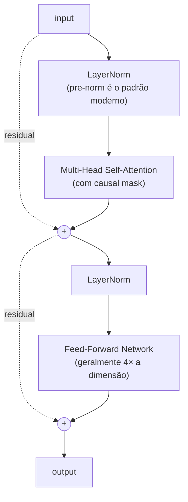

# Módulo 07 — Transformers

> **Objetivo**: aprofundar a arquitetura Transformer além do que o Projeto 8.3 já te fez implementar — o paper original, as arquiteturas que você ainda não construiu (encoder-only, encoder-decoder), e o nível de detalhe que permite ler papers de LLM com fluência.
>
> **Pré-requisitos**: Módulos [08](08_llms_arquiteturas.md)–[20](20_projetos_integradores.md) — em particular, o Transformer decoder-only completo que você já implementou e treinou no Projeto 8.3 (RMSNorm, SwiGLU, RoPE, GQA, máscara causal, loop de treino). Este módulo parte desse código, não do zero.
>
> **Tempo de referência**: 4–6 semanas (denso; ainda o módulo de fundamento mais importante da trilha, mesmo vindo depois da prática).

## Objetivos de aprendizagem

Ao final deste módulo você deve ser capaz de:

- Explicar Q/K/V numa frase e justificar por que dividimos por √d_k.
- Descrever, célula por célula, o que acontece num bloco Transformer (attention, FFN, residual, norm) e por que essa ordem específica importa — incluindo o que muda entre a versão que você já implementou (LLaMA-style) e a versão original de 2017.
- Explicar por que self-attention sozinha não vê ordem, e como positional encoding resolve isso — incluindo as variantes que você ainda não implementou (sinusoidal, aprendida).
- Distinguir encoder-only, decoder-only e encoder-decoder pela arquitetura, não só pelo nome do modelo, e ter implementado pelo menos um exemplo de cada.
- Explicar por que attention é O(n²) e o que Flash Attention/GQA fazem a respeito.

## O que você já sabe, e o que este módulo acrescenta

Se você seguiu a trilha em ordem, no Projeto 8.3 você já implementou `RMSNorm`, `SwiGLU`, `build_rope_cache`/`apply_rope`, `GQACausalSelfAttention`, montou um bloco Transformer decoder-only completo, treinou-o do zero com `AdamW`+`cross_entropy`, e gerou texto por amostragem. Isso cobre a maior parte do coração deste módulo — o que falta é: (1) o paper original de 2017, que descreve uma variante diferente da que você construiu (post-norm, LayerNorm, ReLU, positional encoding somado — não RoPE/RMSNorm/SwiGLU), útil para entender de onde vieram as escolhas modernas; (2) arquiteturas encoder-only e encoder-decoder, que você ainda não implementou (só decoder-only); (3) o detalhe de Flash Attention e outras técnicas de eficiência, cobertas em prosa no mod. 08/10 mas não implementadas; (4) fluência de leitura de paper, que é o objetivo explícito deste módulo.

---

## Por que isso importa

Esta é a arquitetura que tudo usa hoje. GPT, Claude, Llama, Mistral, Gemini, BERT, T5, ViT, Whisper, AlphaFold 2 — todos baseados em Transformers (com variações). Você já sentiu isso na prática, reutilizando peças do Projeto 8.3 em praticamente todo módulo desde então (ViT no mod. 16, Decision Transformer no mod. 17). Este módulo consolida a base formal por trás de código que você já viu funcionar.

---

## 7.1 O paper fundador

"Attention Is All You Need" (Vaswani et al., 2017) é o paper que introduziu a arquitetura — vale a leitura completa, mesmo (especialmente) depois de já ter implementado uma variante moderna dela.

> **Estratégia de leitura**: na primeira leitura, não pare em nenhum detalhe — o objetivo é só mapear a estrutura geral (que seções existem, o que cada uma promete). Na segunda leitura, confira cada equação contra o código que você já escreveu no Projeto 8.3, anotando explicitamente onde o paper original diverge do que você implementou (post-norm vs pre-norm, LayerNorm vs RMSNorm, positional encoding somado vs RoPE, ReLU vs SwiGLU — a seção 7.5 detalha cada uma dessas diferenças). Na terceira, leia só pra confirmar que entendeu por que cada mudança moderna existe, não só que ela existe.

Para apoio de leitura, "The Illustrated Transformer" (Jay Alammar) e "The Annotated Transformer" (Harvard NLP, o paper anotado com código) são as referências mais citadas da comunidade para essa ponte entre paper e implementação; o vídeo "Let's build GPT" do Karpathy cobre a implementação de um decoder-only do zero (o mesmo espírito do que você já fez no Projeto 8.3, de um ângulo um pouco diferente, útil para comparar abordagens).

---

## 7.2 Self-Attention — o coração

### Conceitos
- **Query, Key, Value (Q, K, V)**: três projeções lineares da entrada — os mesmos `q_proj`/`k_proj`/`v_proj` do `GQACausalSelfAttention` que você escreveu.
- **Scaled Dot-Product Attention**: softmax(QKᵀ/√d_k) · V.
- Por que dividir por √d_k (estabilização numérica).
- **Masking**: causal (decoder, o `is_causal=True` do Projeto 8.3), padding (qualquer modelo com batches de sequências de tamanhos diferentes).

### Multi-Head Attention
- Várias cabeças paralelas atendem a aspectos diferentes (sintaxe, coreferência, etc.).
- Concatenação + projeção final.

### Intuição
Self-attention pergunta, para cada token: "quais outros tokens devem influenciar minha próxima representação, e com que peso?". O peso é aprendido.

> **Intuição (expandida)**: pense num motor de busca. Cada token emite uma **Query** ("o que eu preciso?"), e cada token (inclusive ele mesmo) oferece uma **Key** ("isto é o que eu sou, pesquise por mim assim") e um **Value** ("isto é o que eu realmente carrego de informação"). Quanto mais a Query de um token combina com a Key de outro (produto interno alto), mais peso o Value desse outro token recebe na resposta.
>
> **Exemplo resolvido**: imagine 3 tokens com vetores Q, K de dimensão pequena onde os scores brutos `Q·Kᵀ` saem como `[8, 2, 1]` para o primeiro token contra os três (incluindo ele mesmo). Sem escalar, um softmax sobre `[8, 2, 1]` já fica extremamente concentrado no primeiro (a diferença de 6 unidades no expoente domina completamente o resultado) — o modelo "aprende" a prestar atenção quase só naquele token, mesmo que a diferença real de relevância fosse mais sutil. Dividindo por `√d_k` (digamos, `√64 = 8`), os scores viram `[1.0, 0.25, 0.125]` — uma distribuição bem mais suave, com gradiente útil fluindo para todas as posições durante o treino, não só a dominante. Essa suavização é exatamente por que a divisão existe: sem ela, à medida que `d_k` cresce, os produtos internos crescem em magnitude (mais termos sendo somados) e o softmax satura. No Projeto 8.3, `F.scaled_dot_product_attention` já faz essa divisão internamente, por baixo do argumento `is_causal` — o Projeto 7.1 abaixo pede pra você tornar esse cálculo explícito, em NumPy puro.
>
> **Checkpoint**: sem olhar o texto, explique em uma frase o papel de Q, de K e de V — e por que dividimos os scores por `√d_k`. Depois, explique por que multi-head captura mais do que uma única cabeça maior faria.

---

## 7.3 Posicionamento

### Por que precisa
Self-attention é **permutation-invariant** (não vê ordem). Linguagem é ordenada. Resolve-se injetando posição no input.

### Variantes
- **Sinusoidal positional encoding** (paper original) — funções seno/cosseno em frequências diferentes, somadas ao embedding do token uma vez, no início.
- **Learned positional embeddings** (BERT, GPT-2) — um vetor de posição aprendido por posição, também somado uma vez.
- **Relative positional encoding** (T5, Transformer-XL) — codifica a distância entre pares de tokens, não a posição absoluta.
- **RoPE (Rotary Position Embedding)** — o que você já implementou no Projeto 8.3. Usado em LLaMA, Mistral, Qwen. Estado da arte.
- **ALiBi (Attention with Linear Biases)** — em vez de modificar Q/K, soma um viés linear diretamente aos scores de attention, proporcional à distância entre as posições — mais simples que RoPE, usado em alguns modelos de contexto longo.

> **Intuição**: sem informação de posição, "o cão mordeu o homem" e "o homem mordeu o cão" produzem exatamente o mesmo conjunto de pesos de attention — são o mesmo *bag* de tokens, só a ordem muda o sentido. Positional encoding injeta essa ordem no vetor de cada token antes (ou durante) o attention, quebrando a invariância de permutação. A diferença entre as variantes é *como* essa posição é codificada: sinusoidal e learned somam um vetor de posição ao embedding do token, uma vez, no início — funciona, mas generaliza mal para posições nunca vistas no treino. RoPE faz diferente, como você já implementou: em vez de somar algo, ele *rotaciona* o vetor Q e K de cada token por um ângulo proporcional à posição, dentro do próprio cálculo de attention — isso faz o produto interno `Q·K` depender naturalmente da *distância relativa* entre dois tokens, não da posição absoluta de cada um. É essa propriedade que torna RoPE muito melhor em extrapolar para contextos mais longos que o treino. Você compara as três variantes lado a lado, no mesmo corpus, no Projeto 7.4.
>
> **Checkpoint**: sem olhar o texto, explique por que "o cão mordeu o homem" e "o homem mordeu o cão" ficariam indistinguíveis para um Transformer sem positional encoding. Depois, explique por que RoPE extrapola melhor para sequências longas do que positional encoding aprendido.

---

## 7.4 Arquiteturas de Transformer

### Encoder-only (BERT-style)
- Bidirecional.
- Treinado com Masked Language Modeling.
- Bom para: classificação, NER, QA extrativa, embeddings.
- Exemplos: BERT, RoBERTa, DeBERTa, ELECTRA.

Você ainda não implementou isso — o Projeto 8.3 foi inteiramente decoder-only. O Projeto 7.3 fecha essa lacuna.

### Decoder-only (GPT-style)
- Autoregressivo (causal mask).
- Treinado com next-token prediction — o `MiniLlama` do Projeto 8.3.
- Bom para: geração, completion, chat.
- Exemplos: GPT, LLaMA, Mistral, Qwen.

### Encoder-Decoder (T5-style)
- Encoder bidirecional + Decoder autoregressivo, ligados por cross-attention.
- Bom para: tradução, sumarização, qualquer text-to-text.
- Exemplos: T5, BART, mT5, Flan-T5, NLLB.

Cross-attention é a única peça de mecanismo genuinamente nova aqui — implementada no Projeto 7.6.

> **Intuição**: encoder-only é um **revisor de texto** — lê o texto inteiro de uma vez (pode olhar pra frente e pra trás, por isso "bidirecional") antes de opinar sobre cada palavra, ótimo pra entender/classificar. Decoder-only é um **contador de histórias** que só sabe o que já foi dito até agora e precisa prever a próxima palavra sem espiar o futuro (por isso a causal mask que você já usou) — ótimo pra gerar. Encoder-decoder é um **tradutor**: lê a frase inteira de origem (encoder, bidirecional) e só então começa a escrever a tradução palavra por palavra (decoder, autoregressivo), consultando o que leu via cross-attention a cada palavra que escreve — cross-attention é como self-attention, mas Q vem do decoder enquanto K e V vêm do encoder, é literalmente o decoder "perguntando" ao encoder o que é relevante pra próxima palavra.

### Variantes notáveis
Mixture of Experts (Mixtral, mod. 08/19), Sparse Attention (Longformer, BigBird, para contextos longos) e State Space Models (Mamba, RWKV — mod. 19) são alternativas ou complementos ao mecanismo de attention padrão.

> **Checkpoint**: sem olhar o texto, diga qual arquitetura (encoder-only, decoder-only, encoder-decoder) você usaria para (a) classificar sentimento de uma review, (b) traduzir um parágrafo, (c) completar uma frase de forma natural — e por quê.

---

## 7.5 Anatomia de um bloco Transformer

Um "Transformer block" típico (decoder-only moderno — o que você já construiu):



### Detalhes que diferem entre modelos (e entre o que você implementou e o paper original)
- **Pre-norm vs post-norm**: o paper original era post-norm; modelos modernos, incluindo o `LlamaStyleBlock` do Projeto 8.3, são pre-norm (mais estável).
- **LayerNorm vs RMSNorm**: o paper original usa LayerNorm; você implementou RMSNorm.
- **Activation no FFN**: ReLU (original), GELU (BERT, GPT), SwiGLU (o que você implementou, usado em LLaMA/Mistral).
- **Positional encoding**: somado (original) vs RoPE (o que você implementou).
- **Bias terms**: removidos em muitos modelos modernos (seu `nn.Linear(..., bias=False)` em todo o Projeto 8.3).
- **Tie weights**: amarrar embeddings de entrada e saída (economiza parâmetros) — não feito no `MiniLlama`, mas comum em modelos de produção.

> **Intuição**: pre-norm (normalizar *antes* de cada sub-camada, como no diagrama acima e como você já implementou) treina de forma mais estável que post-norm porque o caminho residual (as setas `-. residual .->` no diagrama) fica "limpo" — o sinal pode fluir direto da entrada até a saída sem passar por uma normalização no meio do caminho, o mesmo argumento de gradiente por trás de skip connections em qualquer arquitetura profunda. Post-norm normaliza *depois* da soma residual — no paper original isso ainda funcionava porque a rede era relativamente rasa (6 camadas), mas em redes muito mais profundas (dezenas de camadas, como LLMs modernos) o post-norm é mais instável e exige truques adicionais de warmup pra nem divergir logo no início do treino. É por isso que praticamente todo LLM moderno (LLaMA, Mistral, GPT-*, e o que você já implementou) usa pre-norm. O Projeto 7.2 pede pra você implementar a versão original (post-norm, LayerNorm, ReLU) especificamente para sentir essa diferença na prática, não só ler sobre ela.
>
> **Checkpoint**: olhando o diagrama acima, aponte exatamente onde fica a diferença entre pre-norm e post-norm — o que mudaria de posição no diagrama? Depois, explique por que RMSNorm é computacionalmente mais barato que LayerNorm (dica: o que cada um calcula sobre o vetor de entrada).

---

## 7.6 Treinamento de Transformer

### Loss
- **Cross-entropy** sobre próximo token (decoder, o mesmo `F.cross_entropy` do Projeto 8.3) ou token mascarado (encoder, o que você usa no Projeto 7.3).
- **Label smoothing** (usado no paper original).

### Otimizador
- **AdamW** + **warmup linear** + **decay** (cosine ou linear) — o mesmo `torch.optim.AdamW` do Projeto 8.3, com warmup adicionado.

### Hiperparâmetros típicos
- Learning rate: 1e-4 a 6e-4 (varia com escala).
- Batch size: depende de GPU; effective batch via gradient accumulation (mod. 09).
- Warmup: ~1–10% dos steps.

> Tudo aqui é o mesmo ciclo de otimização que você já rodou no Projeto 8.3 (AdamW, e agora warmup, cosine decay) — a diferença é escala. O mod. [09](09_treinamento_e_alinhamento.mdx) detalha o pipeline completo de treinamento de uma LLM real, deste primeiro passo até alinhamento — você já passou por lá.

---

## 7.7 Eficiência de Attention

### Problema
Attention é **O(n²)** em memória e tempo (n = comprimento da sequência). Inviabiliza contextos muito longos.

### Soluções
- **Flash Attention** — exato, mas otimizado para hierarquia de memória de GPU. Hoje, padrão de fato em treino e inferência (é o que `F.scaled_dot_product_attention` já usa por baixo dos panos, quando disponível, no Projeto 8.3). Implementado conceitualmente no Projeto 7.5.
- **Grouped-Query Attention (GQA)** — o que você já implementou no Projeto 8.3.
- **Multi-Query Attention (MQA)** — caso extremo de GQA com 1 cabeça K/V.
- **Sliding Window Attention** (Mistral) — atenção apenas a janela local (mod. 08).
- **Sparse Attention** (Longformer, BigBird).
- **Linear Attention** (Performer, Linformer) — aproximações que reduzem a O(n).

> **Intuição**: pense num grupo de chat onde todo mundo precisa ler a mensagem de todo mundo antes de responder — com 10 pessoas isso é ~100 "leituras", com 100 pessoas é ~10.000. Isso é O(n²): dobrar o número de participantes (tokens) quadruplica o trabalho, não dobra. Isso vem diretamente da matriz de scores `Q·Kᵀ`, que tem forma `(n, n)` — cada token compara com todo token.
>
> **Aplicação real**: Flash Attention não muda o resultado matemático (é uma reformulação exata, não uma aproximação) — ele muda *como* o cálculo é feito na GPU, processando a matriz de attention em blocos que cabem na memória rápida (SRAM) em vez de materializar a matriz `n×n` inteira na memória lenta (HBM). GQA/MQA atacam um custo diferente: memória de inferência (o cache de K/V que cresce a cada token gerado), compartilhando as projeções K/V entre múltiplas cabeças de Q — é por isso que aparecem juntas na lista de "eficiência de inferência" no mod. [10](10_eficiencia_e_inferencia_local.md).
>
> **Checkpoint**: sem olhar o texto, explique por que dobrar o comprimento da sequência quadruplica (não dobra) o custo de attention. Depois, explique a diferença entre o que Flash Attention otimiza (velocidade/memória de cálculo) e o que GQA otimiza (memória de cache durante geração).

---

## 7.8 Interpretação e visualização

- **Attention maps** — quais tokens "olham" para quais.
- **Limitações da interpretação** — *attention is not explanation* (Jain & Wallace, 2019).
- **Mechanistic interpretability** (mod. 14, aprofundado no mod. 19): circuit analysis, induction heads — você já teve contato prático com isso no Projeto 14.6.

> Peso de attention alto entre dois tokens não prova que o modelo está "raciocinando" sobre a relação entre eles — é uma correlação observável, não uma explicação causal. Trate attention maps como pista, não como prova. A biblioteca BertViz é o ponto de partida padrão da comunidade para visualizar attention maps de verdade.

---

## Projetos práticos

### Projeto 7.1 — Self-attention em NumPy puro

Você já implementou attention em PyTorch (Projeto 8.3), com autodiff e `F.scaled_dot_product_attention` fazendo boa parte do trabalho pesado. Aqui, você torna o cálculo inteiramente explícito, em NumPy, sem nenhum framework de deep learning.

**Pré-requisitos**: `pip install numpy matplotlib`.

```python
import numpy as np

def softmax(x, axis=-1):
    x_exp = np.exp(x - np.max(x, axis=axis, keepdims=True))  # subtrai o máximo por estabilidade numérica
    return x_exp / np.sum(x_exp, axis=axis, keepdims=True)

def self_attention_numpy(X, W_q, W_k, W_v):
    Q = X @ W_q
    K = X @ W_k
    V = X @ W_v
    d_k = K.shape[-1]
    scores = (Q @ K.T) / np.sqrt(d_k)
    pesos = softmax(scores)
    saida = pesos @ V
    return saida, pesos

np.random.seed(0)
X = np.random.randn(5, 8)  # 5 tokens, dimensão 8
W_q, W_k, W_v = [np.random.randn(8, 8) * 0.1 for _ in range(3)]

saida, pesos_attention = self_attention_numpy(X, W_q, W_k, W_v)
print(pesos_attention.round(3))
```

Cada linha aqui é a tradução direta da fórmula `softmax(QKᵀ/√d_k)·V` da seção 7.2 — sem nenhuma camada de abstração escondendo o que está acontecendo. **Antes de plotar qualquer coisa**, calcule à mão (papel) o score entre dois tokens específicos (ex.: `Q[0] @ K[1] / np.sqrt(8)`) e confirme que bate com `scores[0, 1]` do código — só depois confie na implementação para os demais pares.

**Visualize com um heatmap**:

```python
import matplotlib.pyplot as plt

plt.imshow(pesos_attention, cmap="viridis")
plt.xlabel("Key (token atendido)")
plt.ylabel("Query (token que está atendendo)")
plt.colorbar(label="Peso de attention")
plt.savefig("attention_heatmap.png")
```

Cada linha do heatmap soma 1 (é uma distribuição de probabilidade, resultado do `softmax`) — visualize com pesos aleatórios primeiro (como acima) e depois, se quiser, com `W_q`/`W_k` ajustados manualmente para forçar um padrão específico (ex.: cada token atendendo fortemente só a si mesmo), para confirmar que você entende como a matriz de pesos se conecta aos parâmetros.

---

### Projeto 7.2 — O bloco Transformer original (post-norm, LayerNorm, ReLU)

Você vai implementar a variante *original* de 2017 do bloco Transformer — post-norm, LayerNorm em vez de RMSNorm, ReLU em vez de SwiGLU, positional encoding somado em vez de RoPE — para sentir na prática a diferença em relação ao `LlamaStyleBlock` que você já tem.

**Pré-requisitos**: o código do Projeto 8.3.

```python
import torch
import torch.nn as nn
import math

class PositionalEncodingSinusoidal(nn.Module):
    def __init__(self, dim, max_len=512):
        super().__init__()
        posicao = torch.arange(max_len).unsqueeze(1)
        div_term = torch.exp(torch.arange(0, dim, 2) * (-math.log(10000.0) / dim))
        pe = torch.zeros(max_len, dim)
        pe[:, 0::2] = torch.sin(posicao * div_term)
        pe[:, 1::2] = torch.cos(posicao * div_term)
        self.register_buffer("pe", pe)

    def forward(self, x):
        return x + self.pe[:x.shape[1]]

class TransformerBlockOriginal(nn.Module):
    def __init__(self, dim, n_heads, ff_mult=4):
        super().__init__()
        self.attn = nn.MultiheadAttention(dim, n_heads, batch_first=True)
        self.norm1 = nn.LayerNorm(dim)
        self.ff = nn.Sequential(nn.Linear(dim, dim * ff_mult), nn.ReLU(), nn.Linear(dim * ff_mult, dim))
        self.norm2 = nn.LayerNorm(dim)

    def forward(self, x, mascara_causal):
        attn_out, _ = self.attn(x, x, x, attn_mask=mascara_causal, need_weights=False)
        x = self.norm1(x + attn_out)   # post-norm: soma residual PRIMEIRO, normaliza DEPOIS
        ff_out = self.ff(x)
        x = self.norm2(x + ff_out)     # o mesmo padrão post-norm aqui
        return x
```

Compare `TransformerBlockOriginal.forward` com o `LlamaStyleBlock.forward` do Projeto 8.3 linha a linha: lá, `x = x + self.attn(self.norm1(x), ...)` normaliza *antes* de entrar na attention (pre-norm); aqui, `x = self.norm1(x + attn_out)` normaliza *depois* de somar o residual (post-norm) — a diferença de posição exata descrita na seção 7.5. `nn.MultiheadAttention` do PyTorch já implementa multi-head attention pronta (você não precisa reescrevê-la, já fez isso à mão em `GQACausalSelfAttention`); use `attn_mask` para passar a máscara causal.

**Treine essa versão** no mesmo Tiny Shakespeare do Projeto 8.3 (reaproveitando `get_batch`, `encode`/`decode`), usando `PositionalEncodingSinusoidal` somado ao embedding em vez de RoPE. Compare a curva de loss com a do `MiniLlama` original — não espere uma diferença dramática nesse corpus pequeno (a vantagem de pre-norm/RMSNorm/SwiGLU aparece mais claramente em escala maior), mas confirme que ambas convergem, e documente qualquer diferença de estabilidade que observar (ex.: sensibilidade a learning rate mais alto).

---

### Projeto 7.3 — Mini-BERT: encoder-only com Masked Language Modeling

Você vai implementar um encoder-only Transformer do zero — a arquitetura que você ainda não construiu — treinado com masked language modeling em vez de next-token prediction.

**Pré-requisitos**: o código do Projeto 8.3 (reaproveita `RMSNorm`, `SwiGLU`).

```python
class BidirectionalSelfAttention(nn.Module):
    def __init__(self, dim, n_heads):
        super().__init__()
        self.n_heads = n_heads
        self.head_dim = dim // n_heads
        self.qkv_proj = nn.Linear(dim, dim * 3, bias=False)
        self.out_proj = nn.Linear(dim, dim, bias=False)

    def forward(self, x):
        B, T, D = x.shape
        qkv = self.qkv_proj(x).view(B, T, 3, self.n_heads, self.head_dim).permute(2, 0, 3, 1, 4)
        q, k, v = qkv[0], qkv[1], qkv[2]
        # SEM is_causal=True: cada token pode atender a QUALQUER outro, inclusive os que vêm depois
        out = torch.nn.functional.scaled_dot_product_attention(q, k, v, is_causal=False)
        out = out.transpose(1, 2).contiguous().view(B, T, D)
        return self.out_proj(out)
```

A única diferença mecânica em relação ao `GQACausalSelfAttention` do Projeto 8.3 é `is_causal=False` — sem essa flag, cada token atende livremente a todos os outros, inclusive os que viriam "depois" numa leitura esquerda-direita, o que é exatamente o que "bidirecional" significa na seção 7.4. (Esta versão usa multi-head attention comum, não GQA — GQA existe para economizar memória de KV-cache durante *geração* autoregressiva, o que não se aplica aqui, já que encoder-only não gera texto token a token.)

**Masked Language Modeling**: em vez de prever o próximo caractere (como no Projeto 8.3), mascare aleatoriamente uma fração dos tokens de entrada e treine o modelo a prever *o que estava escondido*:

```python
def mascarar_tokens(batch, vocab_size, token_mascara_id, prob_mascara=0.15):
    entrada = batch.clone()
    alvo = batch.clone()
    mascara_aplicada = torch.rand(batch.shape) < prob_mascara
    entrada[mascara_aplicada] = token_mascara_id
    alvo[~mascara_aplicada] = -100  # -100 é ignorado pelo cross_entropy — só queremos loss nas posições mascaradas
    return entrada, alvo

# no loop de treino:
entrada_mascarada, alvo = mascarar_tokens(x, vocab_size, token_mascara_id=vocab_size - 1)
logits = modelo(entrada_mascarada)
loss = F.cross_entropy(logits.view(-1, vocab_size), alvo.view(-1), ignore_index=-100)
```

`alvo[~mascara_aplicada] = -100` é o mesmo mecanismo de loss masking do Projeto 9.1 (SFT) — ali, mascarava-se o prompt para não calcular loss nele; aqui, mascara-se tudo *exceto* as posições escondidas, porque só faz sentido penalizar o modelo por errar previsões nas posições que ele realmente precisou "adivinhar". Monte o resto do modelo (`BidirectionalTransformerBlock` usando `BidirectionalSelfAttention` + `RMSNorm` + `SwiGLU`, empilhados) seguindo exatamente o padrão do `LlamaStyleBlock`, e treine no mesmo Tiny Shakespeare.

**Valide qualitativamente**: mascare uma palavra de uma frase de teste (`"O gato [MASK] no sofá."`) e veja se o modelo prevê algo razoável (`"dormiu"`, `"sentou"`) na posição mascarada — diferente do decoder-only, que só sabe completar da esquerda pra direita, o encoder usa contexto dos dois lados para essa previsão.

---

### Projeto 7.4 — Comparar position encodings

Você vai treinar o mesmo modelo com 3 estratégias de posicionamento diferentes (sinusoidal do Projeto 7.2, RoPE do Projeto 8.3, e aprendida) e comparar extrapolação para sequências mais longas que o treino.

**Pré-requisitos**: os Projetos 7.2 e 8.3 completos.

```python
class PositionalEmbeddingAprendida(nn.Module):
    def __init__(self, dim, max_len=512):
        super().__init__()
        self.embedding = nn.Embedding(max_len, dim)

    def forward(self, x):
        posicoes = torch.arange(x.shape[1], device=x.device)
        return x + self.embedding(posicoes)
```

Diferente da sinusoidal (calculada por uma fórmula fixa) e da RoPE (uma rotação aplicada dentro da attention), a versão aprendida é só mais uma tabela de embedding, treinada normalmente por gradiente — e por isso só tem entradas definidas para posições até `max_len`, o que a torna a pior das três em extrapolação, por construção.

**Antes de rodar o experimento, gere uma hipótese**: com base na Intuição da seção 7.3, preveja qual das três variantes vai extrapolar melhor para sequências além de `max_len` e qual vai extrapolar pior. Depois, treine os 3 modelos (RoPE = `MiniLlama` do Projeto 8.3; sinusoidal e aprendida = o mesmo modelo trocando só o módulo de posicionamento) no mesmo Tiny Shakespeare, com o mesmo `block_size` de treino, e teste a geração (`generate`) pedindo sequências mais longas que `block_size`. Confira se sua previsão bateu — a expectativa, confirmando a seção 7.3, é que a versão aprendida degrade visivelmente além do comprimento visto no treino (ou simplesmente não funcione, se `max_len` for excedido), enquanto RoPE se mantém mais coerente.

---

### Projeto 7.5 — Implementar Flash Attention conceitualmente

Você vai escrever uma versão "blockwise" (por blocos) da attention que respeita o princípio central do Flash Attention — processar a matriz de attention em pedaços, sem nunca materializar a matriz `n×n` inteira de uma vez — e confirmar que produz o mesmo resultado numérico que a versão direta.

**Pré-requisitos**: `pip install torch`.

```python
def attention_naive(Q, K, V):
    d_k = Q.shape[-1]
    scores = Q @ K.transpose(-2, -1) / (d_k ** 0.5)  # materializa a matriz (n, n) inteira de uma vez
    pesos = torch.softmax(scores, dim=-1)
    return pesos @ V

def attention_blockwise(Q, K, V, tamanho_bloco=2):
    n, d_k = Q.shape[-2], Q.shape[-1]
    saida = torch.zeros_like(Q)
    normalizador = torch.zeros(Q.shape[:-1] + (1,))
    maximo_corrente = torch.full(Q.shape[:-1] + (1,), float("-inf"))

    for inicio in range(0, n, tamanho_bloco):
        fim = min(inicio + tamanho_bloco, n)
        K_bloco, V_bloco = K[..., inicio:fim, :], V[..., inicio:fim, :]
        scores_bloco = Q @ K_bloco.transpose(-2, -1) / (d_k ** 0.5)  # só (n, tamanho_bloco) por vez

        novo_maximo = torch.maximum(maximo_corrente, scores_bloco.max(dim=-1, keepdim=True).values)
        exp_scores = torch.exp(scores_bloco - novo_maximo)
        correcao = torch.exp(maximo_corrente - novo_maximo)

        saida = saida * correcao + exp_scores @ V_bloco
        normalizador = normalizador * correcao + exp_scores.sum(dim=-1, keepdim=True)
        maximo_corrente = novo_maximo

    return saida / normalizador

torch.manual_seed(0)
Q, K, V = torch.randn(1, 6, 8), torch.randn(1, 6, 8), torch.randn(1, 6, 8)

resultado_naive = attention_naive(Q, K, V)
resultado_blockwise = attention_blockwise(Q, K, V)
print(torch.allclose(resultado_naive, resultado_blockwise, atol=1e-5))  # deve imprimir True
```

`attention_naive` é o que você já fez no Projeto 8.3 (via `F.scaled_dot_product_attention`) e no Projeto 7.1: calcula a matriz `(n, n)` inteira de uma vez. `attention_blockwise` processa `K`/`V` em pedaços (`tamanho_bloco` por vez) e usa a técnica de "softmax online" (acumular o resultado incrementalmente, corrigindo pela mudança do máximo corrente a cada novo bloco, via `correcao`) para nunca precisar da matriz `(n, n)` completa em memória de uma vez — exatamente o princípio central do Flash Attention descrito na seção 7.7, só que aqui em Python puro, sem otimização de hardware (o ganho real do Flash Attention vem de onde cada bloco fica fisicamente na hierarquia de memória da GPU, que está fora do escopo do que dá pra demonstrar em PyTorch puro).

**Confirme a corretude antes de medir qualquer coisa**: `torch.allclose(...)` deve retornar `True` para uma entrada pequena — só depois disso meça o uso de memória de pico (`torch.cuda.max_memory_allocated()`, se tiver GPU) das duas versões em sequências bem maiores (`n=4096`), onde a diferença deveria aparecer.

---

### Projeto 7.6 — Encoder-decoder pequeno para tradução

Você vai implementar cross-attention — a única peça de mecanismo que falta — montando um encoder-decoder completo para uma tarefa simples.

**Pré-requisitos**: os Projetos 7.3 (encoder) e 8.3 (decoder) completos.

```python
class CrossAttention(nn.Module):
    def __init__(self, dim, n_heads):
        super().__init__()
        self.n_heads = n_heads
        self.head_dim = dim // n_heads
        self.q_proj = nn.Linear(dim, dim, bias=False)   # Q vem do DECODER
        self.k_proj = nn.Linear(dim, dim, bias=False)   # K vem do ENCODER
        self.v_proj = nn.Linear(dim, dim, bias=False)   # V vem do ENCODER
        self.out_proj = nn.Linear(dim, dim, bias=False)

    def forward(self, x_decoder, saida_encoder):
        B, T_dec, D = x_decoder.shape
        T_enc = saida_encoder.shape[1]
        q = self.q_proj(x_decoder).view(B, T_dec, self.n_heads, self.head_dim).transpose(1, 2)
        k = self.k_proj(saida_encoder).view(B, T_enc, self.n_heads, self.head_dim).transpose(1, 2)
        v = self.v_proj(saida_encoder).view(B, T_enc, self.n_heads, self.head_dim).transpose(1, 2)
        out = torch.nn.functional.scaled_dot_product_attention(q, k, v, is_causal=False)
        out = out.transpose(1, 2).contiguous().view(B, T_dec, D)
        return self.out_proj(out)
```

A diferença estrutural em relação a `GQACausalSelfAttention` (self-attention) é exatamente a descrita na Intuição da seção 7.4: `q_proj` processa a entrada do *decoder*, enquanto `k_proj`/`v_proj` processam a *saída do encoder* — duas fontes diferentes de informação, em vez de uma só. `T_dec` e `T_enc` podem ter comprimentos diferentes (a frase de origem e a tradução raramente têm o mesmo número de tokens), o que a self-attention normal não precisa lidar mas cross-attention sim.

**Monte o modelo completo**: um encoder (Projeto 7.3, bidirecional, sem masked language modeling desta vez — só processa a sequência de entrada) produz `saida_encoder`; um decoder (como o Projeto 8.3, mas com um `CrossAttention` adicional em cada bloco, entre a self-attention causal e o FFN) gera a sequência de saída token a token, consultando `saida_encoder` a cada passo via cross-attention.

**Comece com uma tarefa sintética mais simples que tradução real** — inverter a ordem das palavras de uma frase, ou transformar maiúsculas/minúsculas — para validar que encoder, decoder e cross-attention funcionam juntos antes de partir para tradução EN↔PT de frases simples, onde bugs de alinhamento são muito mais difíceis de diagnosticar. **Visualize os pesos de cross-attention** (do mesmo jeito que no Projeto 7.1) para uma frase traduzida: para cada palavra gerada, quais palavras da frase de origem receberam mais peso — numa tradução razoável, esse padrão costuma ser quase diagonal (palavras em posições correspondentes se alinham), mesmo sem nunca ter sido ensinado explicitamente a fazer isso.

---

## Erros comuns

- **Não entender o causal mask** — bug clássico que vaza informação do futuro (você já evitou isso no Projeto 8.3, mas o erro reaparece facilmente ao implementar o encoder do Projeto 7.3 se `is_causal` for esquecido como `True` por engano — bidirecional exige `False`).
- **Misturar `(batch, seq, dim)` e `(seq, batch, dim)`** — PyTorch tem ambas convenções; preste atenção (`batch_first=True` no `nn.MultiheadAttention` do Projeto 7.2 evita a confusão).
- **Esquecer warmup** em treino de Transformer — treinamento explode, especialmente na versão post-norm do Projeto 7.2.
- **Pre-norm vs post-norm** sem entender — copiar código sem saber qual é qual gera bugs sutis.
- **Confiar em attention maps como "explicação"** — pesos altos de attention não significam que o modelo está "raciocinando" sobre aquilo.

---

## Conexão com módulos seguintes

| Conceito daqui | Aparece em |
|---|---|
| Self-attention, Q/K/V | Toda LLM moderna (mod. [08](08_llms_arquiteturas.md)+) |
| Causal mask | GPT-likes (mod. [08](08_llms_arquiteturas.md), [09](09_treinamento_e_alinhamento.mdx)) |
| RoPE | LLaMA, Mistral (mod. [08](08_llms_arquiteturas.md)) |
| Pre-norm + RMSNorm | LLMs modernos |
| GQA, MQA | Eficiência de inferência (mod. [10](10_eficiencia_e_inferencia_local.md)) |
| Flash Attention | Treinamento e inferência (mod. [09](09_treinamento_e_alinhamento.mdx), [10](10_eficiencia_e_inferencia_local.md)) |
| Encoder-decoder | T5, BART, NLLB |

---

## Checklist de saída

- [ ] Li **Attention Is All You Need** e sei apontar, seção por seção, o que mudou entre a versão original e o `MiniLlama` do Projeto 8.3 (se não, revise a seção 7.1 e o Projeto 7.2).
- [ ] Implementei attention em NumPy puro e validei manualmente contra cálculo feito à mão (se não, revise o Projeto 7.1).
- [ ] Implementei um encoder-only com masked language modeling, e um encoder-decoder com cross-attention — as duas arquiteturas que faltavam depois do Projeto 8.3 (se não, revise os Projetos 7.3 e 7.6).
- [ ] Sei explicar Q/K/V em uma frase, e por que dividimos por √d_k (se não, revise a seção 7.2).
- [ ] Entendo a diferença prática entre encoder-only, decoder-only e encoder-decoder, tendo implementado os três (se não, revise a seção 7.4).
- [ ] Sei o que muda entre attention vanilla, GQA, MQA, Flash, e implementei uma versão blockwise que bate numericamente com a versão direta (se não, revise o Projeto 7.5 e a seção 7.7).
- [ ] Posso ler papers de LLM sem precisar de blog explicativo.
