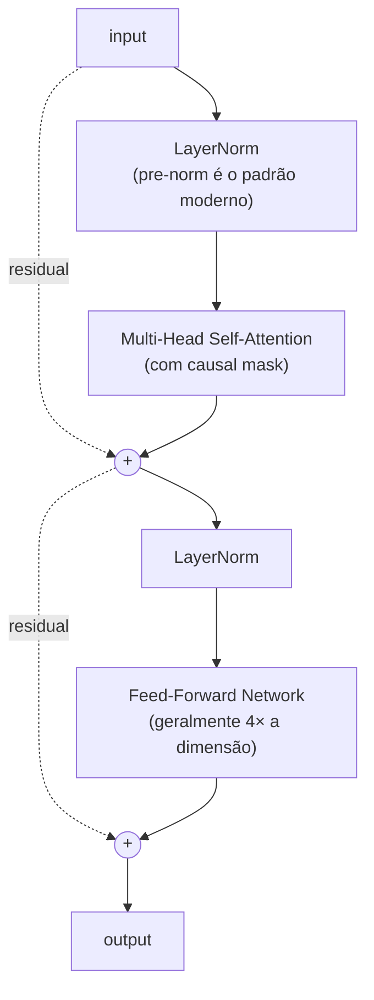

# Módulo 07 — Transformers

> **Objetivo**: dominar a arquitetura Transformer a ponto de **implementar do zero**, ler papers fluentemente e raciocinar sobre escolhas arquiteturais (encoder-only, decoder-only, número de cabeças, posicionamento, etc.).
>
> **Pré-requisitos**: Módulos [01](01_matematica.md)–[06](06_nlp_classico.md).
>
> **Tempo de referência**: 4–6 semanas (dense; este módulo é o "ponto de virada").

## Objetivos de aprendizagem

Ao final deste módulo você deve ser capaz de:

- Explicar Q/K/V numa frase e justificar por que dividimos por √d_k.
- Descrever, célula por célula, o que acontece num bloco Transformer (attention, FFN, residual, norm) e por que essa ordem específica importa.
- Explicar por que self-attention sozinha não vê ordem, e como positional encoding resolve isso.
- Distinguir encoder-only, decoder-only e encoder-decoder pela arquitetura, não só pelo nome do modelo.
- Explicar por que attention é O(n²) e o que Flash Attention/GQA fazem a respeito.
- Implementar um GPT mínimo do zero num corpus pequeno e gerar texto coerente (com apoio do material de referência da seção 7.1).

## Diagnóstico rápido

- Já li **Attention Is All You Need** (mesmo que superficialmente).
- Sei a diferença entre embedding de token e embedding de posição sem precisar consultar nada.
- Sei o que é uma máscara causal (causal mask) e por que ela existe.
- Sei explicar por que RoPE permite extrapolar contexto melhor que positional encoding aprendido.
- Já treinei qualquer modelo autoregressivo (nem que pequeno) de geração de texto.

Poucos "sim" → vá com calma pela seção 7.2 em diante, não pule os checkpoints. Maioria "sim" → o material ainda vale a leitura completa (este é o módulo mais denso da trilha), mas você deve reconhecer a maior parte dos conceitos e avançar mais rápido pelas referências.

---

## Por que isso importa

**Esta é a arquitetura que tudo usa em 2025.** GPT, Claude, Llama, Mistral, Gemini, BERT, T5, ViT, Whisper, AlphaFold 2 — todos baseados em Transformers (com variações). Se há *um* módulo desta trilha que você não pode tratar de forma superficial, é este.

---

## 7.1 O paper fundador

`Paper` **Attention Is All You Need** — Vaswani et al. (2017). https://arxiv.org/abs/1706.03762

**Leia, releia, releia.** Implemente as equações. Desenhe os diagramas. Quando achar que entendeu, leia de novo.

> **Estratégia de leitura**: na primeira leitura, não pare em nenhum detalhe — o objetivo é só mapear a estrutura geral (que seções existem, o que cada uma promete). Na segunda leitura, implemente cada equação conforme lê, seção por seção deste módulo (7.2 em diante segue a mesma ordem do paper). Na terceira, leia só pra confirmar que sua implementação bate com o que o paper descreve. Para a implementação completa guiada linha a linha, use o `Curso` **Let's build GPT** do Karpathy ou **The Annotated Transformer** (ambos nas referências abaixo) — eles fazem exatamente essa ponte entre o paper e código funcionando.

### Material de apoio para o paper
- `Curso` **The Illustrated Transformer** — Jay Alammar. http://jalammar.github.io/illustrated-transformer/ (didática inigualável)
- `Curso` **The Annotated Transformer** — Harvard NLP (paper anotado com código PyTorch). http://nlp.seas.harvard.edu/annotated-transformer/
- `Curso` **Karpathy — Let's build GPT: from scratch, in code, spelled out** (vídeo). https://www.youtube.com/watch?v=kCc8FmEb1nY
- `Curso` **Karpathy — Neural Networks: Zero to Hero — makemore series** (constrói até GPT). https://karpathy.ai/zero-to-hero.html
- `Curso` **Stanford CS25 — Transformers United**. https://web.stanford.edu/class/cs25/

---

## 7.2 Self-Attention — o coração

### Conceitos
- **Query, Key, Value (Q, K, V)**: três projeções lineares da entrada.
- **Scaled Dot-Product Attention**: softmax(QKᵀ/√d_k) · V.
- Por que dividir por √d_k (estabilização numérica).
- **Masking**: causal (decoder), padding (qualquer modelo com batches).

### Multi-Head Attention
- Várias cabeças paralelas atendem a aspectos diferentes (sintaxe, coreferência, etc.).
- Concatenação + projeção final.

### Intuição
Self-attention pergunta, para cada token: "quais outros tokens devem influenciar minha próxima representação, e com que peso?". O peso é aprendido.

> **Intuição (expandida)**: pense num motor de busca. Cada token emite uma **Query** ("o que eu preciso?"), e cada token (inclusive ele mesmo) oferece uma **Key** ("isto é o que eu sou, pesquise por mim assim") e um **Value** ("isto é o que eu realmente carrego de informação"). Quanto mais a Query de um token combina com a Key de outro (produto interno alto), mais peso o Value desse outro token recebe na resposta.
>
> **Exemplo resolvido**: imagine 3 tokens com vetores Q, K de dimensão pequena onde os scores brutos `Q·Kᵀ` saem como `[8, 2, 1]` para o primeiro token contra os três (incluindo ele mesmo). Sem escalar, um softmax sobre `[8, 2, 1]` já fica extremamente concentrado no primeiro (a diferença de 6 unidades no expoente domina completamente o resultado) — o modelo "aprende" a prestar atenção quase só naquele token, mesmo que a diferença real de relevância fosse mais sutil. Dividindo por `√d_k` (digamos, `√64 = 8`), os scores viram `[1.0, 0.25, 0.125]` — uma distribuição bem mais suave, com gradiente útil fluindo para todas as posições durante o treino, não só a dominante. Essa suavização é exatamente por que a divisão existe: sem ela, à medida que `d_k` cresce, os produtos internos crescem em magnitude (mais termos sendo somados) e o softmax satura.
>
> **Aplicação real**: é exatamente esse cálculo — projetar Q/K/V, pontuar, escalar, softmax, ponderar V — repetido em paralelo em várias "cabeças" e em muitas camadas, que roda a cada token gerado por GPT, Claude, Llama — qualquer LLM decoder-only. Multi-head existe porque uma única cabeça de attention aprende um único "padrão" de relação entre tokens; várias cabeças em paralelo permitem que o modelo capture sintaxe, correferência, proximidade posicional etc. simultaneamente, cada uma numa sub-fatia da dimensão total.
>
> **Checkpoint**: sem olhar o texto, explique em uma frase o papel de Q, de K e de V — e por que dividimos os scores por `√d_k`. Depois, explique por que multi-head captura mais do que uma única cabeça maior faria.

### Da matemática ao código
- Implemente attention com NumPy puro.
- Implemente em PyTorch sem `nn.MultiheadAttention`.
- Visualize attention weights em frases simples.

> Para a implementação passo a passo (scaled dot-product, multi-head, causal mask), siga **The Annotated Transformer** ou o vídeo do Karpathy listados na seção 7.1 — eles implementam exatamente isso, comentando cada linha contra a equação correspondente do paper.

---

## 7.3 Posicionamento

### Por que precisa
Self-attention é **permutation-invariant** (não vê ordem). Linguagem é ordenada. Resolve-se injetando posição no input.

### Variantes
- **Sinusoidal positional encoding** (paper original) — funções seno/cosseno em frequências diferentes.
- **Learned positional embeddings** (BERT, GPT-2).
- **Relative positional encoding** (T5, Transformer-XL).
- **RoPE (Rotary Position Embedding)** — usado em LLaMA, Mistral, Qwen. Estado da arte. `Paper` https://arxiv.org/abs/2104.09864
- **ALiBi (Attention with Linear Biases)** — usado em alguns modelos de longo contexto. `Paper` https://arxiv.org/abs/2108.12409

> **Intuição**: sem informação de posição, "o cão mordeu o homem" e "o homem mordeu o cão" produzem exatamente o mesmo conjunto de pesos de attention — são o mesmo *bag* de tokens, só a ordem muda o sentido. Positional encoding injeta essa ordem no vetor de cada token antes (ou durante) o attention, quebrando a invariância de permutação. A diferença entre as variantes é *como* essa posição é codificada: sinusoidal e learned somam um vetor de posição ao embedding do token, uma vez, no início — funciona, mas generaliza mal para posições nunca vistas no treino. RoPE faz diferente: em vez de somar algo, ele *rotaciona* o vetor Q e K de cada token por um ângulo proporcional à posição, dentro do próprio cálculo de attention — isso faz o produto interno `Q·K` depender naturalmente da *distância relativa* entre dois tokens, não da posição absoluta de cada um. É essa propriedade que torna RoPE muito melhor em extrapolar para contextos mais longos que o treino: o modelo nunca "viu" a posição absoluta 50.000 durante o treino, mas relações relativas (token a 3 posições de distância) se comportam de forma consistente independente de onde a sequência começa.

### Por que importa
Position encoding define a capacidade do modelo de **extrapolar contexto** (tamanho de janela maior do que viu no treino). RoPE e ALiBi são respostas a esse problema.

> **Checkpoint**: sem olhar o texto, explique por que "o cão mordeu o homem" e "o homem mordeu o cão" ficariam indistinguíveis para um Transformer sem positional encoding. Depois, explique por que RoPE extrapola melhor para sequências longas do que positional encoding aprendido.

---

## 7.4 Arquiteturas de Transformer

### Encoder-only (BERT-style)
- Bidirecional.
- Treinado com Masked Language Modeling.
- Bom para: classificação, NER, QA extrativa, embeddings.
- Exemplos: BERT, RoBERTa, DeBERTa, ELECTRA.

### Decoder-only (GPT-style)
- Autoregressivo (causal mask).
- Treinado com next-token prediction.
- Bom para: geração, completion, chat.
- Exemplos: GPT, LLaMA, Mistral, Qwen.

### Encoder-Decoder (T5-style)
- Encoder bidirecional + Decoder autoregressivo, ligados por cross-attention.
- Bom para: tradução, sumarização, qualquer text-to-text.
- Exemplos: T5, BART, mT5, Flan-T5, NLLB.

> **Intuição**: encoder-only é um **revisor de texto** — lê o texto inteiro de uma vez (pode olhar pra frente e pra trás, por isso "bidirecional") antes de opinar sobre cada palavra, ótimo pra entender/classificar. Decoder-only é um **contador de histórias** que só sabe o que já foi dito até agora e precisa prever a próxima palavra sem espiar o futuro (por isso a causal mask) — ótimo pra gerar. Encoder-decoder é um **tradutor**: lê a frase inteira de origem (encoder, bidirecional) e só então começa a escrever a tradução palavra por palavra (decoder, autoregressivo), consultando o que leu via cross-attention a cada palavra que escreve — cross-attention é como self-attention, mas Q vem do decoder enquanto K e V vêm do encoder, é literalmente o decoder "perguntando" ao encoder o que é relevante pra próxima palavra.

### Variantes notáveis
- **Mixture of Experts (MoE)**: Mixtral, GPT-4 (especulado), Switch Transformer.
- **Sparse attention**: Longformer, BigBird (para contextos longos).
- **State Space Models** (Mamba, RWKV) — alternativas a attention. Mod. [19](19_topicos_avancados.md).

### Referências
- `Paper` **BERT** — Devlin et al. (2018). https://arxiv.org/abs/1810.04805
- `Paper` **GPT-2 (Language Models are Unsupervised Multitask Learners)** — Radford et al. (2019). https://cdn.openai.com/better-language-models/language_models_are_unsupervised_multitask_learners.pdf
- `Paper` **T5 (Exploring the Limits of Transfer Learning)** — Raffel et al. (2019). https://arxiv.org/abs/1910.10683
- `Paper` **BART** — Lewis et al. (2019). https://arxiv.org/abs/1910.13461

> **Checkpoint**: sem olhar o texto, diga qual arquitetura (encoder-only, decoder-only, encoder-decoder) você usaria para (a) classificar sentimento de uma review, (b) traduzir um parágrafo, (c) completar uma frase de forma natural — e por quê.

---

## 7.5 Anatomia de um bloco Transformer

Um "Transformer block" típico (decoder-only moderno):

### Detalhes que diferem entre modelos
- **Pre-norm vs post-norm**: o paper original era post-norm; modelos modernos quase todos pre-norm (mais estável).
- **LayerNorm vs RMSNorm**: LLaMA, Mistral usam RMSNorm.
- **Activation no FFN**: ReLU (original), GELU (BERT, GPT), SwiGLU (LLaMA, Mistral).
- **Bias terms**: removidos em muitos modelos modernos.
- **Tie weights**: amarrar embeddings de entrada e saída (economiza parâmetros).

> **Intuição**: pre-norm (normalizar *antes* de cada sub-camada, como no diagrama acima) treina de forma mais estável que post-norm porque o caminho residual (as setas `-. residual .->` no diagrama) fica "limpo" — o sinal pode fluir direto da entrada até a saída sem passar por uma normalização no meio do caminho, exatamente o mesmo argumento de gradiente do skip connection do mod. [05](05_deep_learning.md#54-convolutional-neural-networks-cnns). Post-norm normaliza *depois* da soma residual — no paper original isso ainda funcionava porque a rede era relativamente rasa (6 camadas), mas em redes muito mais profundas (dezenas de camadas, como LLMs modernos) o post-norm é mais instável e exige truques adicionais de warmup pra nem divergir logo no início do treino. É por isso que praticamente todo LLM moderno (LLaMA, Mistral, GPT-*) usa pre-norm.
>
> **Checkpoint**: olhando o diagrama acima, aponte exatamente onde fica a diferença entre pre-norm e post-norm — o que mudaria de posição no diagrama? Depois, explique por que RMSNorm é computacionalmente mais barato que LayerNorm (dica: o que cada um calcula sobre o vetor de entrada).

### Referências
- `Paper` **GLU Variants Improve Transformer (SwiGLU)** — Shazeer (2020). https://arxiv.org/abs/2002.05202
- `Paper` **On Layer Normalization in the Transformer Architecture** — Xiong et al. (2020). https://arxiv.org/abs/2002.04745

---

## 7.6 Treinamento de Transformer

### Loss
- **Cross-entropy** sobre próximo token (decoder) ou token mascarado (encoder).
- **Label smoothing** (paper original).

### Otimizador
- **AdamW** + **warmup linear** + **decay** (cosine ou linear).

### Hiperparâmetros típicos
- Learning rate: 1e-4 a 6e-4 (varia com escala).
- Batch size: depende de GPU; effective batch via gradient accumulation.
- Warmup: ~1–10% dos steps.

> Tudo aqui é o mesmo ciclo de otimização do mod. [05](05_deep_learning.md#53-otimização-e-regularização-para-dl) (AdamW, warmup, cosine decay) — a diferença é escala. O mod. [09](09_treinamento_e_alinhamento.mdx) detalha o pipeline completo de treinamento de uma LLM real, deste primeiro passo até alinhamento.

### Referências práticas
- `Paper` **A Recipe for Training Neural Networks** — Karpathy. http://karpathy.github.io/2019/04/25/recipe/
- `Livro` **The Hugging Face Course — Training a causal LM**. https://huggingface.co/learn/llm-course

---

## 7.7 Eficiência de Attention

### Problema
Attention é **O(n²)** em memória e tempo (n = comprimento da sequência). Inviabiliza contextos muito longos.

### Soluções
- **Flash Attention** — exato, mas otimizado para hierarquia de memória de GPU. Hoje, padrão de fato em treino e inferência. `Paper` https://arxiv.org/abs/2205.14135 (v1), https://arxiv.org/abs/2307.08691 (v2)
- **Grouped-Query Attention (GQA)** — compartilha K/V entre cabeças. Usado em LLaMA 2/3, Mistral. `Paper` https://arxiv.org/abs/2305.13245
- **Multi-Query Attention (MQA)** — caso extremo de GQA com 1 cabeça K/V.
- **Sliding Window Attention** (Mistral) — atenção apenas a janela local.
- **Sparse Attention** (Longformer, BigBird).
- **Linear Attention** (Performer, Linformer) — aproximações que reduzem a O(n).

> **Intuição**: pense num grupo de chat onde todo mundo precisa ler a mensagem de todo mundo antes de responder — com 10 pessoas isso é ~100 "leituras", com 100 pessoas é ~10.000. Isso é O(n²): dobrar o número de participantes (tokens) quadruplica o trabalho, não dobra. Isso vem diretamente da matriz de scores `Q·Kᵀ`, que tem forma `(n, n)` — cada token compara com todo token.
>
> **Aplicação real**: Flash Attention não muda o resultado matemático (é uma reformulação exata, não uma aproximação) — ele muda *como* o cálculo é feito na GPU, processando a matriz de attention em blocos que cabem na memória rápida (SRAM) em vez de materializar a matriz `n×n` inteira na memória lenta (HBM). GQA/MQA atacam um custo diferente: memória de inferência (o cache de K/V que cresce a cada token gerado), compartilhando as projeções K/V entre múltiplas cabeças de Q — é por isso que aparecem juntas na lista de "eficiência de inferência" no mod. [10](10_eficiencia_e_inferencia_local.md).
>
> **Checkpoint**: sem olhar o texto, explique por que dobrar o comprimento da sequência quadruplica (não dobra) o custo de attention. Depois, explique a diferença entre o que Flash Attention otimiza (velocidade/memória de cálculo) e o que GQA otimiza (memória de cache durante geração).

### Referências
- `Paper` **Longformer: The Long-Document Transformer** — Beltagy et al. (2020). https://arxiv.org/abs/2004.05150
- `Paper` **Linformer: Self-Attention with Linear Complexity** — Wang et al. (2020). https://arxiv.org/abs/2006.04768

---

## 7.8 Interpretação e visualização

- **Attention maps** — quais tokens "olham" para quais.
- **Limitações da interpretação** — *attention is not explanation* (Jain & Wallace, 2019).
- **Mechanistic interpretability** (preview do mod. [14](14_avaliacao_e_seguranca.md)): circuit analysis, induction heads.

> Peso de attention alto entre dois tokens não prova que o modelo está "raciocinando" sobre a relação entre eles — é uma correlação observável, não uma explicação causal. Trate attention maps como pista, não como prova. Para visualizar attention maps de verdade, a `Ferramenta` BertViz (referências abaixo) é o ponto de partida padrão da comunidade.

### Referências
- `Paper` **A Mathematical Framework for Transformer Circuits** — Anthropic (Elhage et al., 2021). https://transformer-circuits.pub/2021/framework/index.html
- `Ferramenta` **BertViz** (visualização de attention). https://github.com/jessevig/bertviz

---

## Projetos práticos

### Projeto 7.1 — Self-attention em NumPy
- Implemente scaled dot-product attention puro.
- Calcule attention weights manualmente para 5 tokens.
- Plote heatmap.

> **Variante guiada**: antes de plotar o heatmap, calcule à mão (papel) os scores de 2 tokens quaisquer e confirme que batem com a saída do seu código — só depois confie na implementação para os outros pares. Siga **The Annotated Transformer** (seção 7.1) se travar na implementação.

### Projeto 7.2 — Transformer block em PyTorch (sem `nn.Transformer`)
- Implemente: MultiHeadAttention, FFN, LayerNorm, residual.
- Empilhe N blocos.
- Treine numa tarefa simples (cópia, reverso, soma de dígitos) para validar.

> **Variante guiada**: implemente e valide cada peça isoladamente antes de empilhar — teste `MultiHeadAttention` sozinha com um tensor de entrada sintético e confira a forma da saída, depois o `FFN`, só então monte o bloco completo seguindo o diagrama da seção 7.5.

### Projeto 7.3 — minGPT do zero
**Este é o projeto mais importante da trilha até aqui.**
- Siga **integralmente** o vídeo de Karpathy "Let's build GPT".
- Treine em corpus pequeno (Shakespeare, código, letras de música).
- Gere texto.
- **Depois**: refatore tudo sem assistir o vídeo. Implemente do zero.
- Repo de referência: https://github.com/karpathy/nanoGPT

> **Variante guiada**: siga o vídeo do Karpathy do início ao fim, pausando pra implementar cada trecho você mesmo antes de ver a solução dele. Depois de terminar, feche o vídeo e reimplemente do zero olhando só suas próprias anotações — se travar em algum ponto, esse é exatamente o ponto que precisa de mais teoria (volte pra seção correspondente deste módulo: embedding+posição é a 7.3, o bloco é a 7.5, a máscara causal é a 7.2).

### Projeto 7.4 — Comparar position encodings
- Mesmo modelo, três variantes: sinusoidal, learned, RoPE.
- Treine no mesmo corpus.
- Compare loss e qualidade de geração em sequências mais longas que as do treino (extrapolação).

> **Variante guiada**: gere primeiro uma hipótese (baseada na intuição da seção 7.3) de qual variante vai extrapolar melhor e qual vai extrapolar pior — depois rode o experimento e confira se sua previsão bateu. Isso transforma o projeto de "rodar e ver o que sai" em teste de uma intuição específica.

### Projeto 7.5 — Implementar Flash Attention conceitualmente
- Não precisa otimizar CUDA, mas escreva uma versão "blockwise" da attention que respeita o conceito.
- Compare uso de memória com versão naive em PyTorch.

> **Variante guiada**: antes de otimizar memória, confirme que sua versão "blockwise" dá o **mesmo resultado numérico** que a versão naive para uma entrada pequena — só depois meça a diferença de memória em sequências maiores. Sem essa validação de corretude primeiro, uma medição de memória "boa" pode estar escondendo um bug.

### Projeto 7.6 — Encoder-decoder pequeno para tradução
- Toy task: tradução EN→PT de frases simples ou cópia de strings com transformações.
- Implemente em PyTorch.
- Visualize cross-attention.

> **Variante guiada**: comece com uma tarefa sintética mais simples que tradução real (ex.: inverter a ordem das palavras, ou transformar case) — valide que encoder, decoder e cross-attention funcionam nessa tarefa fácil antes de partir para tradução de verdade, onde bugs são mais difíceis de diagnosticar.

---

## Erros comuns

- **Não entender o causal mask** — bug clássico que vaza informação do futuro.
- **Misturar `(batch, seq, dim)` e `(seq, batch, dim)`** — PyTorch tem ambas convenções; preste atenção.
- **Esquecer warmup** em treino de Transformer — treinamento explode.
- **Pre-norm vs post-norm** sem entender — copiar código sem saber qual é qual gera bugs sutis.
- **Confiar em attention maps como "explicação"** — pesos altos de attention não significam que o modelo está "raciocinando" sobre aquilo.

---

## Conexão com módulos seguintes

| Conceito daqui | Aparece em |
|---|---|
| Self-attention, Q/K/V | Toda LLM moderna (mod. [08](08_llms_arquiteturas.md)+) |
| Causal mask | GPT-likes (mod. [08](08_llms_arquiteturas.md), [09](09_treinamento_e_alinhamento.mdx)) |
| RoPE | LLaMA, Mistral (mod. [08](08_llms_arquiteturas.md)) |
| Pre-norm + RMSNorm | LLMs modernos |
| GQA, MQA | Eficiência de inferência (mod. [10](10_eficiencia_e_inferencia_local.md)) |
| Flash Attention | Treinamento e inferência (mod. [09](09_treinamento_e_alinhamento.mdx), [10](10_eficiencia_e_inferencia_local.md)) |
| Encoder-decoder | T5, BART, NLLB |

---

## Checklist de saída

- [ ] Li **Attention Is All You Need** ao menos 3 vezes.
- [ ] Implementei minGPT do zero, **sem copiar e colar**.
- [ ] Sei explicar Q/K/V em uma frase, e por que dividimos por √d_k.
- [ ] Entendo a diferença prática entre encoder-only, decoder-only e encoder-decoder.
- [ ] Sei o que muda entre attention vanilla, GQA, MQA, Flash.
- [ ] Posso ler papers de LLM sem precisar de blog explicativo.
