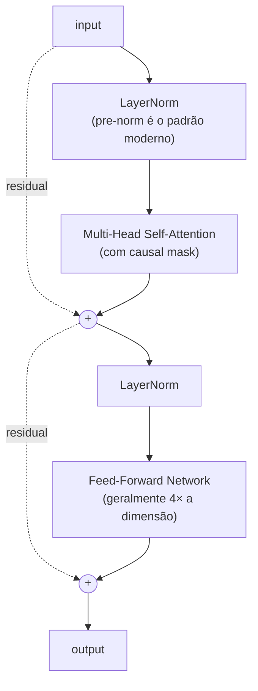

# Módulo 07 — Transformers

> **Objetivo**: dominar a arquitetura Transformer a ponto de **implementar do zero**, ler papers fluentemente e raciocinar sobre escolhas arquiteturais (encoder-only, decoder-only, número de cabeças, posicionamento, etc.).
>
> **Pré-requisitos**: Módulos [01](01_matematica.md)–[06](06_nlp_classico.md).
>
> **Tempo de referência**: 4–6 semanas (dense; este módulo é o "ponto de virada").

---

## Por que isso importa

**Esta é a arquitetura que tudo usa em 2025.** GPT, Claude, Llama, Mistral, Gemini, BERT, T5, ViT, Whisper, AlphaFold 2 — todos baseados em Transformers (com variações). Se há *um* módulo desta trilha que você não pode tratar de forma superficial, é este.

---

## 7.1 O paper fundador

`Paper` **Attention Is All You Need** — Vaswani et al. (2017). https://arxiv.org/abs/1706.03762

**Leia, releia, releia.** Implemente as equações. Desenhe os diagramas. Quando achar que entendeu, leia de novo.

### Material de apoio para o paper
- `Curso` **The Illustrated Transformer** — Jay Alammar. http://jalammar.github.io/illustrated-transformer/ (didática inigualável)
- `Curso` **The Annotated Transformer** — Harvard NLP (paper anotado com código PyTorch). http://nlp.seas.harvard.edu/annotated-transformer/
- `Curso` **Karpathy — Let's build GPT: from scratch, in code, spelled out** (vídeo). https://www.youtube.com/watch?v=kCc8FmEb1nY
- `Curso` **Karpathy — Neural Networks: Zero to Hero — makemore series** (constrói até GPT). https://karpathy.ai/zero-to-hero.html
- `Curso` **Stanford CS25 — Transformers United**. https://web.stanford.edu/class/cs25/

---

## 7.2 Self-Attention — o coração

### Conceitos
- **Query, Key, Value (Q, K, V)**: três projeções lineares da entrada.
- **Scaled Dot-Product Attention**: softmax(QKᵀ/√d_k) · V.
- Por que dividir por √d_k (estabilização numérica).
- **Masking**: causal (decoder), padding (qualquer modelo com batches).

### Multi-Head Attention
- Várias cabeças paralelas atendem a aspectos diferentes (sintaxe, coreferência, etc.).
- Concatenação + projeção final.

### Intuição
Self-attention pergunta, para cada token: "quais outros tokens devem influenciar minha próxima representação, e com que peso?". O peso é aprendido.

### Da matemática ao código
- Implemente attention com NumPy puro.
- Implemente em PyTorch sem `nn.MultiheadAttention`.
- Visualize attention weights em frases simples.

---

## 7.3 Posicionamento

### Por que precisa
Self-attention é **permutation-invariant** (não vê ordem). Linguagem é ordenada. Resolve-se injetando posição no input.

### Variantes
- **Sinusoidal positional encoding** (paper original) — funções seno/cosseno em frequências diferentes.
- **Learned positional embeddings** (BERT, GPT-2).
- **Relative positional encoding** (T5, Transformer-XL).
- **RoPE (Rotary Position Embedding)** — usado em LLaMA, Mistral, Qwen. Estado da arte. `Paper` https://arxiv.org/abs/2104.09864
- **ALiBi (Attention with Linear Biases)** — usado em alguns modelos de longo contexto. `Paper` https://arxiv.org/abs/2108.12409

### Por que importa
Position encoding define a capacidade do modelo de **extrapolar contexto** (tamanho de janela maior do que viu no treino). RoPE e ALiBi são respostas a esse problema.

---

## 7.4 Arquiteturas de Transformer

### Encoder-only (BERT-style)
- Bidirecional.
- Treinado com Masked Language Modeling.
- Bom para: classificação, NER, QA extrativa, embeddings.
- Exemplos: BERT, RoBERTa, DeBERTa, ELECTRA.

### Decoder-only (GPT-style)
- Autoregressivo (causal mask).
- Treinado com next-token prediction.
- Bom para: geração, completion, chat.
- Exemplos: GPT, LLaMA, Mistral, Qwen.

### Encoder-Decoder (T5-style)
- Encoder bidirecional + Decoder autoregressivo, ligados por cross-attention.
- Bom para: tradução, sumarização, qualquer text-to-text.
- Exemplos: T5, BART, mT5, Flan-T5, NLLB.

### Variantes notáveis
- **Mixture of Experts (MoE)**: Mixtral, GPT-4 (especulado), Switch Transformer.
- **Sparse attention**: Longformer, BigBird (para contextos longos).
- **State Space Models** (Mamba, RWKV) — alternativas a attention. Mod. [19](19_topicos_avancados.md).

### Referências
- `Paper` **BERT** — Devlin et al. (2018). https://arxiv.org/abs/1810.04805
- `Paper` **GPT-2 (Language Models are Unsupervised Multitask Learners)** — Radford et al. (2019). https://cdn.openai.com/better-language-models/language_models_are_unsupervised_multitask_learners.pdf
- `Paper` **T5 (Exploring the Limits of Transfer Learning)** — Raffel et al. (2019). https://arxiv.org/abs/1910.10683
- `Paper` **BART** — Lewis et al. (2019). https://arxiv.org/abs/1910.13461

---

## 7.5 Anatomia de um bloco Transformer

Um "Transformer block" típico (decoder-only moderno):

### Detalhes que diferem entre modelos
- **Pre-norm vs post-norm**: o paper original era post-norm; modelos modernos quase todos pre-norm (mais estável).
- **LayerNorm vs RMSNorm**: LLaMA, Mistral usam RMSNorm.
- **Activation no FFN**: ReLU (original), GELU (BERT, GPT), SwiGLU (LLaMA, Mistral).
- **Bias terms**: removidos em muitos modelos modernos.
- **Tie weights**: amarrar embeddings de entrada e saída (economiza parâmetros).

### Referências
- `Paper` **GLU Variants Improve Transformer (SwiGLU)** — Shazeer (2020). https://arxiv.org/abs/2002.05202
- `Paper` **On Layer Normalization in the Transformer Architecture** — Xiong et al. (2020). https://arxiv.org/abs/2002.04745

---

## 7.6 Treinamento de Transformer

### Loss
- **Cross-entropy** sobre próximo token (decoder) ou token mascarado (encoder).
- **Label smoothing** (paper original).

### Otimizador
- **AdamW** + **warmup linear** + **decay** (cosine ou linear).

### Hiperparâmetros típicos
- Learning rate: 1e-4 a 6e-4 (varia com escala).
- Batch size: depende de GPU; effective batch via gradient accumulation.
- Warmup: ~1–10% dos steps.

### Referências práticas
- `Paper` **A Recipe for Training Neural Networks** — Karpathy. http://karpathy.github.io/2019/04/25/recipe/
- `Livro` **The Hugging Face Course — Training a causal LM**. https://huggingface.co/learn/llm-course

---

## 7.7 Eficiência de Attention

### Problema
Attention é **O(n²)** em memória e tempo (n = comprimento da sequência). Inviabiliza contextos muito longos.

### Soluções
- **Flash Attention** — exato, mas otimizado para hierarquia de memória de GPU. Hoje, padrão de fato em treino e inferência. `Paper` https://arxiv.org/abs/2205.14135 (v1), https://arxiv.org/abs/2307.08691 (v2)
- **Grouped-Query Attention (GQA)** — compartilha K/V entre cabeças. Usado em LLaMA 2/3, Mistral. `Paper` https://arxiv.org/abs/2305.13245
- **Multi-Query Attention (MQA)** — caso extremo de GQA com 1 cabeça K/V.
- **Sliding Window Attention** (Mistral) — atenção apenas a janela local.
- **Sparse Attention** (Longformer, BigBird).
- **Linear Attention** (Performer, Linformer) — aproximações que reduzem a O(n).

### Referências
- `Paper` **Longformer: The Long-Document Transformer** — Beltagy et al. (2020). https://arxiv.org/abs/2004.05150
- `Paper` **Linformer: Self-Attention with Linear Complexity** — Wang et al. (2020). https://arxiv.org/abs/2006.04768

---

## 7.8 Interpretação e visualização

- **Attention maps** — quais tokens "olham" para quais.
- **Limitações da interpretação** — *attention is not explanation* (Jain & Wallace, 2019).
- **Mechanistic interpretability** (preview do mod. [14](14_avaliacao_e_seguranca.md)): circuit analysis, induction heads.

### Referências
- `Paper` **A Mathematical Framework for Transformer Circuits** — Anthropic (Elhage et al., 2021). https://transformer-circuits.pub/2021/framework/index.html
- `Ferramenta` **BertViz** (visualização de attention). https://github.com/jessevig/bertviz

---

## Projetos práticos

### Projeto 7.1 — Self-attention em NumPy
- Implemente scaled dot-product attention puro.
- Calcule attention weights manualmente para 5 tokens.
- Plote heatmap.

### Projeto 7.2 — Transformer block em PyTorch (sem `nn.Transformer`)
- Implemente: MultiHeadAttention, FFN, LayerNorm, residual.
- Empilhe N blocos.
- Treine numa tarefa simples (cópia, reverso, soma de dígitos) para validar.

### Projeto 7.3 — minGPT do zero
**Este é o projeto mais importante da trilha até aqui.**
- Siga **integralmente** o vídeo de Karpathy "Let's build GPT".
- Treine em corpus pequeno (Shakespeare, código, letras de música).
- Gere texto.
- **Depois**: refatore tudo sem assistir o vídeo. Implemente do zero.
- Repo de referência: https://github.com/karpathy/nanoGPT

### Projeto 7.4 — Comparar position encodings
- Mesmo modelo, três variantes: sinusoidal, learned, RoPE.
- Treine no mesmo corpus.
- Compare loss e qualidade de geração em sequências mais longas que as do treino (extrapolação).

### Projeto 7.5 — Implementar Flash Attention conceitualmente
- Não precisa otimizar CUDA, mas escreva uma versão "blockwise" da attention que respeita o conceito.
- Compare uso de memória com versão naive em PyTorch.

### Projeto 7.6 — Encoder-decoder pequeno para tradução
- Toy task: tradução EN→PT de frases simples ou cópia de strings com transformações.
- Implemente em PyTorch.
- Visualize cross-attention.

---

## Erros comuns

- **Não entender o causal mask** — bug clássico que vaza informação do futuro.
- **Misturar `(batch, seq, dim)` e `(seq, batch, dim)`** — PyTorch tem ambas convenções; preste atenção.
- **Esquecer warmup** em treino de Transformer — treinamento explode.
- **Pre-norm vs post-norm** sem entender — copiar código sem saber qual é qual gera bugs sutis.
- **Confiar em attention maps como "explicação"** — pesos altos de attention não significam que o modelo está "raciocinando" sobre aquilo.

---

## Conexão com módulos seguintes

| Conceito daqui | Aparece em |
|---|---|
| Self-attention, Q/K/V | Toda LLM moderna (mod. [08](08_llms_arquiteturas.md)+) |
| Causal mask | GPT-likes (mod. [08](08_llms_arquiteturas.md), [09](09_treinamento_e_alinhamento.mdx)) |
| RoPE | LLaMA, Mistral (mod. [08](08_llms_arquiteturas.md)) |
| Pre-norm + RMSNorm | LLMs modernos |
| GQA, MQA | Eficiência de inferência (mod. [10](10_eficiencia_e_inferencia_local.md)) |
| Flash Attention | Treinamento e inferência (mod. [09](09_treinamento_e_alinhamento.mdx), [10](10_eficiencia_e_inferencia_local.md)) |
| Encoder-decoder | T5, BART, NLLB |

---

## Checklist de saída

- [ ] Li **Attention Is All You Need** ao menos 3 vezes.
- [ ] Implementei minGPT do zero, **sem copiar e colar**.
- [ ] Sei explicar Q/K/V em uma frase, e por que dividimos por √d_k.
- [ ] Entendo a diferença prática entre encoder-only, decoder-only e encoder-decoder.
- [ ] Sei o que muda entre attention vanilla, GQA, MQA, Flash.
- [ ] Posso ler papers de LLM sem precisar de blog explicativo.
