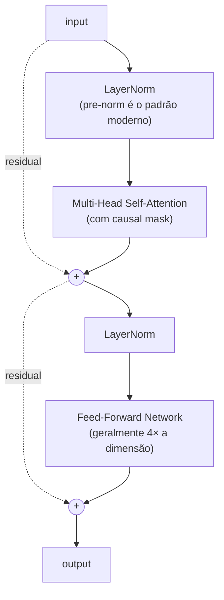

# Módulo 07 — Transformers

> **Objetivo**: dominar a arquitetura Transformer a ponto de **implementar do zero**, ler papers fluentemente e raciocinar sobre escolhas arquiteturais (encoder-only, decoder-only, número de cabeças, posicionamento, etc.).
>
> **Pré-requisitos**: Módulos [01](01_matematica.md)–[06](06_nlp_classico.md).
>
> **Tempo de referência**: 4–6 semanas (dense; este módulo é o "ponto de virada").

> **Tempo por caminho**: **Clássico** ~5–7 semanas (teoria completa + prática) · **Acelerado** ~2 semanas (prática guiada com código, sem reler o paper linha a linha).

## Objetivos de aprendizagem

Ao final deste módulo você deve ser capaz de:

- Implementar scaled dot-product attention e multi-head attention do zero, sem `nn.MultiheadAttention`.
- Explicar Q/K/V numa frase e justificar por que dividimos por √d_k.
- Implementar um bloco Transformer completo (attention + FFN + residual + norm) e empilhar N blocos.
- Distinguir encoder-only, decoder-only e encoder-decoder pela arquitetura, não só pelo nome do modelo.
- Treinar um GPT mínimo do zero num corpus pequeno e gerar texto coerente.
- Explicar por que attention é O(n²) e o que Flash Attention/GQA fazem a respeito.

## Diagnóstico rápido

- Já li **Attention Is All You Need** (mesmo que superficialmente).
- Sei a diferença entre `nn.Embedding` de token e de posição sem precisar consultar nada.
- Já implementei ou depurei uma máscara causal (causal mask) em código.
- Sei explicar por que RoPE permite extrapolar contexto melhor que positional encoding aprendido.
- Já treinei qualquer modelo autoregressivo (nem que pequeno) de geração de texto.

Poucos "sim" → **Clássico**, com calma, implementando cada peça antes de seguir. Maioria "sim" → **Prática guiada — Acelerado**, direto ao código.

---

## Por que isso importa

**Esta é a arquitetura que tudo usa em 2025.** GPT, Claude, Llama, Mistral, Gemini, BERT, T5, ViT, Whisper, AlphaFold 2 — todos baseados em Transformers (com variações). Se há *um* módulo desta trilha que você não pode tratar de forma superficial, é este.

---

## 7.1 O paper fundador

`Paper` **Attention Is All You Need** — Vaswani et al. (2017). https://arxiv.org/abs/1706.03762

**Leia, releia, releia.** Implemente as equações. Desenhe os diagramas. Quando achar que entendeu, leia de novo.

> **Estratégia de leitura (Clássico)**: na primeira leitura, não pare em nenhum detalhe — o objetivo é só mapear a estrutura geral (que seções existem, o que cada uma promete). Na segunda leitura, implemente cada equação conforme lê (é o que a seção 7.2 em diante vai te guiar a fazer). Na terceira, leia só pra confirmar que sua implementação bate com o que o paper descreve.

> **Prática guiada — Acelerado**: pule a leitura completa por enquanto. Vá direto pra seção 7.2 e implemente self-attention primeiro — volte pro paper só quando um trecho específico do código não fizer sentido. Ler implementando é mais rápido que ler primeiro pra quem já tem base.

### Material de apoio para o paper
- `Curso` **The Illustrated Transformer** — Jay Alammar. http://jalammar.github.io/illustrated-transformer/ (didática inigualável)
- `Curso` **The Annotated Transformer** — Harvard NLP (paper anotado com código PyTorch). http://nlp.seas.harvard.edu/annotated-transformer/
- `Curso` **Karpathy — Let's build GPT: from scratch, in code, spelled out** (vídeo). https://www.youtube.com/watch?v=kCc8FmEb1nY
- `Curso` **Karpathy — Neural Networks: Zero to Hero — makemore series** (constrói até GPT). https://karpathy.ai/zero-to-hero.html
- `Curso` **Stanford CS25 — Transformers United**. https://web.stanford.edu/class/cs25/

---

## 7.2 Self-Attention — o coração

### Conceitos
- **Query, Key, Value (Q, K, V)**: três projeções lineares da entrada.
- **Scaled Dot-Product Attention**: softmax(QKᵀ/√d_k) · V.
- Por que dividir por √d_k (estabilização numérica).
- **Masking**: causal (decoder), padding (qualquer modelo com batches).

### Multi-Head Attention
- Várias cabeças paralelas atendem a aspectos diferentes (sintaxe, coreferência, etc.).
- Concatenação + projeção final.

### Intuição
Self-attention pergunta, para cada token: "quais outros tokens devem influenciar minha próxima representação, e com que peso?". O peso é aprendido.

> **Intuição (expandida)**: pense num motor de busca. Cada token emite uma **Query** ("o que eu preciso?"), e cada token (inclusive ele mesmo) oferece uma **Key** ("isto é o que eu sou, pesquise por mim assim") e um **Value** ("isto é o que eu realmente carrego de informação"). Quanto mais a Query de um token combina com a Key de outro (produto interno alto), mais peso o Value desse outro token recebe na resposta. Dividir por `√d_k` existe porque, com vetores de dimensão alta, o produto interno cru tende a crescer em magnitude — sem normalizar, o softmax fica "saturado" (uma cabeça dominando todo o peso), perdendo gradiente útil.
>
> **Exemplo resolvido (código completo, rode como está)**:
>
> ```python
> import numpy as np
>
> np.random.seed(0)
> seq_len, d_k = 3, 4  # 3 "tokens", cada um representado por um vetor de dimensão 4
>
> X = np.random.randn(seq_len, d_k)
>
> Wq = np.random.randn(d_k, d_k) * 0.5
> Wk = np.random.randn(d_k, d_k) * 0.5
> Wv = np.random.randn(d_k, d_k) * 0.5
>
> Q = X @ Wq
> K = X @ Wk
> V = X @ Wv
>
> scores = Q @ K.T / np.sqrt(d_k)
> print("scores (antes do softmax):\n", scores)
>
> def softmax(x, axis=-1):
>     e = np.exp(x - x.max(axis=axis, keepdims=True))
>     return e / e.sum(axis=axis, keepdims=True)
>
> weights = softmax(scores)
> print("pesos de attention (cada linha soma 1):\n", weights)
>
> output = weights @ V
> print("saída — nova representação de cada token:\n", output)
> ```
>
> Rode e confirme: cada linha de `weights` soma 1 (é uma distribuição de probabilidade sobre "quanto atender a cada token"), e `output` tem a mesma forma de `X` — cada token saiu com uma representação nova, misturada com os outros conforme os pesos.
>
> **Aplicação real**: é exatamente esse cálculo, repetido em paralelo em várias "cabeças" e em muitas camadas, que roda a cada token gerado por GPT, Claude, Llama — qualquer LLM decoder-only.
>
> **Checkpoint**: sem olhar o texto, explique em uma frase o papel de Q, de K e de V — e por que dividimos os scores por `√d_k`.

> **Prática guiada — Acelerado**
>
> ```python
> import numpy as np
>
> def softmax(x, axis=-1):
>     e = np.exp(x - x.max(axis=axis, keepdims=True))
>     return e / e.sum(axis=axis, keepdims=True)
>
> def self_attention(X, Wq, Wk, Wv):
>     Q = X @ Wq
>     K = X @ Wk
>     V = X @ Wv
>     d_k = Q.shape[-1]
>     # TODO: calcule os scores (Q @ K^T, escalado por sqrt(d_k)) e aplique softmax
>     weights = ...
>     return weights @ V
> ```
>
> 1. Complete o `TODO` e rode com os mesmos `X, Wq, Wk, Wv` do exemplo de teoria acima — confirme que a saída bate.
> 2. Implemente **multi-head**: faça reshape de `Q`, `K`, `V` em `n_heads` cabeças (dividindo a dimensão), aplique `self_attention` em cada cabeça separadamente, concatene os resultados.
> 3. Implemente **causal mask**: antes do softmax, some uma matriz onde a posição `(i, j)` é `-inf` se `j > i` (token não pode "ver" o futuro):
>    ```python
>    def causal_mask(seq_len):
>        mask = np.triu(np.ones((seq_len, seq_len)), k=1) * -1e9
>        return mask
>
>    scores_masked = scores + causal_mask(seq_len)
>    ```
> 4. Implemente a mesma coisa em PyTorch usando `nn.Linear` para as projeções Q/K/V, depois compare numericamente com `nn.MultiheadAttention` (mesmos pesos) para validar que sua implementação está correta.

### Da matemática ao código
- Implemente attention com NumPy puro.
- Implemente em PyTorch sem `nn.MultiheadAttention`.
- Visualize attention weights em frases simples.

---

## 7.3 Posicionamento

### Por que precisa
Self-attention é **permutation-invariant** (não vê ordem). Linguagem é ordenada. Resolve-se injetando posição no input.

### Variantes
- **Sinusoidal positional encoding** (paper original) — funções seno/cosseno em frequências diferentes.
- **Learned positional embeddings** (BERT, GPT-2).
- **Relative positional encoding** (T5, Transformer-XL).
- **RoPE (Rotary Position Embedding)** — usado em LLaMA, Mistral, Qwen. Estado da arte. `Paper` https://arxiv.org/abs/2104.09864
- **ALiBi (Attention with Linear Biases)** — usado em alguns modelos de longo contexto. `Paper` https://arxiv.org/abs/2108.12409

> **Intuição**: sem informação de posição, "o cão mordeu o homem" e "o homem mordeu o cão" produzem exatamente o mesmo conjunto de pesos de attention — são o mesmo *bag* de tokens, só a ordem muda o sentido. Positional encoding injeta essa ordem no vetor de cada token antes (ou durante) o attention, quebrando a invariância de permutação.
>
> **Exemplo (código)**: sinusoidal encoding do paper original.
>
> ```python
> import numpy as np
>
> def sinusoidal_encoding(seq_len, d_model):
>     position = np.arange(seq_len)[:, None]
>     div_term = np.exp(np.arange(0, d_model, 2) * -(np.log(10000.0) / d_model))
>     pe = np.zeros((seq_len, d_model))
>     pe[:, 0::2] = np.sin(position * div_term)
>     pe[:, 1::2] = np.cos(position * div_term)
>     return pe
>
> print(sinusoidal_encoding(seq_len=5, d_model=8))
> ```
>
> Rode e observe: cada linha (posição) tem um "padrão" único de senos/cossenos — é isso que o modelo usa para distinguir "token na posição 0" de "token na posição 4".

### Por que importa
Position encoding define a capacidade do modelo de **extrapolar contexto** (tamanho de janela maior do que viu no treino). RoPE e ALiBi são respostas a esse problema.

> **Checkpoint**: sem olhar o texto, explique por que "o cão mordeu o homem" e "o homem mordeu o cão" ficariam indistinguíveis para um Transformer sem positional encoding.

> **Prática guiada — Acelerado**
>
> ```python
> import numpy as np
>
> def rope_angles(seq_len, dim, base=10000):
>     freqs = 1.0 / (base ** (np.arange(0, dim, 2) / dim))
>     positions = np.arange(seq_len)
>     return np.outer(positions, freqs)  # (seq_len, dim/2)
>
> def apply_rope(x, angles):
>     x1, x2 = x[:, 0::2], x[:, 1::2]
>     cos, sin = np.cos(angles), np.sin(angles)
>     # TODO: aplique a rotação 2D em cada par (x1, x2):
>     #   x1_rot = x1*cos - x2*sin
>     #   x2_rot = x1*sin + x2*cos
>     x1_rot, x2_rot = ..., ...
>     out = np.empty_like(x)
>     out[:, 0::2], out[:, 1::2] = x1_rot, x2_rot
>     return out
> ```
>
> 1. Complete o `TODO` acima.
> 2. Rode com `x = np.random.randn(5, 8)` e `angles = rope_angles(5, 8)`, imprima o resultado.
> 3. Compare com o `sinusoidal_encoding` da teoria: RoPE **rotaciona** o vetor do token conforme a posição (em vez de somar um vetor de posição fixo) — isso é o que dá a ele a propriedade de codificar posição *relativa* entre dois tokens quaisquer, não só posição absoluta.

---

## 7.4 Arquiteturas de Transformer

### Encoder-only (BERT-style)
- Bidirecional.
- Treinado com Masked Language Modeling.
- Bom para: classificação, NER, QA extrativa, embeddings.
- Exemplos: BERT, RoBERTa, DeBERTa, ELECTRA.

### Decoder-only (GPT-style)
- Autoregressivo (causal mask).
- Treinado com next-token prediction.
- Bom para: geração, completion, chat.
- Exemplos: GPT, LLaMA, Mistral, Qwen.

### Encoder-Decoder (T5-style)
- Encoder bidirecional + Decoder autoregressivo, ligados por cross-attention.
- Bom para: tradução, sumarização, qualquer text-to-text.
- Exemplos: T5, BART, mT5, Flan-T5, NLLB.

> **Intuição**: encoder-only é um **revisor de texto** — lê o texto inteiro de uma vez (pode olhar pra frente e pra trás) antes de opinar sobre cada palavra, ótimo pra entender/classificar. Decoder-only é um **contador de histórias** que só sabe o que já foi dito até agora e precisa prever a próxima palavra sem espiar o futuro — ótimo pra gerar. Encoder-decoder é um **tradutor**: lê a frase inteira de origem (encoder, bidirecional) e só então começa a escrever a tradução palavra por palavra (decoder, autoregressivo), consultando o que leu via cross-attention a cada palavra que escreve.

### Variantes notáveis
- **Mixture of Experts (MoE)**: Mixtral, GPT-4 (especulado), Switch Transformer.
- **Sparse attention**: Longformer, BigBird (para contextos longos).
- **State Space Models** (Mamba, RWKV) — alternativas a attention. Mod. [19](19_topicos_avancados.md).

### Referências
- `Paper` **BERT** — Devlin et al. (2018). https://arxiv.org/abs/1810.04805
- `Paper` **GPT-2 (Language Models are Unsupervised Multitask Learners)** — Radford et al. (2019). https://cdn.openai.com/better-language-models/language_models_are_unsupervised_multitask_learners.pdf
- `Paper` **T5 (Exploring the Limits of Transfer Learning)** — Raffel et al. (2019). https://arxiv.org/abs/1910.10683
- `Paper` **BART** — Lewis et al. (2019). https://arxiv.org/abs/1910.13461

> **Checkpoint**: sem olhar o texto, diga qual arquitetura (encoder-only, decoder-only, encoder-decoder) você usaria para (a) classificar sentimento de uma review, (b) traduzir um parágrafo, (c) completar uma frase de forma natural — e por quê.

> **Prática guiada — Acelerado**
>
> ```python
> from transformers import AutoConfig
>
> for model_name in ["bert-base-uncased", "gpt2", "t5-small"]:
>     config = AutoConfig.from_pretrained(model_name)
>     print(model_name, "-> is_decoder:", getattr(config, "is_decoder", None),
>           "| is_encoder_decoder:", getattr(config, "is_encoder_decoder", None))
> ```
>
> 1. Rode o código acima (precisa de `pip install transformers`) e confirme, pelos campos do config, qual é qual.
> 2. Escolha mais 2 modelos do Hugging Face Hub que você conhece e repita — identifique a arquitetura só pelos campos, sem olhar o nome do modelo.

---

## 7.5 Anatomia de um bloco Transformer

Um "Transformer block" típico (decoder-only moderno):



### Detalhes que diferem entre modelos
- **Pre-norm vs post-norm**: o paper original era post-norm; modelos modernos quase todos pre-norm (mais estável).
- **LayerNorm vs RMSNorm**: LLaMA, Mistral usam RMSNorm.
- **Activation no FFN**: ReLU (original), GELU (BERT, GPT), SwiGLU (LLaMA, Mistral).
- **Bias terms**: removidos em muitos modelos modernos.
- **Tie weights**: amarrar embeddings de entrada e saída (economiza parâmetros).

> **Intuição**: pre-norm (normalizar *antes* de cada sub-camada, como no diagrama acima) treina de forma mais estável que post-norm porque o caminho residual (as setas `-. residual .->` no diagrama) fica "limpo" — o sinal pode fluir direto da entrada até a saída sem passar por uma normalização no meio do caminho, exatamente o mesmo argumento de gradiente do skip connection do mod. [05](05_deep_learning.md#54-convolutional-neural-networks-cnns). É por isso que praticamente todo LLM moderno (LLaMA, Mistral, GPT-*) usa pre-norm.
>
> **Exemplo (código, implementando o diagrama acima)**:
>
> ```python
> import torch
> import torch.nn as nn
>
> class TransformerBlock(nn.Module):
>     def __init__(self, dim, n_heads, ff_mult=4):
>         super().__init__()
>         self.ln1 = nn.LayerNorm(dim)
>         self.attn = nn.MultiheadAttention(dim, n_heads, batch_first=True)
>         self.ln2 = nn.LayerNorm(dim)
>         self.ff = nn.Sequential(
>             nn.Linear(dim, dim * ff_mult),
>             nn.GELU(),
>             nn.Linear(dim * ff_mult, dim),
>         )
>
>     def forward(self, x, attn_mask=None):
>         normed = self.ln1(x)
>         attn_out, _ = self.attn(normed, normed, normed, attn_mask=attn_mask)
>         x = x + attn_out          # residual 1 (ADD1 no diagrama)
>         x = x + self.ff(self.ln2(x))  # residual 2 (ADD2 no diagrama)
>         return x
>
> block = TransformerBlock(dim=32, n_heads=4)
> x = torch.randn(1, 10, 32)  # (batch, seq_len, dim)
> print(block(x).shape)  # torch.Size([1, 10, 32])
> ```
>
> **Checkpoint**: olhando o diagrama acima, aponte exatamente onde fica a diferença entre pre-norm e post-norm — o que mudaria de posição?

> **Prática guiada — Acelerado**
>
> ```python
> import torch
> import torch.nn as nn
>
> class TransformerBlock(nn.Module):
>     def __init__(self, dim, n_heads, ff_mult=4):
>         super().__init__()
>         self.ln1 = nn.LayerNorm(dim)
>         self.attn = nn.MultiheadAttention(dim, n_heads, batch_first=True)
>         self.ln2 = nn.LayerNorm(dim)
>         self.ff = nn.Sequential(
>             nn.Linear(dim, dim * ff_mult),
>             nn.GELU(),
>             nn.Linear(dim * ff_mult, dim),
>         )
>
>     def forward(self, x, attn_mask=None):
>         normed = self.ln1(x)
>         attn_out, _ = self.attn(normed, normed, normed, attn_mask=attn_mask)
>         # TODO: some o residual (x + attn_out)
>         x = ...
>         # TODO: aplique ln2, depois ff, depois some o residual de novo
>         x = ...
>         return x
> ```
>
> 1. Complete os dois `TODO`s seguindo o diagrama Mermaid acima.
> 2. Empilhe 6 blocos (`nn.ModuleList`) e rode um tensor de entrada `(1, 10, 32)` através de todos, confirmando que a forma não muda.
> 3. Troque `nn.LayerNorm` por uma implementação de RMSNorm (`x / x.norm(dim=-1, keepdim=True) * x.shape[-1]**0.5 * weight`) e confirme que o bloco ainda roda.

### Referências
- `Paper` **GLU Variants Improve Transformer (SwiGLU)** — Shazeer (2020). https://arxiv.org/abs/2002.05202
- `Paper` **On Layer Normalization in the Transformer Architecture** — Xiong et al. (2020). https://arxiv.org/abs/2002.04745

---

## 7.6 Treinamento de Transformer

### Loss
- **Cross-entropy** sobre próximo token (decoder) ou token mascarado (encoder).
- **Label smoothing** (paper original).

### Otimizador
- **AdamW** + **warmup linear** + **decay** (cosine ou linear).

### Hiperparâmetros típicos
- Learning rate: 1e-4 a 6e-4 (varia com escala).
- Batch size: depende de GPU; effective batch via gradient accumulation.
- Warmup: ~1–10% dos steps.

> Tudo aqui é o mesmo ciclo de otimização do mod. [05](05_deep_learning.md#53-otimização-e-regularização-para-dl) (AdamW, warmup, cosine decay) — a diferença é escala. O mod. [09](09_treinamento_e_alinhamento.mdx) detalha o pipeline completo de treinamento de uma LLM real, deste primeiro passo até alinhamento.

### Referências práticas
- `Paper` **A Recipe for Training Neural Networks** — Karpathy. http://karpathy.github.io/2019/04/25/recipe/
- `Livro` **The Hugging Face Course — Training a causal LM**. https://huggingface.co/learn/llm-course

---

## 7.7 Eficiência de Attention

### Problema
Attention é **O(n²)** em memória e tempo (n = comprimento da sequência). Inviabiliza contextos muito longos.

### Soluções
- **Flash Attention** — exato, mas otimizado para hierarquia de memória de GPU. Hoje, padrão de fato em treino e inferência. `Paper` https://arxiv.org/abs/2205.14135 (v1), https://arxiv.org/abs/2307.08691 (v2)
- **Grouped-Query Attention (GQA)** — compartilha K/V entre cabeças. Usado em LLaMA 2/3, Mistral. `Paper` https://arxiv.org/abs/2305.13245
- **Multi-Query Attention (MQA)** — caso extremo de GQA com 1 cabeça K/V.
- **Sliding Window Attention** (Mistral) — atenção apenas a janela local.
- **Sparse Attention** (Longformer, BigBird).
- **Linear Attention** (Performer, Linformer) — aproximações que reduzem a O(n).

> **Intuição**: pense num grupo de chat onde todo mundo precisa ler a mensagem de todo mundo antes de responder — com 10 pessoas isso é ~100 "leituras", com 100 pessoas é ~10.000. Isso é O(n²): dobrar o número de participantes (tokens) quadruplica o trabalho, não dobra.
>
> **Exemplo (código)**: quanto de memória a matriz de attention ocupa, sozinha, conforme a sequência cresce.
>
> ```python
> for n in [128, 256, 512, 1024, 2048, 4096]:
>     memory_mb = (n * n * 4) / (1024**2)  # float32, uma única head
>     print(f"seq_len={n}: matriz de attention ~{memory_mb:.1f} MB (1 head, 1 camada)")
> ```
>
> Rode e observe: dobrar `n` sempre quadruplica o número — e isso é só *uma* cabeça de *uma* camada; multiplique por dezenas de camadas e cabeças pra ter a escala real do problema que Flash Attention resolve.
>
> **Checkpoint**: sem olhar o texto, explique por que dobrar o comprimento da sequência quadruplica (não dobra) o custo de attention.

> **Prática guiada — Acelerado**
>
> ```python
> import numpy as np
>
> def naive_attention(Q, K, V):
>     d_k = Q.shape[-1]
>     scores = Q @ K.T / np.sqrt(d_k)
>     weights = np.exp(scores - scores.max(axis=-1, keepdims=True))
>     weights /= weights.sum(axis=-1, keepdims=True)
>     return weights @ V
>
> def blockwise_attention(Q, K, V, block_size):
>     seq_len, d_k = Q.shape
>     output = np.zeros_like(Q)
>     for i in range(0, seq_len, block_size):
>         q_block = Q[i:i + block_size]
>         # TODO: calcule a attention de q_block contra TODO o K e V (não só um bloco de K/V),
>         # mas processando por blocos evita materializar a matriz (seq_len x seq_len) inteira de uma vez
>         output[i:i + block_size] = naive_attention(q_block, K, V)
>     return output
> ```
>
> 1. Rode `naive_attention` e `blockwise_attention` com os mesmos `Q, K, V` aleatórios e confirme que dão o mesmo resultado (a versão em blocos é matematicamente idêntica — só processa em pedaços).
> 2. Meça o pico de memória de cada versão para `seq_len` grande (ex.: 4096) usando `tracemalloc` — essa é a ideia central por trás de Flash Attention: nunca materializar a matriz `seq_len × seq_len` inteira.

### Referências
- `Paper` **Longformer: The Long-Document Transformer** — Beltagy et al. (2020). https://arxiv.org/abs/2004.05150
- `Paper` **Linformer: Self-Attention with Linear Complexity** — Wang et al. (2020). https://arxiv.org/abs/2006.04768

---

## 7.8 Interpretação e visualização

- **Attention maps** — quais tokens "olham" para quais.
- **Limitações da interpretação** — *attention is not explanation* (Jain & Wallace, 2019).
- **Mechanistic interpretability** (preview do mod. [14](14_avaliacao_e_seguranca.md)): circuit analysis, induction heads.

> Peso de attention alto entre dois tokens não prova que o modelo está "raciocinando" sobre a relação entre eles — é uma correlação observável, não uma explicação causal. Trate attention maps como pista, não como prova.

### Referências
- `Paper` **A Mathematical Framework for Transformer Circuits** — Anthropic (Elhage et al., 2021). https://transformer-circuits.pub/2021/framework/index.html
- `Ferramenta` **BertViz** (visualização de attention). https://github.com/jessevig/bertviz

---

## Projetos práticos

### Projeto 7.1 — Self-attention em NumPy
- Implemente scaled dot-product attention puro.
- Calcule attention weights manualmente para 5 tokens.
- Plote heatmap.

> **Clássico — variante guiada**: antes de plotar o heatmap, calcule à mão (papel) os scores de 2 tokens quaisquer e confirme que batem com a saída do seu código — só depois confie na implementação para os outros pares.

> **Acelerado — checklist de implementação**
> 1. Reuse a função `self_attention` implementada na seção 7.2.
> 2. Gere `X` com 5 tokens (`seq_len=5`) em vez de 3.
> 3. Plote `weights` como heatmap: `plt.imshow(weights); plt.colorbar()`.
> 4. Identifique visualmente se algum token está recebendo peso muito alto de todos os outros (isso costuma indicar um token "genérico", tipo `[CLS]` ou pontuação).

### Projeto 7.2 — Transformer block em PyTorch (sem `nn.Transformer`)
- Implemente: MultiHeadAttention, FFN, LayerNorm, residual.
- Empilhe N blocos.
- Treine numa tarefa simples (cópia, reverso, soma de dígitos) para validar.

> **Acelerado — checklist de implementação**
> 1. Reuse o `TransformerBlock` da seção 7.5.
> 2. Empilhe 4 blocos + embedding de entrada + camada de saída.
> 3. Gere um dataset sintético de "cópia" (sequência de números, saída = mesma sequência) ou "reverso".
> 4. Treine com cross-entropy e confirme accuracy ~100% na tarefa sintética antes de seguir pro Projeto 7.3.

### Projeto 7.3 — minGPT do zero
**Este é o projeto mais importante da trilha até aqui.**
- Siga **integralmente** o vídeo de Karpathy "Let's build GPT".
- Treine em corpus pequeno (Shakespeare, código, letras de música).
- Gere texto.
- **Depois**: refatore tudo sem assistir o vídeo. Implemente do zero.
- Repo de referência: https://github.com/karpathy/nanoGPT

> **Clássico — variante guiada**: siga o vídeo do Karpathy do início ao fim, pausando pra implementar cada trecho você mesmo antes de ver a solução dele. Depois de terminar, feche o vídeo e reimplemente do zero olhando só suas próprias anotações — se travar em algum ponto, esse é exatamente o ponto que precisa de mais teoria (volte pra seção correspondente deste módulo).

> **Acelerado — checklist de implementação**
>
> ```python
> import torch
> import torch.nn as nn
>
> def causal_mask(seq_len):
>     # TODO: crie uma máscara (seq_len, seq_len) com -inf estritamente acima da diagonal e 0 no resto
>     mask = ...
>     return mask
>
> class MiniGPT(nn.Module):
>     def __init__(self, vocab_size, dim, n_heads, n_layers, max_len):
>         super().__init__()
>         self.tok_emb = nn.Embedding(vocab_size, dim)
>         self.pos_emb = nn.Embedding(max_len, dim)
>         self.blocks = nn.ModuleList([TransformerBlock(dim, n_heads) for _ in range(n_layers)])
>         self.ln_f = nn.LayerNorm(dim)
>         self.head = nn.Linear(dim, vocab_size)
>
>     def forward(self, idx):
>         seq_len = idx.shape[1]
>         positions = torch.arange(seq_len, device=idx.device)
>         x = self.tok_emb(idx) + self.pos_emb(positions)
>         mask = causal_mask(seq_len)
>         for block in self.blocks:
>             x = block(x, attn_mask=mask)
>         x = self.ln_f(x)
>         return self.head(x)
> ```
>
> 1. Complete o `TODO` da `causal_mask` (dica: `torch.triu(torch.full((seq_len, seq_len), float("-inf")), diagonal=1)`).
> 2. Use o `TransformerBlock` da seção 7.5 (reaproveite, não reescreva).
> 3. Prepare o corpus (tokenização por caractere, igual ao Projeto 5.4).
> 4. Treine com cross-entropy next-token (a saída em cada posição prevê o próximo caractere).
> 5. Implemente geração autoregressiva: gere um caractere, anexe à sequência, repita.
> 6. Depois de funcionar, feche este guia e reimplemente do zero olhando só suas anotações.

### Projeto 7.4 — Comparar position encodings
- Mesmo modelo, três variantes: sinusoidal, learned, RoPE.
- Treine no mesmo corpus.
- Compare loss e qualidade de geração em sequências mais longas que as do treino (extrapolação).

> **Acelerado — checklist de implementação**
> 1. Pegue o `MiniGPT` do Projeto 7.3 e crie 3 variantes, trocando só a forma como a posição é injetada: `pos_emb` aprendida (a original), `sinusoidal_encoding` (seção 7.3, somada ao invés de aprendida) e `apply_rope` (seção 7.3, aplicada dentro do attention em vez de somada na entrada).
> 2. Treine as 3 no mesmo corpus, mesmo orçamento de passos.
> 3. Teste gerando com uma sequência maior que a usada no treino e compare qual variante "quebra" primeiro.

### Projeto 7.5 — Implementar Flash Attention conceitualmente
- Não precisa otimizar CUDA, mas escreva uma versão "blockwise" da attention que respeita o conceito.
- Compare uso de memória com versão naive em PyTorch.

> **Acelerado — checklist de implementação**
> 1. Reuse `blockwise_attention` da seção 7.7 (já implementado lá).
> 2. Porte para PyTorch usando `torch.cuda.max_memory_allocated()` (se tiver GPU) ou `tracemalloc` (CPU) para medir memória de pico.
> 3. Compare com uma implementação naive para `seq_len` crescente e plote memória vs `seq_len` para as duas versões.

### Projeto 7.6 — Encoder-decoder pequeno para tradução
- Toy task: tradução EN→PT de frases simples ou cópia de strings com transformações.
- Implemente em PyTorch.
- Visualize cross-attention.

> **Acelerado — checklist de implementação**
> 1. Monte um encoder (pilha de `TransformerBlock` sem causal mask) e um decoder (pilha com causal mask + uma camada extra de cross-attention sobre a saída do encoder).
> 2. Gere um dataset sintético pequeno (ex.: transformar string em maiúscula, ou inverter palavras) em vez de tradução real, pra simplificar.
> 3. Treine e visualize os pesos de cross-attention entre uma sequência de saída e a de entrada.

---

## Erros comuns

- **Não entender o causal mask** — bug clássico que vaza informação do futuro.
- **Misturar `(batch, seq, dim)` e `(seq, batch, dim)`** — PyTorch tem ambas convenções; preste atenção.
- **Esquecer warmup** em treino de Transformer — treinamento explode.
- **Pre-norm vs post-norm** sem entender — copiar código sem saber qual é qual gera bugs sutis.
- **Confiar em attention maps como "explicação"** — pesos altos de attention não significam que o modelo está "raciocinando" sobre aquilo.

---

## Conexão com módulos seguintes

| Conceito daqui | Aparece em |
|---|---|
| Self-attention, Q/K/V | Toda LLM moderna (mod. [08](08_llms_arquiteturas.md)+) |
| Causal mask | GPT-likes (mod. [08](08_llms_arquiteturas.md), [09](09_treinamento_e_alinhamento.mdx)) |
| RoPE | LLaMA, Mistral (mod. [08](08_llms_arquiteturas.md)) |
| Pre-norm + RMSNorm | LLMs modernos |
| GQA, MQA | Eficiência de inferência (mod. [10](10_eficiencia_e_inferencia_local.md)) |
| Flash Attention | Treinamento e inferência (mod. [09](09_treinamento_e_alinhamento.mdx), [10](10_eficiencia_e_inferencia_local.md)) |
| Encoder-decoder | T5, BART, NLLB |

---

## Checklist de saída

- [ ] Li **Attention Is All You Need** ao menos 3 vezes.
- [ ] Implementei minGPT do zero, **sem copiar e colar**.
- [ ] Sei explicar Q/K/V em uma frase, e por que dividimos por √d_k.
- [ ] Entendo a diferença prática entre encoder-only, decoder-only e encoder-decoder.
- [ ] Sei o que muda entre attention vanilla, GQA, MQA, Flash.
- [ ] Posso ler papers de LLM sem precisar de blog explicativo.
