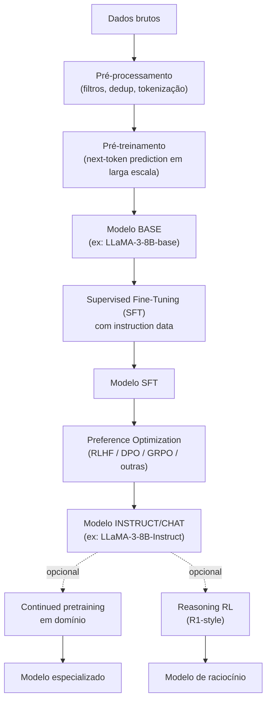

# Módulo 09 — Treinamento e Alinhamento de LLMs

> **Objetivo**: entender o ciclo completo de criação de uma LLM moderna — do pré-treinamento bruto ao modelo "instruct/chat" alinhado, incluindo SFT, DPO, RLHF e variações.
>
> **Pré-requisitos**: Módulos [07](07_transformers.mdx)–[08](08_llms_arquiteturas.md).
>
> **Tempo de referência**: 4–6 semanas.

## Objetivos de aprendizagem

Ao final deste módulo você deve ser capaz de:

- Explicar cada estágio do pipeline (pré-treino → SFT → alinhamento por preferência) e o que cada um adiciona que o anterior não tinha.
- Explicar por que LoRA funciona com uma fração dos parâmetros do fine-tuning completo.
- Explicar a diferença entre RLHF (via PPO) e DPO — e por que DPO ficou popular.
- Diagnosticar catastrophic forgetting e explicar como mitigar durante continued pretraining.
- Escolher a estratégia de paralelismo (DP/TP/PP/FSDP) certa para um cenário de treino dado.

---

## Por que isso importa

Modelos pré-treinados puros são *completion engines*, não assistentes. O comportamento útil ("siga instrução", "recuse pedidos perigosos", "use formato X") é construído em **etapas pós-treinamento**. Entender essas etapas é essencial para:

- Escolher o modelo certo (base vs instruct).
- Fazer fine-tuning sem destruir o modelo (catastrophic forgetting).
- Avaliar trade-offs de safety, performance, custo.

---

## 9.1 Pipeline completo de uma LLM moderna

> Vale a pena voltar a este diagrama depois de ler as seções 9.2–9.6 — cada caixa vira uma seção detalhada, e ter o mapa completo em mente ajuda a situar onde cada técnica entra no ciclo de vida do modelo.

---

## 9.2 Pré-treinamento em escala

### Hardware
- **Centenas a milhares de GPUs** (H100, MI300X) para modelos da escala atual.
- **Interconexão** (NVLink, InfiniBand) é gargalo crítico.
- **Custos**: dezenas de milhões de USD para um modelo grande.

### Paralelismo
- **Data Parallel (DP)**: cada GPU vê batch diferente.
- **Distributed Data Parallel (DDP)** — padrão.
- **Fully Sharded Data Parallel (FSDP)** — particiona pesos, gradientes e estados de otimizador.
- **Tensor Parallel (TP)** — particiona matrizes de atenção/FFN entre GPUs.
- **Pipeline Parallel (PP)** — divide camadas em estágios.
- **Sequence Parallel** — para contextos muito longos.
- **3D parallelism** — combinação de DP + TP + PP.

> **Intuição**: cada tipo de paralelismo divide um recurso diferente. **Data Parallel** dá o modelo *inteiro* pra cada GPU e só divide os *dados* — cada GPU processa um pedaço do batch e depois todas sincronizam gradientes; simples, mas exige que o modelo inteiro caiba em uma GPU. **Tensor Parallel** divide as próprias *matrizes* de peso entre GPUs (metade das colunas de uma matriz numa GPU, metade em outra) — necessário quando uma única camada já não cabe numa GPU, mas exige comunicação intensa entre GPUs a cada operação. **Pipeline Parallel** divide as *camadas*: GPU 1 tem as primeiras 10 camadas, GPU 2 as próximas 10, e os dados fluem em pipeline — menos comunicação que TP, mas introduz "bolhas" de ociosidade enquanto uma GPU espera a anterior terminar. **FSDP** é uma forma mais inteligente de Data Parallel: em vez de cada GPU guardar uma cópia completa do modelo (caro em memória), os pesos ficam fragmentados entre GPUs e são reunidos só durante o cálculo de cada camada, depois descartados — trocando mais comunicação por muito menos memória de pico. Modelos realmente grandes combinam os três (3D parallelism) porque nenhum sozinho resolve tudo: TP para caber uma camada, PP para caber o modelo inteiro, DP para escalar em mais dados/GPUs.
>
> **Checkpoint**: sem olhar o texto, explique a diferença entre Tensor Parallel e Pipeline Parallel — o que cada um divide?

### Frameworks
- **PyTorch FSDP**.
- **DeepSpeed** (Microsoft) — ZeRO 1/2/3.
- **Megatron-LM** (NVIDIA) — TP + PP otimizados.
- **JAX + TPU** — usado pelo Google (T5, Gemma).
- **Hugging Face Accelerate** — abstração mais alta sobre FSDP/DeepSpeed.

### Referências
- `Paper` **ZeRO: Memory Optimizations Toward Training Trillion Parameter Models** — Rajbhandari et al. (2019). https://arxiv.org/abs/1910.02054
- `Paper` **Megatron-LM** — Shoeybi et al. (2019). https://arxiv.org/abs/1909.08053
- `Paper` **PaLM Technical Report** — DeepMind/Google (2022). https://arxiv.org/abs/2204.02311
- `Livro` **The Ultra-Scale Playbook** (Hugging Face, 2024–2025) — guia profundo de paralelismo. https://huggingface.co/spaces/nanotron/ultrascale-playbook

### Cursos
- `Curso` **Stanford CS336 — Language Modeling from Scratch** (literalmente sobre construir LLMs do zero). https://stanford-cs336.github.io/

---

## 9.3 Supervised Fine-Tuning (SFT)

### Objetivo
Pegar um modelo BASE e ensinar a seguir o formato **instruction → response**.

### Dados
- **Instruction datasets**: pares (prompt, resposta) — sintéticos ou humanos.
- **Diálogos multi-turno**: conversas completas.

### Datasets abertos
- **Alpaca** (Stanford, sintético com GPT-3.5). https://crfm.stanford.edu/2023/03/13/alpaca.html
- **Dolly 15k** (Databricks, humano). https://huggingface.co/datasets/databricks/databricks-dolly-15k
- **OpenAssistant Conversations (OASST)**. https://arxiv.org/abs/2304.07327
- **UltraChat / UltraFeedback** (Tsinghua + UCL).
- **Tulu V2/V3** (AI2).
- **Open-Orca**, **SlimOrca**.
- **No Robots** (HuggingFaceH4).

### Técnicas
- **Loss masking**: calcular loss apenas nos tokens de resposta, não de prompt.
- **Packing**: empacotar múltiplas amostras em uma sequência para usar GPU.
- **Mixing**: balancear domínios (chat, código, math).

> **Intuição — loss masking**: o modelo já sabe prever texto genérico bem (pré-treino). SFT quer ensinar especificamente "dado este prompt, gere esta resposta" — se a loss for calculada em cima do prompt também, o modelo gasta capacidade de aprendizado tentando prever o *prompt* (que é dado, não algo a ser gerado), diluindo o sinal de treino que realmente importa: aprender a gerar a resposta certa. Mascarar a loss do prompt (só o zera, ele continua no contexto) foca o gradiente inteiramente em "dado esse contexto, o que eu deveria ter gerado" — que é exatamente o comportamento que SFT quer instalar.
>
> **Checkpoint**: sem olhar o texto, explique por que calcular loss no prompt inteiro (em vez de só na resposta) prejudica o SFT.

### Referências
- `Paper` **Alpaca: A Strong, Replicable Instruction-Following Model**. https://crfm.stanford.edu/2023/03/13/alpaca.html
- `Paper` **Self-Instruct: Aligning Language Models with Self-Generated Instructions** — Wang et al. (2022). https://arxiv.org/abs/2212.10560
- `Paper` **The Tulu 3 Recipe** (AI2, 2024) — receita aberta completa de pós-treinamento. https://arxiv.org/abs/2411.15124

---

## 9.4 Parameter-Efficient Fine-Tuning (PEFT)

### Por que
Fine-tuning completo de um modelo de 70B requer ~1 TB de GPU. PEFT adiciona/treina apenas uma fração pequena dos parâmetros.

### Métodos
- **LoRA (Low-Rank Adaptation)** — adiciona matrizes de baixa-rank A·B aos pesos. `Paper` https://arxiv.org/abs/2106.09685
- **QLoRA** — LoRA + quantização do modelo base em 4-bit. Permite fine-tunar 65B em uma GPU de 48GB. `Paper` https://arxiv.org/abs/2305.14314
- **DoRA** — Weight-Decomposed LoRA (mais expressivo). `Paper` https://arxiv.org/abs/2402.09353
- **Prefix Tuning**, **P-Tuning v2**, **Prompt Tuning** (treinam prefixos no input).
- **(IA)³**, **AdaLoRA** — variantes.

> **Intuição — LoRA**: relembrando o conceito de rank do mod. [01](01_matematica.md#11-álgebra-linear) — a hipótese de LoRA é que a *mudança* necessária nos pesos durante fine-tuning tem rank intrinsecamente baixo, mesmo que os pesos originais não tenham. Em vez de atualizar a matriz de pesos inteira `W` (milhões de parâmetros), LoRA aprende duas matrizes bem menores `A` e `B` cujo produto `A·B` aproxima a atualização necessária — se `W` é `4096×4096` (~16M parâmetros) e o rank escolhido é 8, `A` e `B` juntas têm `2 × 4096 × 8` ≈ 65K parâmetros, uma fração de 1% do original. Durante inferência, `W + A·B` se comporta como se `W` tivesse sido atualizada inteira, mas o treino só precisou ajustar `A` e `B`. QLoRA soma quantização em cima disso: o modelo base congelado fica em 4-bit (mod. [10](10_eficiencia_e_inferencia_local.md) aprofunda por que isso não destrói a qualidade), e só as pequenas matrizes LoRA (que são treinadas) ficam em precisão mais alta.
>
> **Aplicação real**: é por isso que fine-tuning de modelos de dezenas de bilhões de parâmetros virou acessível em uma única GPU de consumo — sem LoRA/QLoRA, isso exigiria um cluster.
>
> **Checkpoint**: sem olhar o texto, explique por que treinar duas matrizes pequenas `A` e `B` pode aproximar bem a atualização de uma matriz grande `W`. Depois, explique o que QLoRA adiciona sobre LoRA puro.

### Ferramentas
- `Ferramenta` **Hugging Face PEFT**. https://huggingface.co/docs/peft
- `Ferramenta` **Unsloth** — fine-tuning otimizado, 2x mais rápido, 70% menos VRAM. https://github.com/unslothai/unsloth
- `Ferramenta` **Axolotl** — config-driven fine-tuning. https://github.com/axolotl-ai-cloud/axolotl
- `Ferramenta` **TRL** (Hugging Face) — training de reinforcement learning. https://huggingface.co/docs/trl

---

## 9.5 Alinhamento via preferências

### O problema
SFT ensina formato. Mas como ensinar **bom** vs **ruim** quando "qualidade" é subjetiva?
**Solução**: aprender com pares de preferência (resposta_A preferida sobre resposta_B).

### RLHF (Reinforcement Learning from Human Feedback)
1. Coletar preferências humanas (pares ranqueados).
2. Treinar **Reward Model (RM)**: dado (prompt, resposta), prediz score de preferência.
3. Treinar política via RL (geralmente **PPO**) usando o RM como recompensa.
4. KL-penalty contra modelo SFT inicial para evitar "reward hacking".

### Papers fundamentais
- `Paper` **Deep Reinforcement Learning from Human Preferences** — Christiano et al. (2017). https://arxiv.org/abs/1706.03741
- `Paper` **InstructGPT (Training language models to follow instructions with human feedback)** — Ouyang et al. (2022). https://arxiv.org/abs/2203.02155
- `Paper` **Constitutional AI: Harmlessness from AI Feedback** — Anthropic (Bai et al., 2022). https://arxiv.org/abs/2212.08073
- `Paper` **Llama 2 paper** — descreve RLHF em detalhe. https://arxiv.org/abs/2307.09288

### Direct Preference Optimization (DPO) e variantes
RLHF é caro e instável. DPO transforma o problema em uma loss supervisionada equivalente (matematicamente derivada do PPO + KL).

- `Paper` **Direct Preference Optimization (DPO)** — Rafailov et al. (2023). https://arxiv.org/abs/2305.18290
- `Paper` **IPO** — Identity Preference Optimization. https://arxiv.org/abs/2310.12036
- `Paper` **KTO (Kahneman-Tversky Optimization)** — não exige pares, só "good/bad". https://arxiv.org/abs/2402.01306
- `Paper` **ORPO** — Monolithic Preference Optimization sem reference model. https://arxiv.org/abs/2403.07691
- `Paper` **GRPO (Group Relative Policy Optimization)** — usado no DeepSeek-R1, sem value model. https://arxiv.org/abs/2402.03300

> **Intuição — por que RLHF é caro**: RLHF precisa manter e treinar **três** modelos simultaneamente — a política (o modelo sendo alinhado), o reward model (que avalia cada resposta gerada) e uma cópia de referência congelada (para o KL-penalty, evitando que a política se afaste demais e "engane" o reward model explorando falhas dele — reward hacking). PPO em cima disso é notoriamente instável e sensível a hiperparâmetros. DPO é uma sacada elegante: matematicamente, é possível mostrar que o objetivo do RLHF tem uma solução ótima que pode ser expressa diretamente em função da política e dos dados de preferência, **sem precisar treinar um reward model separado nem rodar RL**. DPO vira uma loss supervisionada comum — muito mais simples de implementar e estabilizar, o que explica sua popularidade rápida a partir de 2023.
>
> **Aplicação real**: GRPO (usado no DeepSeek-R1) vai um passo além, eliminando também o *value model* do PPO tradicional — em vez de estimar quão boa é uma resposta isoladamente, compara um *grupo* de respostas geradas para o mesmo prompt entre si, usando a média do grupo como baseline. Menos componentes treináveis, mais simples de escalar.
>
> **Checkpoint**: sem olhar o texto, explique por que RLHF via PPO precisa de três modelos simultâneos, e o que DPO elimina dessa equação.

### Referências práticas
- `Ferramenta` **TRL (Hugging Face)** — implementações de PPO, DPO, KTO, ORPO. https://huggingface.co/docs/trl
- `Livro` **Hugging Face — Alignment Handbook**. https://github.com/huggingface/alignment-handbook
- `Livro` **Tulu 3** — receita pública e detalhada de SFT + DPO + GRPO. https://arxiv.org/abs/2411.15124

---

## 9.6 Reasoning RL (estilo R1)

### Conceito
Treinar puramente com RL sobre tarefas verificáveis (matemática, código), sem reward model. Recompensa = "resposta correta".

### Característica
- O modelo "descobre" chain-of-thought longo sozinho.
- Funciona com modelos médios e gera ganhos enormes em raciocínio.

> A intuição de "gastar mais compute em inferência pensando antes de responder" já foi construída no mod. [08](08_llms_arquiteturas.md#85-modelos-de-raciocínio-reasoning) — aqui é onde esse comportamento é efetivamente treinado via RL (mod. [17](17_aprendizado_reforco.md) cobre os fundamentos de RL usados aqui), usando GRPO (seção 9.5) sobre tarefas com resposta verificável automaticamente (matemática, código com testes), o que dispensa reward model treinado em preferências humanas subjetivas.

### Papers
- `Paper` **DeepSeek-R1: Incentivizing Reasoning Capability in LLMs via Reinforcement Learning**. https://arxiv.org/abs/2501.12948
- `Paper` **DeepSeekMath** (introduz GRPO). https://arxiv.org/abs/2402.03300

---

## 9.7 Continued Pretraining (CPT)

### Quando usar
- Adaptar modelo a domínio específico (médico, jurídico, código de empresa) com **muito** texto não-instruct.
- Adaptar a idioma sub-representado.

### Cuidados
- **Catastrophic forgetting**: rodar CPT extenso pode destruir o conhecimento geral.
- Mitigar com **mistura de dados**: 80% domínio novo + 20% genérico.
- Learning rate baixo, warmup curto.

> **Intuição**: catastrophic forgetting acontece porque gradient descent (mod. [05](05_deep_learning.md#53-otimização-e-regularização-para-dl)) não tem memória do que otimizou antes — se você treina exclusivamente em texto jurídico por tempo suficiente, os pesos vão sendo empurrados na direção que minimiza a loss *daquele* domínio, sem nenhuma pressão explícita pra manter o desempenho em inglês genérico ou código. É literalmente o mesmo mecanismo de overfitting (mod. [03](03_ml_classico.md#31-fundamentos-conceituais)), só que "esquecendo" uma tarefa anterior em vez de generalizar mal numa tarefa nova. Misturar uma fração de dados genéricos durante o CPT é uma forma de regularização: mantém pressão de gradiente puxando o modelo a continuar bom no que já sabia, não só no domínio novo.

### Referências
- `Paper` **Continued Pre-Training of Large Language Models: How to (re)warm your model?** https://arxiv.org/abs/2308.04014
- `Paper` **Don't Stop Pretraining** — Gururangan et al. (2020). https://arxiv.org/abs/2004.10964

---

## 9.8 Avaliação durante o treinamento

- **Loss de validação** (mas não basta).
- **Perplexity** em conjuntos held-out por domínio.
- **Benchmarks** (MMLU, GSM8K, HumanEval, etc. — ver mod. [14](14_avaliacao_e_seguranca.md)).
- **Eval qualitativa** (rodadas com prompts próprios).
- **LM-Eval-Harness** (EleutherAI). https://github.com/EleutherAI/lm-evaluation-harness

---

## Projetos práticos

### Projeto 9.1 — SFT em modelo pequeno
- Modelo: TinyLlama 1.1B ou Phi-3 mini.
- Dataset: Alpaca (subset) ou seu próprio dataset de instruções.
- Use Unsloth + QLoRA em GPU única (Colab ou local com 8–16 GB).
- Compare antes/depois em prompts próprios.

> **Variante guiada**: antes de rodar o dataset completo, treine 1 época num subconjunto pequeno (50-100 exemplos) e confirme que o modelo começa a seguir o formato instruction→response nesses mesmos exemplos — se não conseguir nem memorizar um conjunto pequeno, o problema é de configuração (loss masking, chat template), não de escala.

### Projeto 9.2 — DPO em cima do projeto 9.1
- Crie ~500 pares de preferência (manual ou com modelo "juiz" mais forte).
- Aplique DPO via TRL.
- Compare DPO vs SFT puro.

### Projeto 9.3 — CPT em PT-BR
- Pegue um modelo base (Gemma 2B, Qwen 2.5 1.5B).
- Faça continued pretraining em corpus PT-BR (Wikipedia em português, OSCAR-PT).
- Avalie qualidade em PT-BR antes/depois.
- Documente catastrophic forgetting (testando inglês/código).

> **Variante guiada**: meça a performance em inglês/código *antes* de começar o CPT, não só depois — sem uma linha de base, "catastrophic forgetting" vira uma impressão subjetiva em vez de um número comparável.

### Projeto 9.4 — Reproduzir pipeline pequeno do Tulu
- Siga o **Alignment Handbook** ou a receita do Tulu 3.
- Modelo: pequeno (≤7B), GPU única.
- Faça SFT + DPO end-to-end.
- Avalie em LM-Eval-Harness.

### Projeto 9.5 — Reasoning RL minimalista
- Use TRL com GRPO.
- Tarefa: aritmética simples ou problemas verificáveis pequenos.
- Recompensa: parser de resposta correta.
- Observe se "chain of thought" emerge.

---

## Erros comuns

- **Treinar SFT em formato errado** — cada modelo tem seu chat template (ChatML, Llama-3, Gemma, etc.). Não respeitar isso destrói performance.
- **Misturar BOS/EOS errados** — bug silencioso comum.
- **Loss em todos os tokens** em vez de só na resposta — fine-tuning ruim.
- **DPO sem reference model bem ajustado** — colapso de comportamento.
- **Achar que catastrophic forgetting não é real** — sempre teste capacidades antigas após CPT.
- **Avaliar só em "vibe check"** — sem benchmarks objetivos, é folclore.

---

## Conexão com módulos seguintes

| Conceito daqui | Aparece em |
|---|---|
| LoRA, QLoRA | Eficiência (mod. [10](10_eficiencia_e_inferencia_local.md)), customização (mod. [13](13_agentes_tools_protocolos.md)) |
| Chat templates | Prompt engineering (mod. [11](11_prompt_engineering.md)), Agentes (mod. [13](13_agentes_tools_protocolos.md)) |
| RLHF/DPO mindset | Avaliação (mod. [14](14_avaliacao_e_seguranca.md)), safety |
| Reasoning RL | Agentes complexos (mod. [13](13_agentes_tools_protocolos.md)) |

---

## Checklist de saída

- [ ] Sei distinguir base, SFT e instruct/chat de um mesmo modelo.
- [ ] Apliquei LoRA/QLoRA com sucesso em modelo ≥3B.
- [ ] Apliquei DPO em cenário real (mesmo que pequeno).
- [ ] Sei o que é GRPO e quando faz sentido.
- [ ] Entendo paralelismo (DDP, FSDP, TP, PP) suficientemente para escolher estratégia.
- [ ] Sei o que muda entre SFT, RLHF, DPO, KTO conceitualmente.
