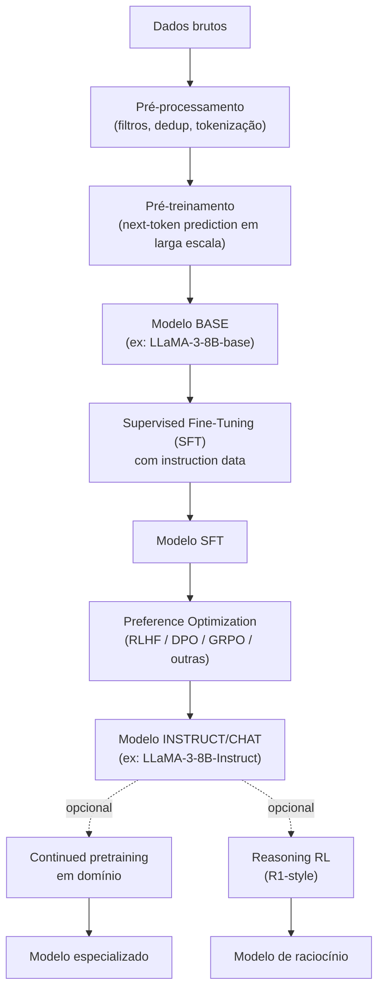

# Módulo 09 — Treinamento e Alinhamento de LLMs

> **Objetivo**: entender o ciclo completo de criação de uma LLM moderna — do pré-treinamento bruto ao modelo "instruct/chat" alinhado, incluindo SFT, DPO, RLHF e variações — e sair com um modelo pequeno que você mesmo levou de base a instruct, com LoRA e DPO aplicados na prática.
>
> **Pré-requisitos**: Módulo [08](08_llms_arquiteturas.md) — em particular, você já implementou um Transformer decoder-only e um loop de treino do zero no Projeto 8.3. Este módulo assume esse loop como ponto de partida e ensina, ali onde for preciso, o que muda ao usar bibliotecas de produção (Hugging Face `transformers`, `peft`, `trl`) em vez de PyTorch puro.
>
> **Tempo de referência**: 4–6 semanas.

## Objetivos de aprendizagem

Ao final deste módulo você deve ser capaz de:

- Explicar cada estágio do pipeline (pré-treino → SFT → alinhamento por preferência) e o que cada um adiciona que o anterior não tinha.
- Explicar por que LoRA funciona com uma fração dos parâmetros do fine-tuning completo.
- Explicar a diferença entre RLHF (via PPO) e DPO — e por que DPO ficou popular.
- Diagnosticar catastrophic forgetting e explicar como mitigar durante continued pretraining.
- Escolher a estratégia de paralelismo (DP/TP/PP/FSDP) certa para um cenário de treino dado.

---

## Por que isso importa

Modelos pré-treinados puros são motores de completar texto, não assistentes — dado um começo de frase, eles continuam da forma estatisticamente mais provável, o que nem sempre é "responder à pergunta do usuário". O comportamento que se espera de um assistente (seguir instrução, recusar pedidos perigosos, responder num formato específico) é construído em etapas de pós-treinamento, que são o assunto deste módulo. Entender essas etapas é o que permite escolher entre um modelo base e um instruct com propósito, fazer fine-tuning sem destruir o que o modelo já sabia, e avaliar os trade-offs de segurança, performance e custo de cada abordagem.

---

## 9.1 Pipeline completo de uma LLM moderna



Vale a pena voltar a este diagrama depois de ler as seções 9.2–9.6: cada caixa vira uma seção detalhada, e ter o mapa completo em mente ajuda a situar onde cada técnica entra no ciclo de vida do modelo. Os Projetos 9.1 e 9.2 percorrem, em miniatura, o caminho `Modelo BASE → SFT → DPO`.

---

## 9.2 Pré-treinamento em escala

### Hardware
- **Centenas a milhares de GPUs** (H100, MI300X) para modelos da escala atual.
- **Interconexão** (NVLink, InfiniBand) é gargalo crítico.
- **Custos**: dezenas de milhões de USD para um modelo grande.

### Paralelismo
- **Data Parallel (DP)**: cada GPU vê batch diferente.
- **Distributed Data Parallel (DDP)** — padrão.
- **Fully Sharded Data Parallel (FSDP)** — particiona pesos, gradientes e estados de otimizador.
- **Tensor Parallel (TP)** — particiona matrizes de atenção/FFN entre GPUs.
- **Pipeline Parallel (PP)** — divide camadas em estágios.
- **Sequence Parallel** — para contextos muito longos.
- **3D parallelism** — combinação de DP + TP + PP.

> **Intuição**: cada tipo de paralelismo divide um recurso diferente. **Data Parallel** dá o modelo *inteiro* pra cada GPU e só divide os *dados* — cada GPU processa um pedaço do batch e depois todas sincronizam gradientes; simples, mas exige que o modelo inteiro caiba em uma GPU. **Tensor Parallel** divide as próprias *matrizes* de peso entre GPUs (metade das colunas de uma matriz numa GPU, metade em outra) — necessário quando uma única camada já não cabe numa GPU, mas exige comunicação intensa entre GPUs a cada operação. **Pipeline Parallel** divide as *camadas*: GPU 1 tem as primeiras 10 camadas, GPU 2 as próximas 10, e os dados fluem em pipeline — menos comunicação que TP, mas introduz "bolhas" de ociosidade enquanto uma GPU espera a anterior terminar. **FSDP** é uma forma mais inteligente de Data Parallel: em vez de cada GPU guardar uma cópia completa do modelo (caro em memória), os pesos ficam fragmentados entre GPUs e são reunidos só durante o cálculo de cada camada, depois descartados — trocando mais comunicação por muito menos memória de pico. Modelos realmente grandes combinam os três (3D parallelism) porque nenhum sozinho resolve tudo: TP para caber uma camada, PP para caber o modelo inteiro, DP para escalar em mais dados/GPUs.
>
> **Checkpoint**: sem olhar o texto, explique a diferença entre Tensor Parallel e Pipeline Parallel — o que cada um divide?

Bibliotecas que implementam isso incluem PyTorch FSDP (nativo), DeepSpeed (Microsoft, com os estágios de otimização ZeRO), Megatron-LM (NVIDIA, TP+PP), e Hugging Face Accelerate, que abstrai as três acima sob uma interface comum. Você não precisa das duas primeiras seções (Hardware, Paralelismo) para os projetos deste módulo — os modelos usados aqui são pequenos o bastante para caber numa única GPU — mas precisa entender os conceitos para interpretar por que treinar um modelo de verdade em escala exige toda essa engenharia adicional.

---

## 9.3 Supervised Fine-Tuning (SFT)

### Objetivo
Pegar um modelo BASE — que só sabe continuar texto — e ensinar a seguir o formato **instrução → resposta**.

### Dados
- **Instruction datasets**: pares (prompt, resposta) — sintéticos ou humanos.
- **Diálogos multi-turno**: conversas completas.

Datasets abertos usados com frequência: Alpaca (Stanford, gerado sinteticamente com um modelo mais forte), Dolly 15k (Databricks, anotado por humanos), OpenAssistant Conversations, UltraChat/UltraFeedback, Tulu (AI2). Você usa um subconjunto do Alpaca no Projeto 9.1.

### Técnicas
- **Loss masking**: calcular loss apenas nos tokens de resposta, não de prompt.
- **Packing**: empacotar múltiplas amostras em uma sequência para usar GPU.
- **Mixing**: balancear domínios (chat, código, math).

> **Intuição — loss masking**: o modelo já sabe prever texto genérico bem (pré-treino). SFT quer ensinar especificamente "dado este prompt, gere esta resposta" — se a loss for calculada em cima do prompt também, o modelo gasta capacidade de aprendizado tentando prever o *prompt* (que é dado, não algo a ser gerado), diluindo o sinal de treino que realmente importa: aprender a gerar a resposta certa. Mascarar a loss do prompt (só o zera, ele continua no contexto) foca o gradiente inteiramente em "dado esse contexto, o que eu deveria ter gerado" — que é exatamente o comportamento que SFT quer instalar. Isso é uma variação do mesmo `cross_entropy` que você já usou no loop de treino do Projeto 8.3 — a diferença é que, ali, todo token contava para a loss; aqui, os tokens do prompt são substituídos por um valor sentinela (`-100`, convenção do PyTorch) que `cross_entropy` ignora automaticamente.
>
> **Checkpoint**: sem olhar o texto, explique por que calcular loss no prompt inteiro (em vez de só na resposta) prejudica o SFT.

---

## 9.4 Parameter-Efficient Fine-Tuning (PEFT)

### Por que
Fine-tuning completo de um modelo de 70B requer atualizar (e guardar o otimizador de) 70 bilhões de parâmetros — na prática, ~1 TB de memória de GPU. PEFT adiciona e treina apenas uma fração pequena dos parâmetros, mantendo o modelo original congelado.

### Métodos
- **LoRA (Low-Rank Adaptation)** — adiciona matrizes de baixa-rank A·B aos pesos (explicado abaixo em detalhe — é o método usado no Projeto 9.1).
- **QLoRA** — LoRA aplicado sobre um modelo base carregado em 4-bit (quantizado). Permite fine-tunar modelos de dezenas de bilhões de parâmetros numa única GPU de 48GB.
- **DoRA** — decompõe o peso em magnitude e direção antes de aplicar a atualização de baixo rank, o que captura mudanças que LoRA puro tem mais dificuldade em representar.
- **Prefix Tuning / P-Tuning v2 / Prompt Tuning** — em vez de modificar pesos, treinam um pequeno conjunto de vetores extras prependados à entrada de cada camada (ou só na entrada), que a rede aprende a usar como um "prompt contínuo".
- **(IA)³, AdaLoRA** — variantes que escalam ativações internas ((IA)³) ou alocam o orçamento de rank dinamicamente entre camadas (AdaLoRA), em vez de usar o mesmo rank fixo em todo lugar como o LoRA padrão.

> **Intuição — LoRA**: relembrando o conceito de rank do mod. [01](01_matematica.md#11-álgebra-linear) — a hipótese de LoRA é que a *mudança* necessária nos pesos durante fine-tuning tem rank intrinsecamente baixo, mesmo que os pesos originais não tenham. Em vez de atualizar a matriz de pesos inteira `W` (milhões de parâmetros), LoRA aprende duas matrizes bem menores `A` e `B` cujo produto `A·B` aproxima a atualização necessária — se `W` é `4096×4096` (~16M parâmetros) e o rank escolhido é 8, `A` e `B` juntas têm `2 × 4096 × 8` ≈ 65K parâmetros, uma fração de 1% do original. Durante inferência, `W + A·B` se comporta como se `W` tivesse sido atualizada inteira, mas o treino só precisou ajustar `A` e `B`. QLoRA soma quantização em cima disso: o modelo base congelado fica em 4-bit (mod. [10](10_eficiencia_e_inferencia_local.md) aprofunda por que isso não destrói a qualidade), e só as pequenas matrizes LoRA (que são treinadas) ficam em precisão mais alta. Você aplica exatamente essa combinação no Projeto 9.1.
>
> **Aplicação real**: é por isso que fine-tuning de modelos de dezenas de bilhões de parâmetros virou acessível em uma única GPU de consumo — sem LoRA/QLoRA, isso exigiria um cluster.
>
> **Checkpoint**: sem olhar o texto, explique por que treinar duas matrizes pequenas `A` e `B` pode aproximar bem a atualização de uma matriz grande `W`. Depois, explique o que QLoRA adiciona sobre LoRA puro.

As bibliotecas que você usa nos projetos deste módulo são a `peft` (Hugging Face, implementa LoRA/QLoRA/DoRA), a `trl` (Hugging Face, implementa os loops de treino de SFT/DPO/GRPO sobre um modelo PEFT) e o `Unsloth`, uma reimplementação otimizada de LoRA/QLoRA que costuma treinar mais rápido e usar menos memória que a combinação padrão — mencionado aqui como alternativa, os projetos abaixo usam a pilha padrão (`transformers` + `peft` + `trl`) por ser mais explícita sobre o que está acontecendo.

---

## 9.5 Alinhamento via preferências

### O problema
SFT ensina formato. Mas como ensinar **bom** vs **ruim** quando "qualidade" é subjetiva?
**Solução**: aprender com pares de preferência (resposta_A preferida sobre resposta_B).

### RLHF (Reinforcement Learning from Human Feedback)
1. Coletar preferências humanas (pares ranqueados).
2. Treinar **Reward Model (RM)**: dado (prompt, resposta), prediz score de preferência.
3. Treinar política via RL (geralmente **PPO**) usando o RM como recompensa.
4. KL-penalty contra modelo SFT inicial para evitar "reward hacking".

RLHF foi a técnica usada para alinhar o InstructGPT (o modelo por trás do ChatGPT original) e é descrita em detalhe no paper do LLaMA 2 — vale a leitura se você quiser entender a receita completa usada num modelo de produção.

### Direct Preference Optimization (DPO) e variantes
RLHF é caro e instável: PPO tem fama de sensível a hiperparâmetros, e manter três modelos treináveis/carregados ao mesmo tempo (política, reward model, referência) é caro em memória. DPO, proposto por Rafailov et al. em 2023, transforma o problema numa loss supervisionada equivalente, derivada matematicamente do mesmo objetivo que RLHF otimiza — sem precisar treinar um reward model separado nem rodar RL. É o método que você usa no Projeto 9.2.

Variantes que surgiram depois de DPO, cada uma simplificando ou ajustando algo diferente: **IPO** troca a função de perda do DPO por uma menos sensível a preferências ruidosas ou pouco consistentes; **KTO** dispensa até os pares de preferência, bastando rotular cada resposta individualmente como "boa" ou "ruim"; **ORPO** elimina o modelo de referência que o DPO ainda usa, combinando SFT e alinhamento por preferência num único passo de treino; **GRPO** (usado no DeepSeek-R1) elimina o *value model* do PPO tradicional, comparando um grupo de respostas geradas para o mesmo prompt entre si em vez de estimar o valor de cada resposta isoladamente — é o método usado no Projeto 9.5.

> **Intuição — por que RLHF é caro**: RLHF precisa manter e treinar **três** modelos simultaneamente — a política (o modelo sendo alinhado), o reward model (que avalia cada resposta gerada) e uma cópia de referência congelada (para o KL-penalty, evitando que a política se afaste demais e "engane" o reward model explorando falhas dele — reward hacking). PPO em cima disso é notoriamente instável e sensível a hiperparâmetros. DPO evita os três: a loss do DPO usa apenas a política sendo treinada e uma cópia congelada dela mesma como referência (nenhum reward model separado), comparando diretamente a probabilidade que o modelo atribui à resposta preferida contra a probabilidade que atribui à resposta rejeitada.
>
> **Aplicação real**: GRPO vai um passo além de DPO, eliminando também o modelo de referência para o cálculo de vantagem — em vez de comparar contra uma cópia congelada, usa a média das recompensas dentro do próprio grupo de respostas geradas para o mesmo prompt como linha de base. Menos componentes treináveis, mais simples de escalar — e funciona bem quando a recompensa pode ser calculada automaticamente (resposta certa/errada), como no Projeto 9.5.
>
> **Checkpoint**: sem olhar o texto, explique por que RLHF via PPO precisa de três modelos simultâneos, e o que DPO elimina dessa equação.

---

## 9.6 Reasoning RL (estilo R1)

### Conceito
Treinar puramente com RL sobre tarefas verificáveis (matemática, código), sem reward model. Recompensa = "resposta correta".

### Característica
- O modelo "descobre" chain-of-thought longo sozinho.
- Funciona com modelos médios e gera ganhos enormes em raciocínio.

A intuição de "gastar mais compute em inferência pensando antes de responder" já foi construída no mod. [08](08_llms_arquiteturas.md#85-modelos-de-raciocínio-reasoning) — aqui é onde esse comportamento é efetivamente treinado via RL (mod. [17](17_aprendizado_reforco.md) cobre os fundamentos de RL usados aqui), usando GRPO (seção 9.5) sobre tarefas com resposta verificável automaticamente (matemática, código com testes), o que dispensa reward model treinado em preferências humanas subjetivas. O Projeto 9.5 aplica exatamente essa ideia, em miniatura, sobre aritmética simples.

---

## 9.7 Continued Pretraining (CPT)

### Quando usar
- Adaptar modelo a domínio específico (médico, jurídico, código de empresa) com **muito** texto não-instruct.
- Adaptar a idioma sub-representado.

### Cuidados
- **Catastrophic forgetting**: rodar CPT extenso pode destruir o conhecimento geral.
- Mitigar com **mistura de dados**: 80% domínio novo + 20% genérico.
- Learning rate baixo, warmup curto.

> **Intuição**: catastrophic forgetting acontece porque gradient descent (mod. [05](05_deep_learning.md#53-otimização-e-regularização-para-dl)) não tem memória do que otimizou antes — se você treina exclusivamente em texto jurídico por tempo suficiente, os pesos vão sendo empurrados na direção que minimiza a loss *daquele* domínio, sem nenhuma pressão explícita pra manter o desempenho em inglês genérico ou código. É o mesmo mecanismo do overfitting (mod. [03](03_ml_classico.md#31-fundamentos-conceituais)), só que "esquecendo" uma tarefa anterior em vez de generalizar mal numa tarefa nova. Misturar uma fração de dados genéricos durante o CPT é uma forma de regularização: mantém pressão de gradiente puxando o modelo a continuar bom no que já sabia, não só no domínio novo. O Projeto 9.3 mede esse efeito diretamente, comparando a **perplexity** do modelo em inglês antes e depois do CPT em português — perplexity é `exp(loss)`, a mesma cross-entropy que você já usa, só reportada numa escala mais interpretável (quanto menor, melhor; um modelo "perfeito" teria perplexity 1).

---

## 9.8 Avaliação durante o treinamento

- **Loss de validação** — mede ajuste ao dado, mas não diz se o modelo é "bom" num sentido mais amplo.
- **Perplexity** em conjuntos held-out por domínio — `exp(loss)`, ver seção 9.7.
- **Benchmarks** (MMLU, GSM8K, HumanEval, etc. — o mod. [14](14_avaliacao_e_seguranca.md) aprofunda como interpretar cada um).
- **Eval qualitativa** — rodadas com prompts próprios, como você já fez no Projeto 8.1.
- **LM-Eval-Harness** (EleutherAI) — ferramenta padrão da comunidade para rodar um modelo contra dezenas de benchmarks com um único comando; usada no Projeto 9.4.

---

## Projetos práticos

### Projeto 9.1 — SFT em modelo pequeno com LoRA

Você vai pegar um modelo BASE pequeno (que só completa texto) e ensiná-lo a seguir instruções, usando LoRA para treinar só uma fração dos parâmetros. Ao final, você compara o modelo antes e depois do SFT no mesmo prompt.

**Pré-requisitos**:
- GPU com pelo menos 8-12 GB de VRAM (uma GPU T4 gratuita do Google Colab serve) — CPU funciona, mas o treino fica lento demais para ser prático.
- `pip install transformers peft trl datasets bitsandbytes accelerate`.

**O que muda em relação ao Projeto 8.3**: lá, você construiu um tokenizador caractere-a-caractere do zero e um modelo pequeno também do zero. Aqui, você carrega um modelo e um tokenizador **já pré-treinados** pela Hugging Face — um tokenizador de verdade (baseado em BPE, que agrupa sequências de caracteres frequentes num único token, mencionado na seção 8.3) e um modelo que já sabe gerar texto coerente, só não sabe seguir instruções ainda.

**1. Carregue o modelo base em 4-bit** — isto é literalmente o "Q" de QLoRA: o modelo original fica comprimido para ocupar 1/4 da memória, e é sobre essa versão congelada e comprimida que as matrizes LoRA (treináveis, em precisão normal) são adicionadas:

```python
import torch
from transformers import AutoModelForCausalLM, AutoTokenizer, BitsAndBytesConfig

model_id = "Qwen/Qwen2.5-0.5B"

bnb_config = BitsAndBytesConfig(
    load_in_4bit=True,
    bnb_4bit_quant_type="nf4",
    bnb_4bit_compute_dtype=torch.bfloat16,
)

tokenizer = AutoTokenizer.from_pretrained(model_id)
model = AutoModelForCausalLM.from_pretrained(model_id, quantization_config=bnb_config, device_map="auto")
```

`BitsAndBytesConfig` descreve como quantizar: `nf4` é um formato de 4 bits calibrado para pesos de rede neural (melhor que uma quantização genérica); `bnb_4bit_compute_dtype` define em que precisão os cálculos são feitos internamente (os pesos ficam comprimidos em 4-bit, mas a multiplicação de matrizes é expandida para `bfloat16` durante o cálculo). `device_map="auto"` deixa a biblioteca decidir automaticamente em qual dispositivo (GPU, se disponível) colocar o modelo.

**2. Configure LoRA e prepare o modelo para treino em 4-bit**:

```python
from peft import LoraConfig, get_peft_model, prepare_model_for_kbit_training

model = prepare_model_for_kbit_training(model)

lora_config = LoraConfig(
    r=8,
    lora_alpha=16,
    target_modules=["q_proj", "k_proj", "v_proj", "o_proj"],
    lora_dropout=0.05,
    task_type="CAUSAL_LM",
)
model = get_peft_model(model, lora_config)
model.print_trainable_parameters()
```

`prepare_model_for_kbit_training` ajusta alguns detalhes numéricos necessários para treinar em cima de pesos quantizados (por exemplo, mantém certas camadas em precisão mais alta para estabilidade). `LoraConfig` é a tradução direta da intuição da seção 9.4 para código: `r=8` é o rank das matrizes `A`/`B` (quanto maior, mais parâmetros treináveis e mais expressivo, com retornos decrescentes); `target_modules` lista em quais camadas do modelo (aqui, as projeções de Query/Key/Value/Output da attention — o mesmo `q_proj`/`k_proj`/`v_proj` que você escreveu à mão no `GQACausalSelfAttention` do Projeto 8.3) o LoRA é aplicado; `lora_alpha` escala a contribuição de `A·B` sobre o peso original. `model.print_trainable_parameters()` imprime quantos parâmetros de fato serão treinados — normalmente bem menos de 1% do total.

**3. Carregue e formate um dataset de instruções**:

```python
from datasets import load_dataset

dataset = load_dataset("tatsu-lab/alpaca", split="train[:300]")

def format_example(example):
    messages = [
        {"role": "user", "content": example["instruction"] + ("\n" + example["input"] if example["input"] else "")},
        {"role": "assistant", "content": example["output"]},
    ]
    return {"text": tokenizer.apply_chat_template(messages, tokenize=False)}

dataset = dataset.map(format_example)
```

O Alpaca vem como colunas separadas (`instruction`, `input`, `output`); `format_example` monta isso no formato de conversa (`messages`) que os modelos de chat esperam. `tokenizer.apply_chat_template` é o que traduz essa lista de mensagens para o **chat template** específico do Qwen2.5 — a sequência exata de tokens especiais (algo como `<|im_start|>user ... <|im_end|>`) que o modelo foi desenhado para reconhecer como "aqui começa a fala do usuário", "aqui começa a resposta do assistente". Cada família de modelo (LLaMA, Qwen, Gemma) tem o seu; usar o template errado é um dos erros mais comuns e silenciosos em fine-tuning (voltamos a isso em "Erros comuns").

**4. Treine com `SFTTrainer`** — ele já implementa o loop de treino (o mesmo `forward` → `loss` → `backward` → `step` do Projeto 8.3) mais o loss masking da seção 9.3, então você não escreve esse loop à mão desta vez:

```python
from trl import SFTConfig, SFTTrainer

sft_config = SFTConfig(
    output_dir="./qwen-sft",
    num_train_epochs=1,
    per_device_train_batch_size=4,
    gradient_accumulation_steps=4,
    learning_rate=2e-4,
    logging_steps=10,
    save_strategy="epoch",
)

trainer = SFTTrainer(
    model=model,
    args=sft_config,
    train_dataset=dataset,
)
trainer.train()
trainer.save_model("./qwen-sft-adapter")
```

`gradient_accumulation_steps=4` acumula gradientes de 4 mini-batches antes de dar um passo do otimizador — simula um batch 4x maior sem precisar da memória para carregá-lo de uma vez, útil numa GPU pequena. `trainer.save_model` salva só o adaptador LoRA (as matrizes `A`/`B`, poucos megabytes), não o modelo base inteiro.

**5. Compare antes e depois**:

```python
def generate_response(model, prompt):
    messages = [{"role": "user", "content": prompt}]
    inputs = tokenizer.apply_chat_template(messages, tokenize=True, add_generation_prompt=True, return_tensors="pt").to(model.device)
    output = model.generate(inputs, max_new_tokens=100)
    return tokenizer.decode(output[0][inputs.shape[1]:], skip_special_tokens=True)

print(generate_response(model, "Explique o que é overfitting em uma frase."))
```

`model.generate` faz o mesmo que a função `generate` que você escreveu manualmente no Projeto 8.3 (amostrar token a token até um limite) — só que aqui é o método pronto da biblioteca, com opções adicionais (temperatura, top-p, etc.) que você pode explorar depois. Rode essa função antes de qualquer treino (no modelo base, sem LoRA aplicado) e depois do treino, com o mesmo prompt, e compare: o modelo base tende a continuar a frase de forma solta; o modelo pós-SFT tende a responder diretamente à instrução.

> Antes de rodar o dataset inteiro (300 exemplos), vale treinar 1 época num subconjunto bem pequeno (30-50 exemplos) e confirmar que o modelo consegue pelo menos memorizar esses exemplos — gerar quase literalmente a resposta esperada para um prompt visto no treino. Se nem isso acontece, o problema é de configuração (chat template errado, loss não mascarada corretamente), não de escala — aumentar o dataset não resolve um bug de configuração.

---

### Projeto 9.2 — DPO em cima do Projeto 9.1

Você vai gerar um pequeno dataset de preferências usando os próprios modelos do Ollama que já instalou no Projeto 8.1 (como "juízes"), e usar esse dataset para alinhar por preferência, com DPO, o modelo que você treinou com SFT no Projeto 9.1.

**Pré-requisitos**: os mesmos do Projeto 9.1, mais o Ollama do Projeto 8.1 rodando localmente (para gerar as preferências), mais `pip install trl` (já instalado no 9.1).

**1. Gere pares de respostas e peça a um modelo mais forte para julgar qual é melhor** — isto reaproveita exatamente o padrão de `requests.post` ao Ollama do Projeto 8.1, só que agora usando a resposta de um modelo como entrada de um prompt para outro modelo:

```python
import requests
import json

def ask_ollama(model, prompt):
    response = requests.post(
        "http://localhost:11434/api/generate",
        json={"model": model, "prompt": prompt, "stream": False},
    )
    return response.json()["response"]

prompts = [
    "Explique o que é overfitting para um iniciante.",
    "Escreva uma função Python que verifica se um número é primo.",
    # adicione até ~30-50 prompts próprios
]

preference_pairs = []
for prompt in prompts:
    response_a = ask_ollama("llama3:8b", prompt)
    response_b = ask_ollama("qwen2.5:7b", prompt)
    judge_prompt = (
        f"Prompt: {prompt}\n\nResposta A: {response_a}\n\nResposta B: {response_b}\n\n"
        "Qual resposta é mais clara, correta e útil? Responda apenas 'A' ou 'B'."
    )
    verdict = ask_ollama("mistral:7b", judge_prompt).strip().upper()
    chosen, rejected = (response_a, response_b) if "A" in verdict else (response_b, response_a)
    preference_pairs.append({"prompt": prompt, "chosen": chosen, "rejected": rejected})

with open("preferences.jsonl", "w") as f:
    for pair in preference_pairs:
        f.write(json.dumps(pair, ensure_ascii=False) + "\n")
```

Cada iteração gera duas respostas candidatas (de dois modelos diferentes, para que sejam de fato diferentes) e usa um terceiro modelo como juiz para decidir qual é melhor — essa é uma forma simples e barata de gerar dados de preferência sem anotação humana, o mesmo princípio usado por datasets como o UltraFeedback (mencionado na seção 9.3), só que em escala muito menor. Use um número de prompts pequeno (30-50) para este experimento — o objetivo é entender o mecanismo, não produzir um dataset de qualidade de produção.

**2. Treine com `DPOTrainer`**:

```python
from datasets import Dataset
from trl import DPOConfig, DPOTrainer

dpo_dataset = Dataset.from_list(preference_pairs)

dpo_config = DPOConfig(
    output_dir="./qwen-dpo",
    num_train_epochs=1,
    per_device_train_batch_size=2,
    learning_rate=5e-5,
    beta=0.1,
)

dpo_trainer = DPOTrainer(
    model=model,               # o modelo já com o adaptador LoRA do Projeto 9.1 carregado
    args=dpo_config,
    train_dataset=dpo_dataset,
    processing_class=tokenizer,
)
dpo_trainer.train()
dpo_trainer.save_model("./qwen-dpo-adapter")
```

`DPOTrainer` espera um dataset com colunas `prompt`, `chosen` e `rejected` — exatamente o que o passo 1 produziu. `beta` controla o quanto a política pode se afastar do modelo de referência (aqui, o próprio modelo antes do DPO): valores maiores mantêm o modelo mais próximo do comportamento original, valores menores permitem mudanças mais agressivas em direção às preferências — é o mesmo KL-penalty da intuição da seção 9.5, exposto como um hiperparâmetro. Diferente do `SFTTrainer`, você não precisa instanciar nem gerenciar manualmente um modelo de referência separado: quando o modelo passado já é um modelo PEFT (com adaptador LoRA), o `DPOTrainer` usa o próprio modelo base congelado (sem o adaptador) como referência automaticamente.

**3. Compare os três estágios**: rode `generate_response` (a mesma função do Projeto 9.1) com o modelo base, com o modelo pós-SFT, e com o modelo pós-SFT+DPO, no mesmo conjunto de prompts, e compare as três respostas lado a lado. Você deve observar o modelo base completando texto de forma solta, o modelo SFT respondendo no formato certo mas talvez de forma mais genérica, e o modelo SFT+DPO tendendo a respostas mais alinhadas ao que o "juiz" considerou melhor nos exemplos de treino.

---

### Projeto 9.3 — Continued Pretraining (CPT) em PT-BR

Você vai continuar o pré-treinamento de um modelo pequeno sobre um corpus em português, e medir diretamente o catastrophic forgetting comparando a perplexity em inglês antes e depois.

**Pré-requisitos**: os mesmos do Projeto 9.1.

**1. Carregue um corpus em português via streaming** (a Wikipedia em português inteira é grande demais para baixar por completo neste experimento; `streaming=True` permite ler pedaço por pedaço sem baixar tudo):

```python
from datasets import load_dataset
from itertools import islice

pt_stream = load_dataset("wikimedia/wikipedia", "20231101.pt", split="train", streaming=True)
pt_texts = [example["text"] for example in islice(pt_stream, 2000)]
```

`islice(pt_stream, 2000)` pega os primeiros 2000 artigos do stream, sem carregar o dataset inteiro (que tem mais de 1 milhão de artigos) na memória.

**2. Meça a perplexity em inglês *antes* do CPT** — sem essa linha de base, você não tem como afirmar que houve esquecimento, só uma impressão subjetiva:

```python
import torch

def compute_perplexity(model, tokenizer, texts):
    model.eval()
    losses = []
    with torch.no_grad():
        for text in texts:
            inputs = tokenizer(text, return_tensors="pt", truncation=True, max_length=512).to(model.device)
            loss = model(**inputs, labels=inputs["input_ids"]).loss
            losses.append(loss.item())
    return torch.exp(torch.tensor(losses).mean()).item()

english_eval_texts = [
    "The transformer architecture relies on self-attention to process sequences in parallel.",
    "Overfitting occurs when a model memorizes training data instead of generalizing.",
    # adicione mais frases técnicas em inglês, ~20-30 no total
]

ppl_before = compute_perplexity(model, tokenizer, english_eval_texts)
print(f"Perplexity em inglês, antes do CPT: {ppl_before:.2f}")
```

Passar `labels=inputs["input_ids"]` para o modelo faz com que ele calcule a loss internamente (prevendo cada token a partir dos anteriores, o mesmo `cross_entropy` de sempre); `torch.exp(loss)` converte essa loss em perplexity, como descrito na seção 9.7.

**3. Rode o continued pretraining** — note que aqui a loss é calculada sobre o texto **inteiro** (não há prompt/resposta a mascarar, como no SFT: você só está continuando o pré-treinamento bruto, agora sobre texto em português):

```python
from trl import SFTConfig, SFTTrainer
from datasets import Dataset

cpt_dataset = Dataset.from_dict({"text": pt_texts})

cpt_config = SFTConfig(
    output_dir="./qwen-cpt-pt",
    num_train_epochs=1,
    per_device_train_batch_size=4,
    learning_rate=1e-5,           # bem mais baixo que o SFT — CPT deve mudar o modelo devagar
    logging_steps=20,
)
cpt_trainer = SFTTrainer(model=model, args=cpt_config, train_dataset=cpt_dataset)
cpt_trainer.train()
```

Reutilizamos o `SFTTrainer` porque, sem colunas de conversa (`chosen`/`rejected`/`messages`), ele se comporta como um treino de linguagem padrão sobre a coluna `text` — sem loss masking, já que não há prompt a distinguir de resposta. O learning rate propositalmente mais baixo (`1e-5` contra `2e-4` do SFT) é a mitigação de catastrophic forgetting mencionada na seção 9.7: passos menores mudam o modelo mais devagar, reduzindo o quanto ele se afasta do que já sabia.

**4. Meça a perplexity em inglês de novo, depois do CPT**, com o mesmo `compute_perplexity` e o mesmo `english_eval_texts` do passo 2, e compare com `ppl_before`. Um aumento pequeno é esperado (algum esquecimento é normal); um aumento grande indica que o CPT foi longe demais ou o learning rate estava alto — nesse caso, misturar uma fração de texto em inglês genérico junto ao corpus em português (a mitigação de "mistura de dados" da seção 9.7) é o próximo passo a testar.

---

### Projeto 9.4 — Pipeline SFT + DPO documentado, avaliado com LM-Eval-Harness

Este projeto não introduz treino novo — ele empacota os Projetos 9.1 e 9.2 como um pipeline reproduzível e usa uma ferramenta de avaliação padrão da comunidade para medir, com benchmarks objetivos, se cada etapa (base → SFT → SFT+DPO) de fato melhorou o modelo.

**Pré-requisitos**: ter completado os Projetos 9.1 e 9.2 (os adaptadores salvos em `./qwen-sft-adapter` e `./qwen-dpo-adapter`), mais `pip install lm-eval`.

**1. Documente o pipeline como um único script** que carrega o modelo base, aplica o adaptador SFT, treina DPO em cima, e salva os três estágios (base, SFT, SFT+DPO) em pastas separadas — isso é essencialmente concatenar o código dos Projetos 9.1 e 9.2 em sequência, salvando um checkpoint a cada etapa, para que os três modelos fiquem disponíveis para comparação.

**2. Rode o LM-Eval-Harness contra os três estágios** — ele é uma ferramenta de linha de comando, não uma biblioteca Python que você importa; ela carrega um modelo e roda automaticamente contra um benchmark padronizado:

```bash
lm_eval --model hf \
    --model_args pretrained=./qwen-base,dtype=bfloat16 \
    --tasks gsm8k,hellaswag \
    --batch_size 8

lm_eval --model hf \
    --model_args pretrained=./qwen-sft-adapter,dtype=bfloat16 \
    --tasks gsm8k,hellaswag \
    --batch_size 8

lm_eval --model hf \
    --model_args pretrained=./qwen-dpo-adapter,dtype=bfloat16 \
    --tasks gsm8k,hellaswag \
    --batch_size 8
```

`--tasks gsm8k,hellaswag` seleciona dois benchmarks pequenos (GSM8K, problemas de matemática de nível escolar; HellaSwag, compreensão de senso comum) — o mod. [14](14_avaliacao_e_seguranca.md) explica em detalhe o que cada benchmark do harness mede e como interpretar os números. `lm_eval` imprime uma tabela com a métrica de cada task para o modelo carregado.

**3. Compare a tabela dos três estágios**: o objetivo não é necessariamente ver o número subir monotonicamente em cada benchmark (SFT e DPO otimizam para *seguir instrução* e *alinhar a preferências*, não diretamente para *acertar mais problemas de matemática*) — o objetivo é ter, pela primeira vez neste módulo, uma medida objetiva e reproduzível do efeito de cada etapa, em vez de só uma impressão subjetiva lendo as respostas geradas.

---

### Projeto 9.5 — Reasoning RL minimalista com GRPO

Você vai treinar o modelo, via RL puro (sem reward model), para resolver problemas de aritmética simples — reproduzindo, em miniatura, o princípio por trás do DeepSeek-R1.

**Pré-requisitos**: os mesmos do Projeto 9.1 (uma versão recente do `trl` que inclua `GRPOTrainer`).

**1. Construa um dataset de problemas com resposta verificável**:

```python
import random
from datasets import Dataset

def make_problem():
    a, b = random.randint(1, 100), random.randint(1, 100)
    op = random.choice(["+", "-", "*"])
    answer = {"+": a + b, "-": a - b, "*": a * b}[op]
    return {"prompt": f"Calcule: {a} {op} {b}. Responda apenas com o número final.", "answer": str(answer)}

problems = [make_problem() for _ in range(500)]
grpo_dataset = Dataset.from_list(problems)
```

Cada exemplo é só um problema aritmético e a resposta correta — não há resposta "modelo" a imitar (como em SFT) nem par de preferência (como em DPO), só uma forma de verificar automaticamente se a resposta gerada está certa.

**2. Escreva a função de recompensa** — é aqui que a "resposta correta" da seção 9.6 vira um número que o GRPO usa como sinal de treino:

```python
import re

def reward_correct_answer(completions, answer, **kwargs):
    rewards = []
    for completion, correct in zip(completions, answer):
        match = re.search(r"-?\d+", completion)
        predicted = match.group() if match else None
        rewards.append(1.0 if predicted == correct else 0.0)
    return rewards
```

`GRPOTrainer` chama essa função passando, para cada prompt, um grupo de respostas geradas pelo modelo (`completions`) e os valores correspondentes da coluna `answer` do dataset; a função extrai o primeiro número da resposta gerada com uma expressão regular e retorna `1.0` se bater com a resposta certa, `0.0` caso contrário. Essa é a recompensa "verificável" da seção 9.6 — sem ambiguidade subjetiva, sem reward model treinado.

**3. Treine com `GRPOTrainer`**:

```python
from trl import GRPOConfig, GRPOTrainer

grpo_config = GRPOConfig(
    output_dir="./qwen-grpo",
    num_train_epochs=1,
    per_device_train_batch_size=4,
    num_generations=4,          # respostas geradas por prompt, formando o "grupo" do GRPO
    learning_rate=1e-5,
    logging_steps=10,
)

grpo_trainer = GRPOTrainer(
    model=model,
    args=grpo_config,
    reward_funcs=[reward_correct_answer],
    train_dataset=grpo_dataset,
)
grpo_trainer.train()
```

`num_generations=4` é o tamanho do grupo mencionado na seção 9.5: para cada prompt, o modelo gera 4 respostas diferentes (amostradas, não determinísticas — o mesmo `torch.multinomial` do Projeto 8.3, por baixo dos panos), a recompensa de cada uma é calculada, e a diferença de cada resposta em relação à média do grupo vira o sinal de treino — respostas acima da média do grupo são reforçadas, abaixo da média são desencorajadas.

**4. Observe o comportamento**: gere respostas do modelo antes e depois do treino GRPO, para problemas novos (não vistos no dataset de treino), e compare a taxa de acerto. Diferente do experimento de bolso deste projeto, no DeepSeek-R1 esse mesmo princípio, aplicado em escala (mais parâmetros, mais dados, mais passos de treino), é o que fez cadeias de raciocínio longas emergirem sem terem sido explicitamente demonstradas em nenhum exemplo de treino — aqui, com um modelo de 0.5B e 500 problemas, não espere esse efeito qualitativo, mas a taxa de acerto deve subir mensuravelmente.

---

## Erros comuns

- **Treinar SFT em formato errado** — cada modelo tem seu chat template (ChatML, Llama-3, Gemma, etc.). Não respeitar isso destrói performance.
- **Misturar BOS/EOS errados** — bug silencioso comum.
- **Loss em todos os tokens** em vez de só na resposta — fine-tuning ruim.
- **DPO sem reference model bem ajustado** — colapso de comportamento.
- **Achar que catastrophic forgetting não é real** — sempre teste capacidades antigas após CPT.
- **Avaliar só em "vibe check"** — sem benchmarks objetivos (Projeto 9.4), é folclore.

---

## Conexão com módulos seguintes

| Conceito daqui | Aparece em |
|---|---|
| LoRA, QLoRA | Eficiência (mod. [10](10_eficiencia_e_inferencia_local.md)), customização (mod. [13](13_agentes_tools_protocolos.md)) |
| Chat templates | Prompt engineering (mod. [11](11_prompt_engineering.md)), Agentes (mod. [13](13_agentes_tools_protocolos.md)) |
| RLHF/DPO mindset | Avaliação (mod. [14](14_avaliacao_e_seguranca.md)), safety |
| Reasoning RL | Agentes complexos (mod. [13](13_agentes_tools_protocolos.md)) |

---

## Checklist de saída

- [ ] Sei distinguir base, SFT e instruct/chat de um mesmo modelo (se não, revise a seção 9.1 e o diagrama do pipeline).
- [ ] Apliquei LoRA/QLoRA com sucesso e comparei o modelo antes/depois do SFT (se não, revise o Projeto 9.1, em particular a variante guiada com poucos exemplos).
- [ ] Apliquei DPO em cima de um modelo já com SFT, usando um dataset de preferências que eu mesmo gerei (se não, revise o Projeto 9.2).
- [ ] Medi catastrophic forgetting com um número (perplexity), não só uma impressão (se não, revise o Projeto 9.3 e a seção 9.7).
- [ ] Sei o que é GRPO, por que ele dispensa reward model e value model, e apliquei numa tarefa verificável (se não, revise a seção 9.5 e o Projeto 9.5).
- [ ] Entendo paralelismo (DDP, FSDP, TP, PP) suficientemente para explicar o que cada um divide, mesmo sem ter rodado em escala (se não, revise a seção 9.2).
- [ ] Sei o que muda entre SFT, RLHF, DPO, KTO, ORPO conceitualmente (se não, revise a seção 9.5).
