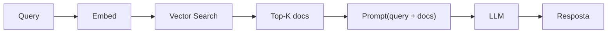

# Módulo 12 — RAG (Retrieval-Augmented Generation)

> **Objetivo**: dominar a arquitetura RAG do conceito original às variantes modernas (hybrid, graph, agentic). Embeddings, chunking, vector DBs, retrievers, rerankers, avaliação.
>
> **Pré-requisitos**: Módulos [08](08_llms_arquiteturas.md)–[11](11_prompt_engineering.md) — em particular, embeddings e similaridade de cosseno (Projeto 8.5), a mini-busca por similaridade do Projeto 11.4, e o cliente TypeScript com streaming do Projeto 10.2.
>
> **Tempo de referência**: 3–5 semanas.

## Objetivos de aprendizagem

Ao final deste módulo você deve ser capaz de:

- Explicar cada estágio do pipeline canônico de RAG e o que cada um resolve.
- Justificar uma estratégia de chunking para um tipo de documento específico.
- Explicar por que busca vetorial aproximada (ANN/HNSW) é necessária em vez de busca exata.
- Explicar por que hybrid retrieval (denso + esparso) costuma superar qualquer um isolado.
- Escolher entre RAG, long context e fine-tuning para um cenário dado, com justificativa de custo/qualidade.

---

## Por que isso importa

LLMs têm conhecimento limitado ao que viram no pré-treino, desatualizado a partir de uma certa data de corte, e sujeito a alucinação quando não sabem a resposta. RAG resolve isso separando o que o modelo "sabe" (nos pesos) do que ele "pode consultar" (documentos, atualizáveis sem retreinar nada) — o que importa para atualidade de dados, privacidade (dados que nunca estiveram na web pública), atribuição (poder citar a fonte de uma afirmação), e custo (um modelo pequeno com bom retrieval frequentemente supera um modelo muito maior sem acesso a dados externos). RAG mal implementado, no entanto, é pior que um LLM puro: documentos errados recuperados viram respostas erradas ditas com a mesma confiança de uma resposta certa.

---

## 12.1 Conceito e pipeline canônico

RAG (Retrieval-Augmented Generation) foi formalizado como técnica em 2020, unindo um retriever (que busca documentos relevantes) a um LLM (que gera a resposta condicionado nesses documentos) — uma combinação que hoje é a espinha dorsal de praticamente toda aplicação de LLM que precisa responder com base em dados específicos, não só conhecimento geral.



> **Intuição**: RAG separa "o que o modelo sabe" (parâmetros, congelados após treino) de "o que o modelo pode consultar" (documentos, atualizáveis a qualquer momento sem retreinar nada). Cada etapa do pipeline resolve um problema específico: embed transforma texto em algo comparável por similaridade — o mesmo `SentenceTransformer(...).encode(...)` que você já usa desde o Projeto 8.5; vector search encontra candidatos relevantes rapidamente entre milhões de documentos; o LLM então gera a resposta *condicionado* nesses documentos, em vez de confiar só no que aprendeu no pré-treino. O ganho é real, mas cada etapa é também um ponto de falha — um retrieval ruim garante uma resposta ruim, não importa quão bom seja o LLM na ponta final. Você constrói esse pipeline completo, do zero, no Projeto 12.1.

### Variações modernas
- **Pre-retrieval**: query rewriting, HyDE, sub-query decomposition (seção 12.5).
- **Retrieval**: hybrid (dense + sparse), graph, multi-hop (seções 12.5, 12.8).
- **Post-retrieval**: rerank, compression, fusion (seção 12.6).
- **Generation**: citação, fallback, refinamento iterativo (seção 12.7).

---

## 12.2 Embeddings

### Conceito
Embeddings são vetores densos que codificam significado — o mesmo conceito do Projeto 8.5. Documentos próximos em significado têm embeddings próximos por similaridade (cosseno, produto escalar).

### Modelos de embedding
Além dos modelos que você já usou no Projeto 8.5 (E5, BGE-M3, Nomic), a paisagem inclui opções proprietárias via API (OpenAI text-embedding-3, Cohere Embed v3, Voyage AI) e outros modelos abertos competitivos (Jina Embeddings v3, Stella, GTE, Snowflake Arctic). Para escolher, o MTEB (Massive Text Embedding Benchmark, já mencionado no mod. 08) é a referência: filtre por idioma (PT-BR é importante — modelos treinados só em inglês degradam, mesmo que ainda funcionem parcialmente), considere o tamanho do vetor de saída (384 a 4096 dimensões — mais dimensões, mais precisão e mais custo de armazenamento), e considere licença e custo.

### Matryoshka Representation Learning
Alguns modelos de embedding recentes são treinados de um jeito que permite truncar o vetor (usar só as primeiras N dimensões de, digamos, 1024) sem precisar retreinar nada — as primeiras dimensões concentram a informação mais importante, e as seguintes refinam progressivamente, de forma parecida com bonecas russas encaixadas (daí o nome "Matryoshka"). Isso permite trocar precisão por espaço de armazenamento dinamicamente, sem manter múltiplos modelos.

---

## 12.3 Chunking: a arte de dividir documentos

### Estratégias
- **Fixed size**: N caracteres/tokens, com overlap. Simples, frequentemente sub-ótimo.
- **Recursive**: dividir por separadores em prioridade decrescente (parágrafo → frase → palavra).
- **Semantic chunking**: agrupar por similaridade entre frases adjacentes.
- **Document-aware**: respeitar headings (Markdown), seções (LaTeX), tabelas.
- **Sentence-based**: por frase, com janela.
- **Token-based**: respeitar limite do modelo de embedding e do LLM.

Você implementa e compara as três primeiras diretamente no Projeto 12.2.

### Trade-offs
- **Chunks pequenos**: mais precisão, menos contexto.
- **Chunks grandes**: mais contexto, menos precisão (e pode estourar contexto do LLM).
- **Overlap** ajuda na fronteira mas duplica armazenamento.

> **Intuição**: um chunk pequeno demais separa uma frase do contexto que a explica (ex.: "o resultado foi positivo" sem saber o resultado de *quê*) — o embedding fica preciso, mas incompleto. Um chunk grande demais mistura tópicos diferentes num único vetor, "diluindo" a similaridade — uma pergunta específica pode não encontrar o chunk certo porque o vetor médio do chunk representa mal qualquer tópico individual dentro dele. Parent-Child Chunking ataca isso diretamente: embeda o pedaço pequeno e preciso (melhor para *encontrar*), mas retorna o pedaço-pai maior pro LLM (melhor para *responder com contexto suficiente*) — otimizando as duas etapas separadamente em vez de um único tamanho de chunk fazendo os dois trabalhos.

### Truques modernos
- **Late Chunking** (Jina) — chunkar **depois** de embeddar o documento todo, deixando cada chunk carregar informação do documento inteiro no seu vetor.
- **Contextual Retrieval** (Anthropic) — usar um LLM para anexar uma frase de contexto a cada chunk antes de embeddá-lo (ex.: "este trecho é do relatório financeiro do 3º trimestre de 2024"), compensando o que se perde ao isolar o chunk do resto do documento.
- **Parent-Child Chunking** — descrito na Intuição acima.

Bibliotecas como os Text Splitters do LangChain, os NodeParsers do LlamaIndex, ou o Unstructured.io (para extrair texto de PDF/HTML/DOCX com estrutura preservada) implementam essas estratégias prontas — os projetos deste módulo implementam as versões mais simples à mão, por clareza.

---

## 12.4 Vector Databases

### Categorias
- **Bibliotecas embarcadas**: FAISS (Meta — usada no Projeto 12.1), USearch, ScaNN, Annoy, hnswlib.
- **Bancos open-source self-hosted**: Qdrant, Weaviate, Milvus, Chroma, Vespa, pgvector (extensão do Postgres).
- **SaaS**: Pinecone, Vespa Cloud, Qdrant Cloud, Weaviate Cloud.
- **Multi-modal/full-text**: Vespa, Elasticsearch (com kNN search), OpenSearch.

### Algoritmos de busca aproximada (ANN)
- **HNSW** (Hierarchical Navigable Small World) — padrão moderno, detalhado na Intuição abaixo.
- **IVF + PQ** (Inverted File + Product Quantization) — agrupa vetores em clusters (IVF) e comprime cada vetor (PQ) para escalar a bilhões de itens; usado internamente pelo FAISS quando configurado para isso.
- **DiskANN** — mantém o índice em disco em vez de RAM, para datasets grandes demais para caber em memória.

> **Intuição — por que "aproximada"**: encontrar o vizinho mais próximo *exato* entre milhões de vetores exige comparar a query com cada vetor, um por um — inviável em tempo real. HNSW constrói um grafo em camadas (parecido com uma rede de "atalhos" tipo metrô expresso vs linha local): a busca começa numa camada esparsa, dando saltos grandes na direção aproximada certa, e desce para camadas mais densas conforme se aproxima do alvo, refinando a busca. O resultado não é garantidamente o vizinho mais próximo exato, mas é uma aproximação muito boa, encontrada em tempo logarítmico em vez de linear — o trade-off (perder um pouco de precisão exata por uma ordem de magnitude de velocidade) é a razão de HNSW ser o padrão de fato em praticamente todo vector DB moderno. No Projeto 12.1, com ~100 documentos, essa diferença é irrelevante (uma busca exata é instantânea nessa escala) — mas o índice que você usa (`IndexFlatL2` do FAISS) é exato justamente por isso; ao escalar para milhões de documentos, você trocaria por um índice HNSW (`IndexHNSWFlat`, também no FAISS) sem mudar o resto do pipeline.
>
> **Checkpoint**: sem olhar o texto, explique por que busca vetorial exata não escala para milhões de documentos, e o que HNSW troca para resolver isso.

### Critérios de escolha
| Necessidade | Sugestão |
|---|---|
| Local, simples, embeded | Chroma, FAISS |
| Postgres-based, transacional | pgvector |
| Self-hosted produção | Qdrant, Weaviate, Milvus |
| Hybrid (BM25 + vetor) nativo | Vespa, Weaviate, Elasticsearch |
| Escala massiva managed | Pinecone, Vespa Cloud |
| Edge/serverless | Turbopuffer, LanceDB |

### TS / JS
Chroma, Qdrant, Pinecone e Weaviate têm clientes oficiais em TS; LanceDB é embedded e particularmente amigável para projetos TS por não exigir um servidor separado.

---

## 12.5 Retrieval avançado

### Sparse retrieval (não é "antigo", é complementar)
- **BM25** — variante clássica de TF-IDF, ainda excelente baseline, usada no Projeto 12.3.
- **SPLADE**, **uniCOIL**, **TILDE** — versões "aprendidas" de retrieval esparso, que usam um modelo neural para decidir quais termos expandir/ponderar, em vez de contagem pura de frequência como BM25.

### Hybrid retrieval
Combinar dense + sparse via:
- **Reciprocal Rank Fusion (RRF)** — método simples e eficaz, implementado no Projeto 12.3.
- **Pesos linearmente combinados**.
- **Learned fusion**.

> **Intuição — por que hybrid vence**: busca densa (embeddings) captura *significado* — encontra documentos relevantes mesmo sem palavras exatas em comum ("carro" encontra "automóvel"). Busca esparsa (BM25) captura *correspondência exata* — essencial para nomes próprios, códigos de erro, siglas técnicas, números, onde o significado "aproximado" não ajuda e a palavra exata importa. Nenhum dos dois é estritamente melhor; eles erram em casos diferentes. RRF combina os rankings dos dois métodos sem precisar normalizar scores em escalas diferentes (que é o problema de combinar scores diretamente) — só usa a *posição* de cada documento em cada ranking: `score_RRF(doc) = soma, para cada ranking, de 1/(k + posição do doc naquele ranking)`, com `k` uma constante (tipicamente 60) que evita que a primeira posição domine demais o resultado. Você implementa exatamente essa fórmula no Projeto 12.3.

### Multi-vector / Late interaction
**ColBERT** (e sua evolução, ColBERTv2) embeda cada *token* do documento separadamente (em vez de um único vetor para o documento inteiro) e combina as similaridades token a token via "max-sim" — mais preciso que um embedding único por documento, ao custo de armazenar muito mais vetores.

### Query transformation
- **HyDE (Hypothetical Document Embeddings)** — gerar resposta hipotética, embeddá-la, buscar (detalhado abaixo).
- **Query rewriting** com LLM — reformular a query do usuário para uma forma mais adequada à busca, antes de embeddar.
- **Multi-query retrieval** — gerar variações da query e fundir os resultados de cada uma.
- **Step-back prompting** — pedir ao LLM para abstrair a pergunta específica numa pergunta mais geral antes de buscar (ex.: de "qual foi o lucro da empresa X no Q3 de 2023" para "relatórios financeiros da empresa X").

> **Intuição — HyDE**: uma pergunta curta ("qual a capital da França?") tem um embedding estruturalmente diferente de uma resposta/documento que a contém ("Paris é a capital da França, uma cidade..."). HyDE contorna essa assimetria pedindo ao LLM para gerar uma resposta *hipotética* (possivelmente errada em detalhes) e embeddando essa resposta hipotética em vez da pergunta crua — o embedding de um texto "no estilo de resposta" tende a ficar mais próximo dos documentos reais (também no estilo de resposta/afirmação) do que o embedding da pergunta interrogativa original.

### Multi-hop retrieval
Para perguntas que exigem combinar múltiplos documentos (datasets como HotpotQA e MuSiQue são usados para avaliar isso), técnicas como IRCoT intercalam retrieval com Chain-of-Thought (mod. 11): gera um passo de raciocínio, usa esse passo para buscar mais informação, incorpora, gera o próximo passo. É um parente próximo do Graph RAG (seção 12.8) e do Agentic RAG (seção 12.9), que você implementa nos Projetos 12.6 e 12.7.

---

## 12.6 Reranking

### Por quê
Retrieval rápido (top-100) com baixa precisão → rerank lento (top-10) com alta precisão.

### Modelos
Cross-encoders — variantes do Sentence-BERT que processam query e documento juntos, em vez de separadamente — são o tipo de modelo usado para rerank. `bge-reranker-v2-m3` (aberto) e o Cohere Rerank (via API) são as opções mais usadas hoje; MonoT5 e MonoBERT são abordagens mais antigas do mesmo princípio.

### Custo
Reranker tipicamente é 10–100× mais caro que retrieval inicial. Use só no top-K (K = 50–200).

> **Intuição — por que duas etapas**: retrieval vetorial (bi-encoder, embeda query e documento *separadamente* e compara os vetores) é rápido porque os embeddings dos documentos podem ser pré-computados uma vez e indexados — comparar contra uma query nova é só uma busca vetorial. Um cross-encoder (reranker) processa query e documento *juntos*, através da mesma rede, permitindo que o modelo compare palavra a palavra entre os dois — muito mais preciso, mas impossível de pré-computar (cada par query-documento exige uma passada nova pela rede), então só é viável rodar sobre uma lista curta de candidatos já filtrados. É o mesmo padrão "rápido e aproximado primeiro, lento e preciso depois" que aparece em duas etapas em quase todo sistema de busca em escala. Você mede esse ganho diretamente no Projeto 12.4.
>
> **Checkpoint**: sem olhar o texto, explique por que um cross-encoder não pode ser usado para buscar entre milhões de documentos diretamente, mas um bi-encoder (embeddings) pode.

---

## 12.7 Geração com contexto

### Anti-padrões comuns
- Concatenar todos os docs sem hierarquia.
- Não citar fontes.
- Não tratar caso "nenhum doc relevante".
- Não validar a resposta vs docs.

### Padrões bons
- **Estrutura clara** no prompt (com XML/marcadores — o mesmo padrão usado como mitigação de prompt injection no Projeto 11.4, e não por acaso: contexto RAG é exatamente o tipo de conteúdo que precisa ser tratado como dado, não instrução).
- **Instrução para citar IDs** dos docs.
- **Self-grounding**: pedir para o modelo apontar a parte do doc que sustenta cada afirmação.
- **Refusal** quando docs não suportam: "Diga 'não sei com base nos documentos' se não houver evidência."

### Long context vs RAG
"Contextos de 1M tokens" não eliminam a necessidade de RAG. Trade-offs:
- **Long context**: mais simples, mais caro por chamada, performance degrada no meio do contexto ("lost in the middle").
- **RAG**: mais infraestrutura, mais barato, melhor para corpora dinâmicos e grandes demais para caber em qualquer janela de contexto.

> **Intuição — "lost in the middle"**: mesmo modelos com janelas de contexto enormes não usam essa informação uniformemente — evidência empírica mostra que informação no início e no fim do contexto é recuperada com mais confiabilidade do que informação no meio, um viés posicional que persiste mesmo em modelos state-of-the-art. Isso significa que despejar 500 páginas de documentos no contexto e esperar que o modelo "ache a agulha no meio do palheiro" é uma aposta pior do que parece — RAG, ao filtrar primeiro pelos documentos realmente relevantes (retrieval) antes de gerar, reduz a chance da informação certa ficar "perdida no meio" de conteúdo irrelevante.

---

## 12.8 Graph RAG

Para perguntas que exigem **conexões** entre entidades — RAG tradicional recupera chunks isolados, o que é bom para "o que é X" mas ruim para "como X se relaciona com Y", já que a relação pode nunca aparecer explicitamente perto o bastante num único chunk para ser recuperada junto.

### Conceito
- Extrair entidades + relações dos documentos (usando um LLM para essa extração).
- Construir um grafo de conhecimento a partir dessas triplas (entidade, relação, entidade).
- Recuperar **subgrafos** ou caminhos relevantes em vez de chunks isolados.

Implementações como Microsoft GraphRAG, LightRAG e HippoRAG automatizam esse processo em escala; você implementa uma versão simplificada, com poucas dezenas de documentos, no Projeto 12.6.

---

## 12.9 Agentic RAG

Em vez de um pipeline fixo (busca sempre, sempre do mesmo jeito, sempre uma vez), um agente decide dinamicamente se deve buscar, que query fazer, que ferramenta usar, e quando buscar de novo com uma query refinada — o mesmo tipo de loop que você já implementou manualmente no Projeto 11.3 (ReAct), agora aplicado especificamente à decisão de busca. Duas variantes citadas com frequência na literatura: Self-RAG (o próprio modelo é treinado para decidir quando buscar e para criticar os documentos recuperados) e CRAG, Corrective RAG (avalia a relevância dos documentos recuperados e, se insuficiente, reformula a busca) — você implementa uma versão simplificada de CRAG no Projeto 12.7. O mod. [13](13_agentes_tools_protocolos.md) aprofunda agentes de forma mais geral, incluindo RAG como uma tool entre outras.

---

## 12.10 Avaliação de RAG

### Métricas separadas para retrieval e generation
- **Retrieval**: Recall@K, MRR, NDCG, hit rate.
- **Generation**: faithfulness (resposta apoia-se nos docs?), answer relevance, context relevance.

> **Intuição — por que separar as métricas**: um RAG pode falhar em duas camadas independentes — retrieval ruim (os documentos certos nem foram encontrados) ou generation ruim (os documentos certos foram encontrados, mas o LLM os ignorou ou os interpretou mal). Medir só a qualidade da resposta final mistura essas duas causas — se a resposta está errada, você não sabe se o problema é "buscou errado" ou "gerou errado" a partir do que buscou certo. Faithfulness especificamente mede se cada afirmação da resposta é *sustentada* pelos documentos recuperados (não a mesma coisa que "a resposta está correta" — um LLM pode dar uma resposta correta que não veio dos documentos, o que ainda é uma falha de RAG, mesmo com resposta certa).

Ferramentas como RAGAS, TruLens e DeepEval automatizam essas métricas, tipicamente usando um LLM como juiz (o mesmo padrão que você já usou no Projeto 9.2, para gerar preferências, e no Projeto 11.2, para julgar respostas) — você usa o RAGAS diretamente no Projeto 12.5. Datasets canônicos usados para avaliar retrieval em benchmarks públicos incluem Natural Questions, TriviaQA, HotpotQA e MS MARCO; o BEIR reúne vários desses num benchmark heterogêneo único.

---

## 12.11 Frameworks de RAG

Em Python, LlamaIndex (focado em indexação e retrieval), LangChain (mais generalista, com componentes de RAG entre muitos outros), Haystack e txtai empacotam os padrões deste módulo prontos para uso. Em TypeScript, LlamaIndex.TS, LangChain.js, o Vercel AI SDK (com hooks para RAG) e o Mastra (um framework agentico que cobre RAG) cumprem papel equivalente.

Para pipelines simples, escrever diretamente (como você faz em todos os projetos deste módulo) evita o overhead conceitual de aprender a API de um framework antes de entender o que ele está fazendo por baixo — vale a pena conhecer pelo menos um framework depois de já ter implementado o suficiente à mão para reconhecer o que ele está automatizando.

---

## Projetos práticos

### Projeto 12.1 — RAG mínimo do zero, em Python e em TypeScript

Você vai implementar o pipeline completo (ingest → embed → search → prompt → resposta) duas vezes: em Python com FAISS, e em TypeScript com `transformers.js`, sem nenhum framework de RAG em nenhuma das duas.

**Pré-requisitos**: `pip install sentence-transformers faiss-cpu`; para a versão TS, o setup do Projeto 10.2 (Node, `tsx`) mais `npm install @xenova/transformers`.

**1. Versão Python — monte um corpus e indexe com FAISS**:

```python
from sentence_transformers import SentenceTransformer
import faiss
import numpy as np

embedder = SentenceTransformer("intfloat/multilingual-e5-large")

documentos = [
    "O Ollama permite rodar LLMs localmente via linha de comando ou API HTTP.",
    "RMSNorm é uma alternativa mais simples e rápida ao LayerNorm, usada em modelos como LLaMA.",
    "LoRA treina apenas duas matrizes de baixo rank, reduzindo drasticamente os parâmetros treináveis.",
    # complete até ~100 documentos próprios — pode ser sobre qualquer assunto que você conheça bem,
    # para conseguir julgar se as respostas geradas depois fazem sentido
]

embeddings = embedder.encode(documentos, normalize_embeddings=True)
dimensao = embeddings.shape[1]

index = faiss.IndexFlatIP(dimensao)  # IP = inner product; com vetores normalizados, equivale a cosseno
index.add(np.array(embeddings, dtype="float32"))
```

`faiss.IndexFlatIP` é um índice *exato* (compara a query contra todo vetor indexado, sem aproximação — adequado na escala de ~100 documentos deste projeto) que usa produto interno como métrica de similaridade; `normalize_embeddings=True` garante que cada vetor tenha norma 1, o que faz o produto interno ser matematicamente equivalente à similaridade de cosseno do Projeto 8.5.

**2. Busque e gere a resposta**:

```python
import requests

def buscar(query, k=3):
    query_emb = embedder.encode([query], normalize_embeddings=True)
    distancias, indices = index.search(np.array(query_emb, dtype="float32"), k)
    return [documentos[i] for i in indices[0]]

def responder(query):
    docs_relevantes = buscar(query)
    contexto = "\n".join(f"[{i+1}] {doc}" for i, doc in enumerate(docs_relevantes))
    prompt = (
        f"Contexto:\n{contexto}\n\n"
        f"Pergunta: {query}\n"
        "Responda com base apenas no contexto acima, citando o número do documento entre colchetes. "
        "Se o contexto não tiver a resposta, diga que não sabe."
    )
    response = requests.post(
        "http://localhost:11434/api/generate",
        json={"model": "qwen2.5:7b", "prompt": prompt, "stream": False},
    )
    return response.json()["response"]

print(responder("O que é RMSNorm?"))
```

`index.search` retorna, para cada query, as distâncias e os índices dos `k` vizinhos mais próximos no índice — os mesmos índices são usados para recuperar os textos originais em `documentos` (o FAISS guarda só os vetores, não o texto). A instrução "cite o número do documento" e "diga que não sabe" no prompt implementam dois dos "padrões bons" da seção 12.7 diretamente.

**3. Versão TypeScript** (`rag.ts`) — mesmo pipeline, com `transformers.js` no lugar de `sentence-transformers`, e um array simples no lugar de FAISS (na escala deste projeto, uma busca linear em JavaScript é instantânea, então um vector DB de verdade seria overhead desnecessário):

```typescript
import { pipeline } from "@xenova/transformers";
import { ollama } from "ollama-ai-provider";
import { generateText } from "ai";

const documentos = [
  "O Ollama permite rodar LLMs localmente via linha de comando ou API HTTP.",
  "RMSNorm é uma alternativa mais simples e rápida ao LayerNorm, usada em modelos como LLaMA.",
  // complete o mesmo corpus da versão Python, para poder comparar
];

function cosineSim(a: number[], b: number[]): number {
  const dot = a.reduce((sum, ai, i) => sum + ai * b[i], 0);
  const normA = Math.sqrt(a.reduce((sum, ai) => sum + ai * ai, 0));
  const normB = Math.sqrt(b.reduce((sum, bi) => sum + bi * bi, 0));
  return dot / (normA * normB);
}

async function main() {
  const embedder = await pipeline("feature-extraction", "Xenova/all-MiniLM-L6-v2");

  async function embed(texto: string): Promise<number[]> {
    const resultado = await embedder(texto, { pooling: "mean", normalize: true });
    return Array.from(resultado.data as Float32Array);
  }

  const docEmbeddings = await Promise.all(documentos.map(embed));

  async function buscar(query: string, k = 3): Promise<string[]> {
    const queryEmb = await embed(query);
    const scores = docEmbeddings.map((docEmb, i) => ({ i, sim: cosineSim(queryEmb, docEmb) }));
    scores.sort((a, b) => b.sim - a.sim);
    return scores.slice(0, k).map(({ i }) => documentos[i]);
  }

  const docsRelevantes = await buscar("O que é RMSNorm?");
  const contexto = docsRelevantes.map((doc, i) => `[${i + 1}] ${doc}`).join("\n");

  const { text } = await generateText({
    model: ollama("qwen2.5:7b"),
    prompt: `Contexto:\n${contexto}\n\nPergunta: O que é RMSNorm?\nResponda com base apenas no contexto acima.`,
  });
  console.log(text);
}

main();
```

`pipeline("feature-extraction", ...)` carrega um modelo de embedding pequeno (`all-MiniLM-L6-v2`, ~90MB, adequado para rodar client-side) via `transformers.js`, o mesmo padrão do Projeto 10.5, só que usando o resultado para embeddings em vez de classificação. `cosineSim` é a mesma fórmula matemática do Projeto 8.5, reescrita em TypeScript porque não existe um equivalente de `numpy` embutido no ecossistema JS. Rode com `npx tsx rag.ts`.

> Teste o pipeline primeiro com uma pergunta cuja resposta você *sabe* que está literalmente em um documento específico — confirme que o retrieval encontra esse documento antes de testar perguntas mais ambíguas. Isso separa bugs de infraestrutura (embedding, indexação) de limitações reais de retrieval semântico.

---

### Projeto 12.2 — Comparativo de chunking

Você vai implementar 3 estratégias de chunking e comparar qual delas produz melhor retrieval no mesmo corpus, com o mesmo modelo de embedding.

**Pré-requisitos**: os mesmos do Projeto 12.1, mais um corpus de documentos mais longos (3-5 artigos ou textos de várias páginas, não frases soltas como no Projeto 12.1 — chunking só faz sentido em texto que não caiba inteiro num único chunk razoável).

**1. Implemente as 3 estratégias**:

```python
def chunk_fixed_size(texto, tamanho=500, overlap=50):
    chunks = []
    inicio = 0
    while inicio < len(texto):
        chunks.append(texto[inicio:inicio + tamanho])
        inicio += tamanho - overlap
    return chunks

def chunk_recursive(texto, tamanho_max=500):
    paragrafos = texto.split("\n\n")
    chunks = []
    atual = ""
    for paragrafo in paragrafos:
        if len(atual) + len(paragrafo) <= tamanho_max:
            atual += paragrafo + "\n\n"
        else:
            if atual:
                chunks.append(atual.strip())
            atual = paragrafo + "\n\n"
    if atual:
        chunks.append(atual.strip())
    return chunks

def chunk_semantic(texto, embedder, limiar_similaridade=0.5):
    frases = [f.strip() for f in texto.split(". ") if f.strip()]
    if not frases:
        return []
    embeddings_frases = embedder.encode(frases, normalize_embeddings=True)
    chunks, atual = [], [frases[0]]
    for i in range(1, len(frases)):
        sim = float(np.dot(embeddings_frases[i - 1], embeddings_frases[i]))
        if sim >= limiar_similaridade:
            atual.append(frases[i])
        else:
            chunks.append(". ".join(atual) + ".")
            atual = [frases[i]]
    chunks.append(". ".join(atual) + ".")
    return chunks
```

`chunk_fixed_size` divide por contagem bruta de caracteres, com sobreposição (`overlap`) entre chunks consecutivos, para reduzir a chance de cortar uma ideia bem no meio. `chunk_recursive` respeita a estrutura do texto (parágrafos), só quebrando um parágrafo grande demais quando necessário. `chunk_semantic` calcula a similaridade de cosseno entre frases consecutivas (a mesma conta do Projeto 8.5) e começa um novo chunk sempre que a similaridade cai abaixo de um limiar — a ideia sendo que frases muito diferentes entre si provavelmente mudam de assunto, e merecem chunks separados.

**2. Monte um conjunto de 30 perguntas com gabarito** (a resposta certa, e idealmente qual trecho do corpus a sustenta), e para cada estratégia de chunking: gere os chunks, embedde e indexe (reaproveitando o código do Projeto 12.1), busque para cada pergunta, e meça se o chunk correto está entre os top-3 recuperados.

```python
def avaliar_estrategia(nome_estrategia, chunks, perguntas_gabarito):
    embeddings = embedder.encode(chunks, normalize_embeddings=True)
    index = faiss.IndexFlatIP(embeddings.shape[1])
    index.add(np.array(embeddings, dtype="float32"))

    acertos = 0
    for pergunta, trecho_esperado in perguntas_gabarito:
        query_emb = embedder.encode([pergunta], normalize_embeddings=True)
        _, indices = index.search(np.array(query_emb, dtype="float32"), 3)
        recuperados = [chunks[i] for i in indices[0]]
        if any(trecho_esperado in chunk for chunk in recuperados):
            acertos += 1
    print(f"{nome_estrategia}: {acertos}/{len(perguntas_gabarito)}")
```

Rode `avaliar_estrategia` para os chunks de cada uma das 3 estratégias (aplicadas ao mesmo corpus) e compare os acertos — não existe vencedor universal, o resultado depende do tipo de documento no seu corpus, e é exatamente por isso que vale medir em vez de assumir.

---

### Projeto 12.3 — Hybrid retrieval com RRF

Você vai combinar busca esparsa (BM25) com a busca densa do Projeto 12.1, fundindo os dois rankings com Reciprocal Rank Fusion.

**Pré-requisitos**: `pip install rank_bm25`, mais o Projeto 12.1 completo.

**1. Implemente BM25** sobre o mesmo corpus:

```python
from rank_bm25 import BM25Okapi

corpus_tokenizado = [doc.lower().split() for doc in documentos]
bm25 = BM25Okapi(corpus_tokenizado)

def buscar_bm25(query, k=5):
    scores = bm25.get_scores(query.lower().split())
    top_k_indices = np.argsort(scores)[-k:][::-1]
    return list(top_k_indices)  # retorna índices, não os textos, para facilitar a fusão no próximo passo
```

`BM25Okapi` espera o corpus já tokenizado (aqui, um `split()` simples por espaço — suficiente para o experimento; em produção, um tokenizador mais cuidadoso trataria pontuação e acentos). `get_scores` calcula, para a query, uma pontuação BM25 contra cada documento do corpus, baseada em frequência de termos — sem nenhum embedding envolvido.

**2. Implemente RRF, combinando os rankings denso e esparso**:

```python
def buscar_denso_ranked(query, k=5):
    query_emb = embedder.encode([query], normalize_embeddings=True)
    _, indices = index.search(np.array(query_emb, dtype="float32"), k)
    return list(indices[0])

def rrf(rankings, k_constante=60):
    scores = {}
    for ranking in rankings:
        for posicao, doc_idx in enumerate(ranking):
            scores[doc_idx] = scores.get(doc_idx, 0) + 1 / (k_constante + posicao + 1)
    return sorted(scores.keys(), key=lambda idx: scores[idx], reverse=True)

def buscar_hybrid(query, k=5):
    ranking_denso = buscar_denso_ranked(query, k=10)
    ranking_esparso = buscar_bm25(query, k=10)
    indices_fundidos = rrf([ranking_denso, ranking_esparso])
    return [documentos[i] for i in indices_fundidos[:k]]
```

`rrf` implementa exatamente a fórmula da seção 12.5: para cada documento, soma `1/(k_constante + posição)` em cada ranking em que ele aparece — um documento que aparece bem posicionado em ambos os rankings acumula pontuação de ambos; um documento que só aparece num dos dois ainda entra na disputa, mas com menos força.

**3. Compare os três** (denso puro, BM25 puro, hybrid) num conjunto de teste que inclua **pelo menos algumas perguntas com termos exatos importantes** — siglas, códigos, nomes próprios — usando o mesmo padrão de avaliação do Projeto 12.2 (`avaliar_estrategia`, adaptado para chamar cada uma das três funções de busca). É nesse tipo de pergunta que a diferença entre BM25 e busca densa deve aparecer mais claramente, confirmando (ou não, no seu corpus específico) a intuição da seção 12.5.

---

### Projeto 12.4 — Reranker

Você vai adicionar uma etapa de reranking ao pipeline hybrid do Projeto 12.3, usando um cross-encoder, e medir o ganho.

**Pré-requisitos**: `pip install sentence-transformers` (já instalado), que também fornece a classe `CrossEncoder`.

```python
from sentence_transformers import CrossEncoder

reranker = CrossEncoder("BAAI/bge-reranker-v2-m3")

def buscar_com_rerank(query, k_final=5, k_candidatos=20):
    candidatos = buscar_hybrid(query, k=k_candidatos)
    pares = [[query, doc] for doc in candidatos]
    scores = reranker.predict(pares)
    ranking = sorted(zip(candidatos, scores), key=lambda x: x[1], reverse=True)
    return [doc for doc, score in ranking[:k_final]]
```

Diferente de `SentenceTransformer` (que embedda query e documento separadamente), `CrossEncoder.predict` recebe pares `[query, documento]` e processa os dois juntos através da mesma rede, retornando diretamente uma pontuação de relevância — não um vetor para comparar depois, mas já o resultado da comparação, como descrito na Intuição da seção 12.6. Note que `buscar_com_rerank` primeiro recupera 20 candidatos (`k_candidatos`) com o retrieval hybrid, barato, e só roda o reranker (caro) sobre esses 20 — nunca sobre o corpus inteiro.

Meça o Recall@5 (a fração de perguntas do seu conjunto de teste onde o documento certo está entre os top-5) com e sem a etapa de rerank, no mesmo conjunto de perguntas do Projeto 12.3, e compare.

---

### Projeto 12.5 — Avaliação rigorosa com RAGAS

Você vai construir um conjunto de avaliação formal (perguntas, documentos relevantes anotados, respostas de referência) e usar o RAGAS para medir faithfulness, relevância da resposta, e relevância do contexto recuperado.

**Pré-requisitos**: `pip install ragas datasets`.

**1. Monte o eval set**: 50 perguntas sobre o seu corpus, cada uma com a resposta "de ouro" (escrita por você, com base no corpus) e os documentos que a sustentam.

**2. Rode seu pipeline RAG (do Projeto 12.1 ou 12.4) para gerar as respostas e capture o contexto usado**:

```python
from datasets import Dataset
from ragas import evaluate
from ragas.metrics import faithfulness, answer_relevancy, context_relevancy

perguntas, respostas_geradas, contextos_usados, respostas_referencia = [], [], [], []

for pergunta, resposta_ouro in eval_set:  # sua lista de (pergunta, resposta_ouro) montada no passo 1
    docs = buscar_com_rerank(pergunta)
    resposta = responder(pergunta)  # reaproveita a função do Projeto 12.1
    perguntas.append(pergunta)
    respostas_geradas.append(resposta)
    contextos_usados.append(docs)
    respostas_referencia.append(resposta_ouro)

dataset_avaliacao = Dataset.from_dict({
    "question": perguntas,
    "answer": respostas_geradas,
    "contexts": contextos_usados,
    "ground_truth": respostas_referencia,
})

resultado = evaluate(dataset_avaliacao, metrics=[faithfulness, answer_relevancy, context_relevancy])
print(resultado)
```

O RAGAS usa um LLM como juiz por baixo dos panos (por padrão, espera acesso à API da OpenAI; para usar um modelo local via Ollama, configure `ragas` com um LLM wrapper apontando para o endpoint compatível OpenAI do Ollama — o mesmo endpoint usado no Projeto 11.5) para decidir, por exemplo, se cada afirmação da resposta gerada é sustentada pelo contexto (`faithfulness`), se a resposta de fato responde à pergunta feita (`answer_relevancy`), e se os documentos recuperados são relevantes para a pergunta (`context_relevancy`) — três julgamentos distintos, que juntos separam falhas de retrieval de falhas de geração, como descrito na seção 12.10.

**3. Documente onde o RAG quebra**: ordene as 50 perguntas pela métrica de `faithfulness` mais baixa e leia as piores — são casos onde o modelo "inventou" algo não sustentado pelo contexto recuperado. Separadamente, ordene por `context_relevancy` mais baixa — são casos onde o retrieval falhou em encontrar o documento certo, independente do que o LLM fez depois.

---

### Projeto 12.6 — Graph RAG mini

Você vai extrair um grafo de entidades e relações de um corpus pequeno e responder perguntas de "conexão" que RAG tradicional (baseado em chunks) tem dificuldade em responder.

**Pré-requisitos**: `pip install networkx`, mais Ollama.

**1. Monte um corpus pequeno com relações entre entidades** (por exemplo, biografias curtas de 10-15 pessoas fictícias ou reais, mencionando quem trabalhou com quem, em que projeto, em que época).

**2. Extraia triplas (entidade, relação, entidade) com o LLM**:

```python
import json

def extrair_triplas(texto):
    prompt = (
        f"Texto: {texto}\n\n"
        "Extraia relações no formato de uma lista JSON de objetos {\"sujeito\": ..., \"relacao\": ..., \"objeto\": ...}. "
        "Exemplo: [{\"sujeito\": \"Ana\", \"relacao\": \"trabalhou com\", \"objeto\": \"Bruno\"}]. "
        "Responda apenas com o JSON."
    )
    resposta = requests.post(
        "http://localhost:11434/api/generate",
        json={"model": "qwen2.5:7b", "prompt": prompt, "stream": False, "format": "json"},
    ).json()["response"]
    try:
        return json.loads(resposta)
    except json.JSONDecodeError:
        return []

todas_triplas = []
for documento in corpus_biografias:
    todas_triplas.extend(extrair_triplas(documento))
```

**3. Construa o grafo e responda perguntas de conexão**:

```python
import networkx as nx

grafo = nx.DiGraph()
for tripla in todas_triplas:
    grafo.add_edge(tripla["sujeito"], tripla["objeto"], relacao=tripla["relacao"])

def pessoas_conectadas(pessoa_a, pessoa_b):
    grafo_nao_direcionado = grafo.to_undirected()
    if nx.has_path(grafo_nao_direcionado, pessoa_a, pessoa_b):
        caminho = nx.shortest_path(grafo_nao_direcionado, pessoa_a, pessoa_b)
        return caminho
    return None

print(pessoas_conectadas("Ana", "Carla"))
```

`nx.shortest_path` encontra o caminho mais curto entre dois nós no grafo — se "Ana" e "Carla" nunca colaboraram diretamente, mas ambas trabalharam com "Bruno", o caminho `["Ana", "Bruno", "Carla"]` responde "como eles se conectam" de um jeito que nenhum chunk isolado do corpus conseguiria, porque essa conexão nunca é dita explicitamente em nenhum trecho único de texto.

**4. Compare com RAG de chunks**: rode a mesma pergunta de conexão ("Ana e Carla já trabalharam com a mesma pessoa?") no pipeline do Projeto 12.1 (chunks + busca vetorial) e compare com a resposta via grafo — o RAG de chunks tende a falhar exatamente nesse tipo de pergunta multi-hop, confirmando a limitação descrita na seção 12.8.

---

### Projeto 12.7 — Self-RAG / CRAG simplificado

Você vai implementar um loop onde o próprio LLM avalia se os documentos recuperados são relevantes e, se não forem, reformula a busca — reaproveitando diretamente o padrão de loop do ReAct (Projeto 11.3).

**Pré-requisitos**: os mesmos do Projeto 12.1.

```python
def avaliar_relevancia(query, documentos_recuperados):
    contexto = "\n".join(documentos_recuperados)
    prompt = (
        f"Query: {query}\nDocumentos recuperados:\n{contexto}\n\n"
        "Esses documentos contêm informação suficiente para responder à query? Responda apenas 'SIM' ou 'NAO'."
    )
    resposta = requests.post(
        "http://localhost:11434/api/generate",
        json={"model": "qwen2.5:7b", "prompt": prompt, "stream": False},
    ).json()["response"]
    return "SIM" in resposta.upper()

def reformular_query(query_original, documentos_insuficientes):
    prompt = (
        f"A busca por \"{query_original}\" não encontrou documentos suficientes. "
        "Reescreva a query de forma diferente (sinônimos, termos mais específicos ou mais gerais) "
        "para tentar encontrar informação relevante. Responda apenas com a nova query."
    )
    return requests.post(
        "http://localhost:11434/api/generate",
        json={"model": "qwen2.5:7b", "prompt": prompt, "stream": False},
    ).json()["response"].strip()

def crag_loop(query, max_tentativas=3):
    query_atual = query
    for tentativa in range(max_tentativas):
        docs = buscar(query_atual)  # reaproveita a função de busca do Projeto 12.1
        if avaliar_relevancia(query_atual, docs):
            return responder(query_atual)
        query_atual = reformular_query(query_atual, docs)
        print(f"Tentativa {tentativa + 1} insuficiente, nova query: {query_atual}")
    return "Não foi possível encontrar informação suficiente após várias tentativas."

print(crag_loop("Qual a diferença entre otimização de treino e otimização de inferência?"))
```

O loop é estruturalmente idêntico ao ReAct do Projeto 11.3 (gera → avalia → age de novo se necessário), só que aqui a "ação" é sempre busca, e a decisão em jogo é "os documentos encontrados bastam, ou preciso buscar diferente". `avaliar_relevancia` usa o LLM como um juiz binário simples (SIM/NÃO) — mais barato e mais fácil de interpretar do que pedir uma nota numérica. Compare esse loop com uma busca de tentativa única (sem correção) em perguntas cuja primeira formulação é deliberadamente vaga ou mal fraseada, e veja se a reformulação melhora o resultado.

---

## Erros comuns

- **Avaliar só "vibe"** — sem dataset, sem métricas, qualquer mudança parece melhoria.
- **Embedding model + LLM model em idiomas diferentes** — degradação em PT-BR clássica.
- **Chunks muito grandes** — diluição de relevância no retrieval.
- **Não normalizar embeddings** — o RRF e o `IndexFlatIP` deste módulo assumem vetores normalizados; esquecer `normalize_embeddings=True` quebra a equivalência com cosseno silenciosamente.
- **Confundir "tem embedding" com "encontra documento"** — embeddings ruins → retrieval ruim → resposta ruim.
- **Não tratar "nada relevante encontrado"** — modelo alucina com confiança.
- **Misturar dimensões/modelos** ao migrar — reindexação total é necessária.

---

## Conexão com módulos seguintes

| Conceito daqui | Aparece em |
|---|---|
| Embeddings + retrieval | Agentes (mod. [13](13_agentes_tools_protocolos.md)) — RAG como tool |
| Reranker | Avaliação (mod. [14](14_avaliacao_e_seguranca.md)) |
| Citações e grounding | Segurança (mod. [14](14_avaliacao_e_seguranca.md)) |
| Vector DB ops | Produção (mod. [15](15_engenharia_producao.mdx)) |

---

## Checklist de saída

- [ ] Construí RAG do zero em Python e em TypeScript, sem framework (se não, revise o Projeto 12.1).
- [ ] Avaliei pelo menos 3 estratégias de chunking objetivamente, com um conjunto de perguntas e gabarito (se não, revise o Projeto 12.2).
- [ ] Sei configurar hybrid retrieval (BM25 + vetorial) e implementei RRF do zero (se não, revise o Projeto 12.3 e a seção 12.5).
- [ ] Uso reranker no pipeline e medi o ganho em Recall@5 (se não, revise o Projeto 12.4).
- [ ] Tenho um conjunto de avaliação formal rodando com RAGAS, separando falhas de retrieval de falhas de geração (se não, revise o Projeto 12.5 e a seção 12.10).
- [ ] Implementei uma versão simplificada de Graph RAG e sei em que tipo de pergunta ela supera RAG de chunks (se não, revise o Projeto 12.6 e a seção 12.8).
- [ ] Sei distinguir quando usar RAG, long context, ou fine-tuning (se não, revise a seção 12.7).
