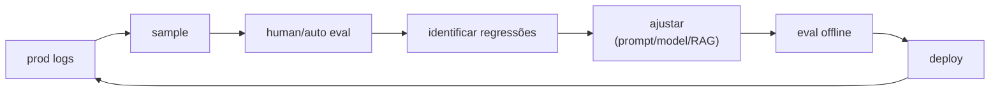
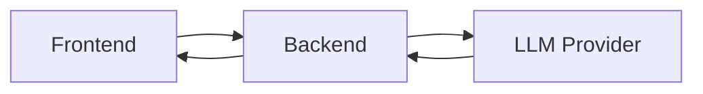
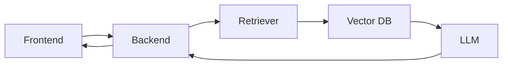
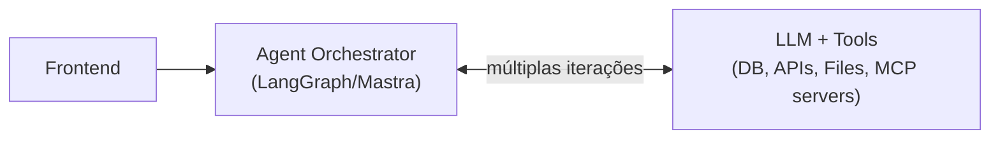

# Módulo 15 — Engenharia de Produção (LLMOps)

> **Objetivo**: levar sistemas de LLM da prototipagem para produção real — observability, custo, latência, cache, deploy, monitoring, drift, A/B testing, CI/CD.
>
> **Pré-requisitos**: Módulos [10](10_eficiencia_e_inferencia_local.md)–[14](14_avaliacao_e_seguranca.md).
>
> **Tempo de referência**: 3–5 semanas.

## Objetivos de aprendizagem

Ao final deste módulo você deve ser capaz de:

- Montar observability completo (traces, logs, metrics) para um sistema de LLM, com os campos específicos que só fazem sentido nesse domínio.
- Calcular custo de uma aplicação de LLM e identificar as alavancas de redução mais eficazes.
- Explicar por que TTFT e TPOT são métricas diferentes e por que streaming muda a latência percebida sem mudar a latência real.
- Explicar por que A/B testing de LLM exige amostras maiores que A/B testing tradicional.
- Diagnosticar os 4 tipos de drift e escolher a mitigação certa para cada.

---

## Por que isso importa

Um demo bonito ≠ produto. Em produção você lida com:
- **Custo real** (cada token é dinheiro).
- **Latência** que afasta usuários.
- **Falhas em cascata**: API caiu, agente trava, usuário fica sem resposta.
- **Drift**: modelo, prompts, dados mudam; qualidade despenca silenciosamente.
- **Compliance**: logs, PII, auditoria.

Isto é o módulo que separa "fiz um chatbot" de "operou um sistema de IA".

---

## 15.1 Observability

### O tripé: traces, logs, metrics
- **Traces**: visão fim-a-fim de uma requisição (cada chamada LLM, cada tool, latência).
- **Logs**: eventos discretos, com contexto.
- **Metrics**: agregações (P50/P95/P99 de latência, taxa de erro, tokens/min).

### Específico de LLM
Adicione: tokens in/out por chamada, custo, prompt versionado, modelo, sampling params, score do juiz/eval, score do guardrail.

> **Intuição**: observability tradicional (traces/logs/metrics) responde "o sistema está saudável?" — latência, erros, throughput. Sistemas de LLM precisam de uma camada extra porque a *qualidade* da resposta é uma dimensão totalmente separada da saúde técnica: um sistema pode estar 100% "saudável" (sem erros, latência baixa) e ainda assim estar gerando respostas ruins, alucinadas ou fora de política. É por isso que campos como "score do juiz" e "score do guardrail" (mod. [14](14_avaliacao_e_seguranca.md)) precisam estar no mesmo trace que latência e custo — sem isso, você só enxerga metade do que pode estar quebrado.

### Ferramentas
- `Ferramenta` **Langfuse** — open-source, self-hostable. https://langfuse.com/
- `Ferramenta` **LangSmith** — SaaS LangChain. https://www.langchain.com/langsmith
- `Ferramenta` **Helicone** — proxy + analytics. https://www.helicone.ai/
- `Ferramenta` **Phoenix** (Arize). https://github.com/Arize-ai/phoenix
- `Ferramenta` **Weights & Biases — Weave**. https://wandb.ai/site/weave
- `Ferramenta` **OpenTelemetry GenAI semantic conventions** — padrão emergente. https://opentelemetry.io/docs/specs/semconv/gen-ai/

### TS / JS
- Langfuse, Helicone e LangSmith têm SDKs TS.
- OpenTelemetry tem SDK Node.js completo.

### Princípios
- **Trace por sessão e por requisição** — sempre conseguir reconstruir a história.
- **Tags estruturadas** — modelo, versão de prompt, feature flag, tier de usuário.
- **Privacidade**: logs com PII precisam de redação ou criptografia em rest.

---

## 15.2 Custo e cost engineering

### Modelo mental de custo
```
custo = ∑ (tokens_in × preço_in + tokens_out × preço_out) [+ chamadas a tools / embeddings / vector DB]
```

### Comparativos públicos
- **Artificial Analysis**. https://artificialanalysis.ai/
- **OpenRouter** (preços e benchmarks). https://openrouter.ai/

### Estratégias de redução
- **Cache de prompts** (Anthropic prompt caching, OpenAI prompt caching) — reduz custo de prompts longos repetidos.
- **Cache semântico** — cache em nível de query (com embedding match).
- **Roteamento entre modelos** — modelo barato resolve o fácil; modelo caro só para o difícil. Routers: RouteLLM, Martian.
- **Compactação de prompts** — LLMLingua. `Paper` https://arxiv.org/abs/2310.05736
- **Modelos menores fine-tunados** para tarefas específicas.
- **Batching** quando latência permite.
- **Streaming** para latência percebida menor (não custo, mas UX).

### Calculadoras
- Faça **a sua**: custo médio por user, por feature, p95 — e expresse em $/dia, $/mês.

---

## 15.3 Latência e performance

### Fatores
- **TTFT (Time To First Token)**: critico em chat.
- **TPOT (Time Per Output Token)**: define velocidade de geração.
- **Tokens totais**.
- **Network round-trips** entre serviços.
- **Cold starts** em serverless.

> **Intuição**: TTFT e TPOT medem coisas diferentes e otimizam-se de formas diferentes. TTFT é o tempo até o *primeiro* token aparecer — dominado por overhead de rede, fila de processamento, e o custo de processar o prompt inteiro (prefill) antes de começar a gerar. TPOT é o tempo *entre* tokens subsequentes — dominado pela velocidade de geração autoregressiva em si (mod. [10](10_eficiencia_e_inferencia_local.md#102-kv-cache-e-otimizações-de-inferência)). Streaming não muda nem TTFT nem TPOT tecnicamente — a resposta completa ainda leva o mesmo tempo total — mas muda a *latência percebida*: o usuário vê o primeiro token rapidamente e a sensação de "o sistema está trabalhando" substitui a sensação de "o sistema travou", mesmo com o tempo total idêntico.
>
> **Checkpoint**: sem olhar o texto, explique a diferença entre TTFT e TPOT — otimizar um necessariamente otimiza o outro?

### Otimizações
- **Modelos menores** quando bastam.
- **Streaming** para esconder TPOT.
- **Speculative decoding** (mod. [10](10_eficiencia_e_inferencia_local.md)).
- **Prompt caching**.
- **Edge inference** quando possível.
- **Reduzir prompt** sem perder qualidade.

### Benchmarks
- **Lateralidade real do usuário** (browser → backend → LLM → backend → browser) é maior que latência da API.

---

## 15.4 Cache

### Níveis
- **Exact-match**: hash da query → resposta. Útil em FAQ.
- **Semantic cache**: embedding da query → busca top-1 no cache; se similaridade > threshold, retorna.
- **Prompt prefix cache** (servidor): mesmo system prompt entre usuários compartilha computação.
- **HTTP cache padrão** para recursos (docs, embeddings).

> **Intuição**: exact-match cache só ajuda quando a mesma pergunta literal se repete — útil, mas limitado (usuários raramente digitam a mesma pergunta com as mesmas palavras exatas). Semantic cache generaliza isso usando embeddings (mod. [12](12_rag.mdx#122-embeddings)): perguntas *semanticamente* parecidas ("qual o horário de vocês?" e "vocês abrem que horas?") caem no mesmo cache mesmo com palavras diferentes. O trade-off é o threshold de similaridade — muito permissivo, perguntas diferentes recebem a resposta errada; muito restritivo, o cache raramente é usado. Prompt prefix cache ataca um problema diferente: quando muitos usuários compartilham o mesmo system prompt longo, reprocessar esse prefixo idêntico do zero a cada requisição é desperdício puro — o servidor reutiliza o cálculo já feito (via KV-cache, mod. 10) para a parte comum.

### Ferramentas
- `Ferramenta` **GPTCache**. https://github.com/zilliztech/GPTCache
- `Ferramenta` **Redis** com vector search.
- `Ferramenta` **Provedor cache** (Anthropic, OpenAI).

### Cuidados
- Stale cache em domínios dinâmicos.
- Cache poisoning via prompt injection.

---

## 15.5 Deploy

### Padrões de deploy de aplicação LLM
- **Backend tradicional**: API (FastAPI, Express, Hono) chamando provedor LLM ou modelo self-hosted.
- **Serverless**: Vercel, Cloudflare Workers, AWS Lambda — bom para tráfego intermitente.
- **Edge**: Cloudflare AI, Vercel Edge — latência baixa, mas restrições de bibliotecas (TS-friendly).
- **Self-hosted modelo** + frontend: Kubernetes/Nomad com vLLM/TGI atrás de gateway.

### Containers
- **Docker** com multi-stage builds.
- **GPU containers**: imagens NVIDIA NGC ou builds próprios com CUDA + Python.
- **Air-gapped** quando dado é sensível.

### Frameworks/templates
- **LangServe** (Python) — deploy rápido de chains LangChain. https://www.langchain.com/langserve
- **BentoML**, **Ray Serve**.
- **Modal**, **Replicate**, **Banana** — serverless GPU.
- **HuggingFace Inference Endpoints** — managed.

### CI/CD para LLM apps
- Testes que incluem **eval contra dataset** em PR.
- **Versionamento de prompts** + dataset + modelo + código.
- **Canary deployment** — % do tráfego em nova versão.
- **Rollback rápido** quando métrica cai.

---

## 15.6 A/B testing e experimentação

### Específico para LLMs
- A/B em **prompt versions**, **modelo**, **temperatura**, **tool sets**.
- Métricas:
  - **Engajamento**: tempo de sessão, mensagens por sessão.
  - **Outcome**: tarefa completada, conversão, satisfação.
  - **Qualidade**: thumbs up/down, eval automática.
- **Statistical power**: LLM gera variância maior que features estáticas; n maior necessário.

> **Intuição**: um teste A/B tradicional (ex.: cor de um botão) tem resultado binário e relativamente estável por usuário — clicou ou não clicou. Saída de LLM tem variância inerente mesmo pro *mesmo* prompt (sampling, mod. [10](10_eficiencia_e_inferencia_local.md#108-sampling-e-parâmetros-de-geração)) — duas respostas à mesma pergunta podem diferir em qualidade percebida sem que nada tenha mudado estruturalmente. Essa variância extra "engole" parte do sinal que você está tentando medir, exigindo mais amostras para atingir a mesma confiança estatística de que a diferença observada entre variante A e B é real, e não apenas ruído de amostragem do próprio modelo.
>
> **Checkpoint**: sem olhar o texto, explique por que testar prompts A/B exige mais tráfego que testar duas cores de botão A/B, para a mesma confiança estatística.

### Ferramentas
- **GrowthBook**, **PostHog**, **Statsig** — feature flags + experimentos.
- **Promptfoo** integra eval com PRs.

---

## 15.7 Monitoring e drift

### O que monitorar
- **Saúde do sistema**: latência, taxa de erro, custo por dia.
- **Qualidade**: eval automático em sample de produção, thumbs up/down.
- **Drift**:
  - **Data drift**: distribuição de queries muda.
  - **Concept drift**: mesma query, resposta correta diferente (ex: notícias).
  - **Prompt drift**: alterações acumuladas degradam.
  - **Provider drift**: provider atualiza modelo silenciosamente.
- **Safety incidents**: jailbreaks, alucinação grave.

> **Intuição**: os 4 tipos de drift têm causas e mitigações diferentes, apesar de todos se manifestarem como "qualidade caindo aos poucos". Data drift é sobre *o que os usuários perguntam* mudando (ex.: um produto novo lançado gera queries que o sistema nunca viu). Concept drift é sobre *a resposta certa* mudando para a mesma pergunta (o mundo mudou, não o sistema). Prompt drift é auto-inflingido — pequenos ajustes acumulados no prompt ao longo de meses, cada um razoável isoladamente, que juntos degradam o comportamento de formas difíceis de rastrear a uma mudança específica. Provider drift é o mais insidioso: você não mudou nada, mas o provedor atualizou o modelo por trás da mesma API — é por isso que pinning de versão de modelo (quando disponível) e monitoring contínuo (não só "testei uma vez e funcionou") são não-negociáveis em produção.

### Ferramentas
- Langfuse / LangSmith / Helicone agregam métricas.
- **Evidently AI** — drift em features tradicionais.
- **Arize Phoenix** — drift e tracing combinados.

### Ciclo


> **Checkpoint**: sem olhar o texto, explique a diferença entre data drift e concept drift com um exemplo próprio para cada.

---

## 15.8 Versionamento e governance

### O que versionar
- **Código** (Git, padrão).
- **Prompts** (banco, ou Git, ou ferramenta de prompt management).
- **Datasets** (DVC, Hugging Face datasets, Git LFS, blob storage).
- **Modelos** (HF Hub, MLflow Model Registry).
- **Embeddings indexados** (snapshots do vector DB).
- **Configurações** de pipeline.

### Reprodutibilidade
- Cada resposta em produção rastreável a:
  - Versão de código.
  - Versão de prompt.
  - Versão de modelo.
  - Versão de índice RAG.
  - Random seed (quando aplicável).

### Ferramentas
- `Ferramenta` **MLflow**. https://mlflow.org/
- `Ferramenta` **Weights & Biases**. https://wandb.ai/
- `Ferramenta` **Aim**. https://github.com/aimhubio/aim
- `Ferramenta` **DVC**. https://dvc.org/

---

## 15.9 Compliance e regulação

### Frameworks relevantes
- **GDPR** (UE) — direito à informação, deleção, portabilidade.
- **LGPD** (Brasil) — análoga ao GDPR.
- **EU AI Act** (2024+) — categorias de risco, transparência.
- **HIPAA** (saúde EUA), **PCI-DSS** (pagamentos).
- **NIST AI Risk Management Framework**. https://www.nist.gov/itl/ai-risk-management-framework

### Implicações práticas
- **Logs com PII**: criptografia, retenção limitada, redação.
- **Direito de explicação**: deve poder justificar saídas.
- **Direito de não submissão a decisão automatizada** (LGPD/GDPR).
- **Auditoria**: trilhas reproduzíveis.

---

## 15.10 Failure modes em produção

### Recorrentes
- **API do provider** caiu / latente. Mitigação: fallback para outro provider.
- **Rate limits** estouraram. Mitigação: queue, backoff exponencial, multi-key.
- **Timeout** em geração longa. Mitigação: streaming, max_tokens, deadline.
- **Output em formato errado**. Mitigação: validação + retry com mensagem de correção.
- **Loop em agente**. Mitigação: max_steps, detecção de repetição.
- **Custo descontrolado**. Mitigação: rate limit por user, alertas em $/h.
- **Prompt injection** explorada. Mitigação: guardrails + monitoring.
- **Jailbreak** viral. Mitigação: refusal mais forte + detecção.

### Padrão Circuit Breaker
Como em microsserviços tradicionais: se taxa de erro > X em janela Y, "abre" o circuito, falha rapidamente, retorna fallback. Especialmente útil com LLMs externos.

> Circuit breaker existe porque, sem ele, um provider degradado (lento, mas não totalmente fora do ar) pode derrubar seu sistema inteiro indiretamente — cada requisição espera o timeout completo antes de falhar, esgotando conexões/threads disponíveis. "Abrir o circuito" após detectar a degradação falha *rápido* (sem esperar timeout) e libera capacidade para outras requisições ou fallback, em vez de todo o sistema travar esperando um provider que não vai responder a tempo.

---

## 15.11 Padrões de arquitetura de aplicação

### Single-call (mais simples)


### RAG-augmented


### Agentic


### Multi-tenant
Atenção a:
- Isolamento de contexto (PII de A não vaza para B).
- Rate limit por tenant.
- Custo allocado por tenant.
- Modelos/prompts customizados por tenant.

---

## 15.12 Custos invisíveis frequentes

- **Embeddings**: rebuild de índice a cada mudança de chunking custa caro.
- **Vector DB**: storage + queries em escala.
- **Tracing/observability** em SaaS pode escalar com volume.
- **Egress** (cloud egress fees) ao mover dados.
- **Cold-start em serverless GPU**: primeiros segundos pagam o preço do warmup.

---

## Projetos práticos

### Projeto 15.1 — Observability completo
- Pegue um pipeline RAG/agente do mod. [12](12_rag.mdx) ou 13.
- Adicione Langfuse self-hosted (Docker compose).
- Capture traces detalhados + custo por chamada.
- Construa dashboard com p50/p95 de TTFT, custo/dia, taxa de erro.

### Projeto 15.2 — Cache semântico
- Implemente semantic cache em Redis (com módulo de vetores) ou GPTCache.
- Meça hit rate em workload realista (logs de projeto anterior).
- Documente quando cache leva a respostas defasadas/erradas.

> **Variante guiada**: teste deliberadamente com um par de perguntas quase-idênticas mas com resposta correta diferente (ex.: "qual o preço do plano básico?" antes e depois de um reajuste) — isso expõe concretamente o risco de cache semântico "stale" descrito na seção 15.4.

### Projeto 15.3 — Roteamento de modelos
- Implemente router: queries simples → modelo pequeno open; complexas → modelo grande.
- Use classificador (zero-shot ou pequeno LLM) para decidir.
- Compare custo total vs sempre usar modelo grande.

### Projeto 15.4 — Deploy multi-ambiente
- Mesmo backend (FastAPI ou Hono) deployado em:
  - Vercel / Cloudflare Workers (edge).
  - Container em VPS / Fly.io.
  - Self-hosted com vLLM atrás.
- Compare TTFT, custo, complexidade.

### Projeto 15.5 — Pipeline CI/CD com eval
- GitHub Actions:
  - PR triggera linting + testes unitários + suite de eval (Promptfoo) contra dataset fixo.
  - Métricas regredem? Bloqueia merge.
  - Merge dispara deploy canary.

### Projeto 15.6 — Detecção de drift
- Capture 1k queries reais.
- Calcule embeddings; detecte se distribuição mudou (KS-test em projeções, ou clustering).
- Alerte quando > X% de queries são "novas" comparadas à base de eval.

### Projeto 15.7 — Resiliência
- Implemente fallback: provider primário → secundário → modelo local.
- Circuit breaker.
- Teste com chaos: derrube providers e meça comportamento.

> **Variante guiada**: confirme primeiro que o circuit breaker "abre" corretamente sob falha simulada (derrube o provider primário de propósito e observe o fallback acionar) antes de considerar o sistema resiliente — resiliência não testada é só uma esperança.

---

## Erros comuns

- **Não logar prompt + resposta** completos — debug fica impossível.
- **Logar PII** sem redação — exposição legal.
- **Eval só offline** — sem feedback de produção, drift mata silenciosamente.
- **Não medir custo** — surpresa no fim do mês.
- **Acoplamento com 1 provider** — quando ele cai/aumenta preço, sistema quebra.
- **Esquecer rate limit** quando tráfego sobe.
- **Confundir thumbs up/down com eval real** — sinal ruidoso, mas útil agregado.
- **Subestimar drift** silencioso quando provider atualiza modelo.

---

## Conexão com módulos seguintes

Este módulo é o "meta" sobre os anteriores. Os galhos (mod. [16](16_visao_computacional.md)–[19](19_topicos_avancados.md)) podem reaproveitar tudo aqui.

---

## Checklist de saída

- [ ] Tenho observability completo (traces + custo + qualidade) em projeto real.
- [ ] Pipeline com eval automático bloqueando regressões em CI.
- [ ] Implementei cache semântico ou prompt caching com ganho mensurável.
- [ ] Sei estimar e monitorar $ por usuário, $ por feature.
- [ ] Tenho fallback / circuit breaker para falhas de provider.
- [ ] Sei o básico de compliance (LGPD/GDPR) aplicado a LLM apps.
- [ ] Posso fazer A/B test de prompts/modelos com métricas válidas.
