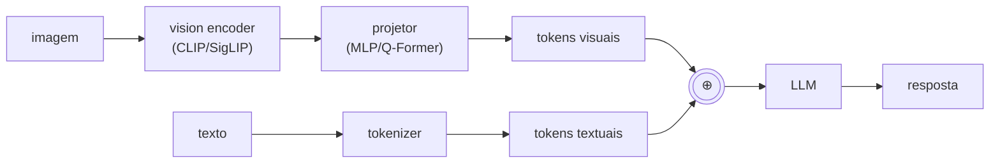

# Módulo 18 — Modelos Multimodais

> **Objetivo**: dominar modelos que combinam texto + imagem + áudio (+ vídeo). VLMs (LLaVA, Qwen-VL, InternVL), modelos de fala (Whisper, voice models), modelos visão-linguagem-ação, omni-modal.
>
> **Pré-requisitos**: Módulos [08](08_llms_arquiteturas.md)–[17](17_aprendizado_reforco.md) — em particular, CLIP/OpenCLIP e os modelos de visão via Ollama (mod. 16), LoRA/TRL (mod. 09), e o agente de browser do Projeto 13.7, que este módulo estende com visão de verdade.
>
> **Tempo de referência**: 4–6 semanas.

## Objetivos de aprendizagem

Ao final deste módulo você deve ser capaz de:

- Explicar os 3 padrões arquiteturais multimodais (encoder+projetor, cross-attention, nativo) e o trade-off entre eles.
- Explicar o que um Q-Former faz e por que "comprimir" tokens visuais importa.
- Descrever o recipe do LLaVA e por que ele é tão barato de treinar comparado a um VLM do zero.
- Explicar por que ColPali pula OCR e embeda a página inteira como imagem.
- Escolher entre pipeline de VC clássico (OCR) e VLM end-to-end para uma tarefa de documento.

---

## Por que isso importa

A interface humana com IA está se tornando inerentemente multimodal: foto + pergunta, voz + tela, vídeo + comando. Os modelos de ponta atuais (Claude, GPT-4o, Gemini, Qwen-VL, LLaVA-OneVision) são todos multimodais. Agentes profissionais leem screenshots (você já fez uma versão simplificada disso, baseada em DOM, no Projeto 13.7), escutam comandos, processam documentos com diagramas. Sem este módulo, você está limitado a texto puro.

---

## 18.1 Padrões arquiteturais multimodais

### Encoders separados + projetor (padrão LLaVA-style)


Este é o padrão dominante: **encoder visual congelado** + **projetor treinado** para mapear features visuais ao espaço de embedding do LLM.

### Cross-attention layered (Flamingo-style)
LLM tem camadas extras de cross-attention que consultam features visuais. Mais complexo, melhor para vídeo longo.

### Native multimodal / unified tokenizer
Modelo treinado from scratch com tokens unificados (texto + imagem patches + áudio frames) — a tendência mais recente, com modelos como Chameleon (Meta), Gemini (treinado conjuntamente desde o início) e GPT-4o (omni-modal nativo).

### Mixture of Modality Experts
MoE (mod. 08) onde experts diferentes se especializam por modalidade, em vez de por domínio de conhecimento.

> **Intuição**: os três padrões trocam custo de treino por flexibilidade. Encoder+projetor (o diagrama acima) é o mais barato: pegue um LLM já pronto e um vision encoder já pronto (ambos congelados — transfer learning puro, o mesmo princípio do Projeto 16.1), treine só uma pequena "ponte" (o projetor) que traduz features visuais para o espaço de embedding que o LLM já entende — é literalmente ensinar dois especialistas que já existem a se comunicar, sem retreinar nenhum dos dois. Cross-attention (Flamingo) dá ao LLM acesso mais rico às features visuais (consulta ativamente, camada por camada, em vez de só receber tokens visuais concatenados no início) — mais caro de treinar, mas lida melhor com sequências visuais longas (vídeo) onde "concatenar tudo no início" ficaria proibitivo. Nativo multimodal é o mais caro (treina tudo junto, do zero, sem aproveitar um LLM pré-existente) mas potencialmente o mais capaz, porque o modelo aprende a processar as modalidades de forma verdadeiramente integrada desde o início, em vez de "encaixar" visão num modelo que só conhecia texto. O LLaVA que você já usou via Ollama (mod. 16) segue exatamente o padrão encoder+projetor.
>
> **Checkpoint**: sem olhar o texto, explique por que o padrão LLaVA-style (encoder+projetor) é tão mais barato de treinar que um modelo nativo multimodal.

---

## 18.2 CLIP e modelos contrastivos visão-texto

Você já usou CLIP diretamente no Projeto 16.6 (zero-shot classification) e no Projeto 16.3 (comparando embeddings com DINOv2) — a intuição de contrastive learning entre modalidades já foi construída ali. Aqui, o foco é no papel de CLIP como **peça de infraestrutura** de praticamente todo VLM deste módulo, não só como classificador zero-shot: encoders CLIP (ou variantes como SigLIP, treinado com uma loss sigmoid em vez de softmax, mais estável em batches grandes) são o "vision encoder" na maioria dos diagramas da seção 18.1.

### Por que CLIP foi um marco
- **Zero-shot classification**: classifique sem treinar — só descreva as classes em texto.
- **Embeddings universais**: imagem e texto no mesmo espaço.
- **Backbone para muitas coisas**: Stable Diffusion, LLaVA, etc.

### Aplicações
- Image-text retrieval (em RAG multimodal, seção 18.11).
- Zero-shot classification.
- Filtragem de datasets (o dataset LAION foi filtrado usando o próprio CLIP).
- Inicialização de VLMs.

---

## 18.3 BLIP, BLIP-2 e modelos de captioning

BLIP-2 introduziu o Q-Former (detalhado abaixo) para conectar um encoder visual congelado a um LLM congelado, treinando só a ponte entre eles — a mesma filosofia de custo mínimo que o LLaVA (seção 18.4) leva ainda mais longe. InstructBLIP aplica instruction-tuning (mod. 09) em cima do BLIP-2.

### Q-Former
Módulo aprendível que extrai um número fixo de "query tokens" do encoder visual, comprimindo informação para o LLM. Padrão em vários VLMs.

> **Intuição**: uma imagem em alta resolução processada por um vision encoder pode gerar centenas de tokens visuais (um por patch) — caro em termos de contexto do LLM, especialmente com múltiplas imagens ou vídeo. Q-Former resolve isso com um pequeno conjunto de "queries" aprendidas (ex.: 32) que fazem cross-attention sobre todos os tokens visuais e produzem uma representação comprimida de tamanho fixo — não importa se a imagem gerou 200 ou 2000 tokens visuais brutos, o Q-Former sempre entrega o mesmo número fixo e compacto de tokens ao LLM. É uma forma de compressão aprendida, análoga em espírito ao gargalo de um autoencoder — forçar uma representação menor obriga o modelo a reter só a informação mais relevante.

---

## 18.4 LLaVA e a família de VLMs open

### LLaVA recipe
1. Pegue LLM forte (Vicuna/LLaMA).
2. Pegue vision encoder (CLIP).
3. Treine **só um projetor MLP** com pares (imagem, descrição).
4. Faça SFT com instruções visuais.

Resultado: VLM competitivo com fração do compute de treinar um modelo nativo multimodal do zero. É essencialmente o mesmo pipeline SFT do Projeto 9.1, com a diferença de que aqui o "modelo" sendo ajustado inclui uma nova camada (o projetor) conectando um encoder visual pré-existente ao LLM, não só LoRA sobre pesos já existentes.

A família LLaVA evoluiu através de LLaVA-1.5, LLaVA-NeXT (resolução mais alta) e LLaVA-OneVision (imagem única, múltiplas imagens e vídeo no mesmo modelo). O ecossistema de VLMs abertos é amplo e muda rápido: Qwen-VL/Qwen2-VL/Qwen2.5-VL (Alibaba, o mesmo `qwen2.5vl` que você já usou via Ollama no Projeto 16.5), InternVL (OpenGVLab), MiniCPM-V (OpenBMB, otimizado para edge — usado no Projeto 18.4), Pixtral (Mistral), Molmo (Allen AI), Phi-3.5/Phi-4 Multimodal (Microsoft), PaliGemma (Google, com uma receita de treino completamente pública — boa referência educacional, também usada no Projeto 18.4), NVLM (NVIDIA) e Idefics (Hugging Face).

---

## 18.5 Capacidades modernas de VLMs

### High-resolution / dynamic resolution
Modelos modernos (Qwen2-VL, InternVL 2.5) processam imagens em resolução nativa, sem downsampling agressivo. Crítico para OCR, leitura de documentos, UI.

### Multi-image e vídeo
Modelos como LLaVA-OneVision, Qwen2-VL e InternVL 2 aceitam múltiplas imagens no mesmo prompt, ou um vídeo tratado como sequência de frames com positional embeddings temporais adicionais (marcando "quando" cada frame ocorre, além de "onde" cada patch está dentro do frame).

### Document understanding
Modelos especializados (Donut, Pix2Struct, DocOwl) ou VLMs de propósito geral modernos fazem OCR, entendimento de layout, e resposta a perguntas sobre um documento numa única passada — sem um pipeline de OCR separado.

### Grounding e referring
"Aponte onde está X na imagem" — o modelo retorna coordenadas de bounding box, não só uma descrição textual. Grounding DINO, Florence-2 e Qwen2-VL suportam isso nativamente.

### Computer use / GUI agents
Modelos especializados em ler screenshots e gerar ações (clicar, digitar) — CogAgent, ShowUI, Claude Computer Use e OS-Copilot são exemplos. Você constrói uma versão desse padrão, com um VLM local, no Projeto 18.6.

---

## 18.6 Modelos de áudio e fala

### ASR (Automatic Speech Recognition)
Whisper (OpenAI) é o modelo de referência: aberto, multilíngue, robusto a ruído e sotaque. Variantes otimizadas para velocidade incluem faster-whisper (reimplementação em CTranslate2, usada no Projeto 18.5), whisper.cpp (C++, para CPU/edge) e Distil-Whisper (destilado, mod. 10). SeamlessM4T (Meta) cobre tradução de fala multilíngue diretamente; wav2vec 2.0 é um foundation model de áudio self-supervised, análogo em espírito ao DINOv2 (mod. 16) para imagens.

### TTS (Text-to-Speech)
Piper (rápido, local — usado no Projeto 18.5), F5-TTS, MeloTTS, StyleTTS 2 e Kokoro TTS são as opções abertas mais citadas atualmente; Bark é gerativo e mais expressivo, mas mais lento; Tortoise TTS prioriza qualidade sobre velocidade.

### Modelos de áudio gerais (música, sons)
MusicGen (Meta), Stable Audio e AudioLDM geram áudio/música a partir de texto; CLAP é o equivalente do CLIP para áudio — um espaço de embedding compartilhado entre áudio e texto.

### Speech-to-Speech / voice
GPT-4o (proprietário) popularizou conversação por voz de baixa latência direto modelo-a-modelo, sem um pipeline ASR→LLM→TTS separado; Moshi (Kyutai, aberto) é a alternativa open mais citada seguindo esse mesmo princípio. O Projeto 18.5 constrói a versão "clássica" (pipeline em 3 etapas), mais simples de montar com peças que você já conhece.

---

## 18.7 Modelos de vídeo

### Compreensão (vídeo → texto/resposta)
VideoChat, Video-LLaVA, InternVideo e o próprio Qwen2-VL processam vídeo como entrada, respondendo perguntas sobre o conteúdo; Gemini se destaca por aceitar vídeos de contexto muito longo (até horas).

### Geração (texto → vídeo)
Sora (OpenAI) e Veo (Google) são os modelos proprietários mais conhecidos; entre os abertos, Mochi 1 (Genmo), CogVideoX, HunyuanVideo (Tencent) e LTX-Video (Lightricks) são as opções mais citadas — você experimenta com um deles no Projeto 18.7. Stable Video Diffusion e AnimateDiff antecederam essa geração mais recente de modelos.

---

## 18.8 Modelos visão-linguagem-ação (VLA)

Para robótica e agentes embodied: RT-1/RT-2 (Google) produzem ações de robô diretamente a partir de visão + instrução em texto; OpenVLA é a versão aberta mais citada do mesmo princípio; π0 (Physical Intelligence) e Octo seguem a mesma linha — fora do escopo prático deste módulo, mas relevantes se você seguir para robótica.

---

## 18.9 Treinamento e fine-tuning de VLMs

### Estágios
1. **Pretrain do projetor**: dados (imagem, caption) — datasets como LAION, COYO, CC12M.
2. **SFT visual**: dados (imagem, instrução, resposta) — LLaVA-Instruct, ShareGPT4V, entre outros.
3. **(opcional) DPO/RLHF visual** — o mesmo princípio do mod. 09, aplicado a preferências sobre respostas que envolvem imagem.

> Esses três estágios espelham diretamente o pipeline de LLM do mod. [09](09_treinamento_e_alinhamento.mdx#91-pipeline-completo-de-uma-llm-moderna) (pré-treino → SFT → alinhamento por preferência) — só que o "pré-treino" aqui é focado especificamente em ensinar o projetor a traduzir entre espaços visual e textual, já que o LLM em si já vem pré-treinado. Você aplica o estágio 2 (SFT visual, via LoRA) diretamente no Projeto 18.4.

### Datasets visuais úteis
LAION-2B, COYO-700M e DataComp são os datasets de escala massiva usados no pré-treino de encoders visuais e projetores; ShareGPT4V oferece legendas mais ricas (geradas por um VLM forte); para documentos especificamente, DocVQA, ChartQA, InfographicVQA e AI2D são os datasets de referência.

---

## 18.10 Avaliação de multimodal

### Benchmarks
MMMU (múltiplas disciplinas, nível universitário), MMBench (checklists granulares por capacidade), MM-Vet, OCRBench/DocVQA/ChartQA/AI2D (documentos), MathVista/MathVerse (raciocínio matemático visual), POPE (mede especificamente alucinação visual — o modelo afirma que um objeto está presente quando não está), e VideoMME/MVBench (vídeo) são os benchmarks mais citados; o Open VLM Leaderboard (HF) agrega resultados de vários deles para comparação entre modelos.

### Métricas específicas
- **Hallucination rate** em imagens.
- **Grounding accuracy** (IoU de bounding boxes — a mesma métrica de sobreposição usada em detecção de objetos, mod. 16).
- **OCR accuracy** em documentos.

---

## 18.11 Multimodal RAG e embeddings

### RAG com imagens
Embeddings unificados (CLIP, SigLIP, Jina-CLIP, Cohere Multimodal) permitem busca cruzada: query em texto recupera imagens; query em imagem recupera textos — o mesmo padrão de busca por similaridade de cosseno do Projeto 12.1, com embeddings que colocam as duas modalidades no mesmo espaço.

### Document RAG moderno
ColPali e variantes pulam OCR inteiramente: embeddam a **imagem da página** diretamente, sem nunca extrair o texto explicitamente. Excelente para layouts complexos (finance, science, legal). Você compara essa abordagem contra o RAG tradicional do mod. 12 diretamente no Projeto 18.3.

> **Intuição**: RAG tradicional sobre PDFs (mod. [12](12_rag.mdx)) depende de OCR extrair texto corretamente antes de fazer qualquer coisa — e OCR falha silenciosamente em layouts complexos (tabelas multi-coluna, gráficos com legendas, diagramas com texto embutido), perdendo estrutura que carrega significado. ColPali contorna isso tratando a página inteira como uma *imagem* e usando um modelo tipo ViT (mod. [16](16_visao_computacional.md#163-vision-transformer-vit-e-variantes)) para embeddar diretamente — preservando layout, posição relativa de elementos, e informação visual que uma etapa de OCR teria descartado. O trade-off: embeddings de imagem de página são mais pesados que embeddings de texto puro, mas a fidelidade em documentos visualmente complexos compensa.
>
> **Checkpoint**: sem olhar o texto, explique por que RAG tradicional (OCR + texto) pode falhar num documento com uma tabela complexa, e o que ColPali faz de diferente.

---

## Projetos práticos

### Projeto 18.1 — Zero-shot com CLIP, em Python e no browser

Você vai estender o classificador zero-shot do Projeto 16.6, comparando CLIP com SigLIP, e reproduzindo o mesmo mecanismo diretamente no navegador.

**Pré-requisitos**: o setup do Projeto 16.6 (`open_clip_torch`), mais o setup do Projeto 10.5/16.7 (`@xenova/transformers`).

**1. Compare CLIP com SigLIP na mesma tarefa**:

```python
import open_clip

modelo_clip, _, preprocess_clip = open_clip.create_model_and_transforms("ViT-B-32", pretrained="openai")
modelo_siglip, _, preprocess_siglip = open_clip.create_model_and_transforms("ViT-B-16-SigLIP", pretrained="webli")

# reaproveite classificar_zero_shot do Projeto 16.6, parametrizado pelo modelo/preprocess/tokenizer,
# rodando com os dois modelos nas mesmas imagens e categorias, comparando confiança e acerto
```

**2. Reproduza zero-shot classification no navegador**, reaproveitando o padrão do Projeto 16.7:

```javascript
import { pipeline } from "@xenova/transformers";

async function classificarZeroShotBrowser(urlImagem, categorias) {
  const classificador = await pipeline("zero-shot-image-classification", "Xenova/clip-vit-base-patch32");
  const resultado = await classificador(urlImagem, categorias);
  console.log(resultado);
}

classificarZeroShotBrowser("https://exemplo.com/foto.jpg", ["gato", "cachorro", "pássaro"]);
```

O pipeline `"zero-shot-image-classification"` do `transformers.js` já encapsula o mecanismo que você implementou manualmente em Python no Projeto 16.6 (embeddar imagem, embeddar cada categoria como texto, comparar por similaridade) — compare o resultado e a latência com a versão Python/servidor.

---

### Projeto 18.2 — Comparar VLMs locais em 3 tarefas

Você vai rodar pelo menos 2 VLMs locais via Ollama (que você já usa desde o Projeto 16.5) em 3 tipos de tarefa, de forma sistemática.

**Pré-requisitos**: `ollama pull qwen2.5vl` e `ollama pull llava`.

```python
import requests
import base64

def perguntar_sobre_imagem(caminho_imagem, pergunta, modelo):
    with open(caminho_imagem, "rb") as f:
        imagem_b64 = base64.b64encode(f.read()).decode()
    response = requests.post(
        "http://localhost:11434/api/generate",
        json={"model": modelo, "prompt": pergunta, "images": [imagem_b64], "stream": False},
    )
    return response.json()["response"]

tarefas = [
    ("screenshot_app.png", "Descreva os elementos de interface visíveis nesta tela."),
    ("documento_scaneado.png", "Transcreva todo o texto visível nesta imagem."),
    ("foto_paisagem.jpg", "Descreva esta imagem em uma frase."),
]

for imagem, pergunta in tarefas:
    for modelo in ["qwen2.5vl", "llava"]:
        resposta = perguntar_sobre_imagem(imagem, pergunta, modelo)
        print(f"\n[{modelo}] {imagem}: {resposta[:200]}")
```

A única diferença estrutural em relação a todas as chamadas ao Ollama que você já fez é o campo `images` — o resto do padrão (`requests.post` para `/api/generate`) é idêntico ao que você usa desde o Projeto 8.1. Documente qual modelo se saiu melhor em cada tipo de tarefa (análise de screenshot, OCR, captioning geral) — não é incomum que modelos diferentes tenham pontos fortes bem diferentes entre essas 3 categorias, mesmo com tamanhos de parâmetros parecidos.

---

### Projeto 18.3 — RAG multimodal de fato, com ColPali

Você vai construir RAG sobre PDFs com diagramas usando ColPali (que pula OCR, embeddando páginas como imagem) e comparar com o pipeline OCR-based do mod. 12.

**Pré-requisitos**: `pip install colpali-engine pdf2image`, alguns PDFs com tabelas/diagramas complexos (papers técnicos funcionam bem).

**1. Indexe páginas de PDF diretamente como imagens**:

```python
from colpali_engine.models import ColPali, ColPaliProcessor
from pdf2image import convert_from_path
import torch

modelo = ColPali.from_pretrained("vidore/colpali-v1.2", torch_dtype=torch.bfloat16)
processor = ColPaliProcessor.from_pretrained("vidore/colpali-v1.2")

paginas = convert_from_path("paper_com_diagramas.pdf")  # uma imagem PIL por página

with torch.no_grad():
    inputs_paginas = processor.process_images(paginas)
    embeddings_paginas = modelo(**inputs_paginas)  # um embedding multi-vetor por página, não um único vetor
```

Diferente do CLIP (que produz um único vetor por imagem), ColPali produz um embedding *multi-vetor* por página — um vetor por "patch" da imagem, no espírito do ColBERT (mod. 12) aplicado a documentos: mais granular, permitindo que a busca encontre relevância em uma região específica da página (uma tabela no canto, por exemplo), não só uma similaridade média da página inteira.

**2. Busque e compare com o pipeline OCR tradicional**:

```python
def buscar_colpali(query, embeddings_paginas, k=3):
    with torch.no_grad():
        inputs_query = processor.process_queries([query])
        embedding_query = modelo(**inputs_query)
    scores = processor.score_multi_vector(embedding_query, embeddings_paginas)
    top_k = scores[0].topk(k).indices
    return top_k.tolist()

# compare com o pipeline do Projeto 16.5 (Docling) + retrieval do Projeto 12.1 sobre o texto extraído
```

`score_multi_vector` calcula a similaridade considerando todos os vetores de ambos os lados (query e cada página), não um único produto escalar — a mecânica exata é mais sofisticada que a cosine similarity simples do Projeto 12.1, mas o princípio de uso (rankear páginas por relevância à query) é o mesmo.

**3. Escolha deliberadamente PDFs com tabelas ou diagramas complexos** para o conjunto de teste: rode a mesma pergunta ("qual foi o resultado reportado na Tabela 3?") nos dois pipelines e compare — é onde a diferença entre OCR-based e ColPali deve aparecer mais claramente, confirmando (ou não, no seu conjunto específico de documentos) a intuição da seção 18.11.

---

### Projeto 18.4 — Fine-tune de um mini-VLM

Você vai fazer fine-tuning de um VLM pequeno (PaliGemma ou MiniCPM-V) num domínio próprio, com LoRA — o mesmo padrão do Projeto 9.1, estendido para incluir a modalidade visual.

**Pré-requisitos**: os mesmos do Projeto 9.1, mais um dataset de pares (imagem, pergunta, resposta) no seu domínio (algumas centenas de exemplos — pode ser gerado com um VLM maior como teacher, no mesmo espírito do Projeto 10.4).

```python
from transformers import AutoProcessor, PaliGemmaForConditionalGeneration
from peft import LoraConfig, get_peft_model
from trl import SFTConfig, SFTTrainer

processor = AutoProcessor.from_pretrained("google/paligemma-3b-pt-224")
modelo = PaliGemmaForConditionalGeneration.from_pretrained("google/paligemma-3b-pt-224")

lora_config = LoraConfig(
    r=8, lora_alpha=16,
    target_modules=["q_proj", "k_proj", "v_proj", "o_proj"],  # o mesmo alvo do Projeto 9.1 — a attention do LLM
    task_type="CAUSAL_LM",
)
modelo = get_peft_model(modelo, lora_config)

def formatar_exemplo(exemplo):
    inputs = processor(text=exemplo["pergunta"], images=exemplo["imagem"], suffix=exemplo["resposta"], return_tensors="pt")
    return inputs

# o restante — SFTConfig, SFTTrainer, trainer.train() — segue o mesmo padrão exato do Projeto 9.1
```

A diferença estrutural em relação ao Projeto 9.1 está só na formatação da entrada: `processor` (em vez de `tokenizer`) recebe tanto `text` quanto `images`, e `suffix` marca onde a resposta esperada começa (equivalente ao loss masking da seção 9.3 — a loss é calculada só sobre o `suffix`, não sobre a pergunta+imagem). `target_modules` continua mirando as camadas de attention do LLM subjacente, não o vision encoder (que normalmente permanece congelado, seguindo a filosofia LLaVA da seção 18.4 de treinar o mínimo possível).

---

### Projeto 18.5 — Pipeline de fala completo, local

Você vai montar um loop voz-para-voz completo: ASR transcreve o que você disse, o LLM responde, TTS fala a resposta.

**Pré-requisitos**: `pip install faster-whisper piper-tts sounddevice`.

```python
from faster_whisper import WhisperModel
import subprocess
import sounddevice as sd
import numpy as np

modelo_asr = WhisperModel("small", device="cpu", compute_type="int8")  # quantizado, mod. 10

def gravar_audio(duracao_s=5, taxa_amostragem=16000):
    print("Gravando...")
    audio = sd.rec(int(duracao_s * taxa_amostragem), samplerate=taxa_amostragem, channels=1)
    sd.wait()
    return audio.flatten()

def transcrever(audio, taxa_amostragem=16000):
    segmentos, _ = modelo_asr.transcribe(audio, language="pt")
    return " ".join(s.text for s in segmentos)

def falar(texto, caminho_saida="resposta.wav"):
    subprocess.run(["piper", "--model", "pt_BR-faber-medium", "--output_file", caminho_saida], input=texto.encode())
    subprocess.run(["aplay" if _sistema_linux() else "afplay", caminho_saida])  # aplay (Linux) ou afplay (Mac)

def loop_voz_para_voz():
    while True:
        audio = gravar_audio()
        texto_usuario = transcrever(audio)
        print(f"Você disse: {texto_usuario}")
        if not texto_usuario.strip():
            continue

        resposta = query_ollama(texto_usuario)  # o mesmo padrão desde o Projeto 8.1
        print(f"Resposta: {resposta}")
        falar(resposta)

loop_voz_para_voz()
```

`WhisperModel("small", compute_type="int8")` carrega uma versão quantizada do Whisper (o mesmo princípio de quantização do mod. 10, agora aplicado a um modelo de áudio) — pequena e rápida o bastante para rodar em CPU com latência razoável. O loop é sequencial e simples (grava um turno completo, depois processa) — um sistema de voz de produção (como GPT-4o em modo voz) sobrepõe essas etapas e detecta quando o usuário parou de falar automaticamente, mas essa versão em etapas discretas é suficiente para entender o pipeline completo.

**Meça a latência de cada etapa** (transcrição, geração do LLM, síntese de fala) separadamente, com `time.time()` como em vários projetos anteriores — é normal que a soma das três etapas sequenciais seja perceptível (1-3 segundos), o que explica por que sistemas de voz-para-voz de produção investem tanto em rodar as etapas em paralelo ou usar modelos nativamente de voz-para-voz (seção 18.6), evitando a soma serial dessas três latências.

---

### Projeto 18.6 — Agente que vê a tela de verdade

Você vai substituir a abordagem baseada em DOM do Projeto 13.7 por um VLM que olha diretamente o screenshot — mais próximo do que Anthropic Computer Use ou OS-Copilot fazem.

**Pré-requisitos**: os mesmos do Projeto 13.7 (`playwright`), mais Ollama com `qwen2.5vl`.

```python
from playwright.sync_api import sync_playwright
import requests
import base64
import re

def agente_visual_browser(objetivo, url_inicial, max_passos=8):
    with sync_playwright() as p:
        browser = p.chromium.launch()
        page = browser.new_page()
        page.goto(url_inicial)

        for passo in range(max_passos):
            screenshot_bytes = page.screenshot()
            screenshot_b64 = base64.b64encode(screenshot_bytes).decode()

            prompt = (
                f"Objetivo: {objetivo}\n"
                "Esta é a tela atual do navegador. Responda com uma ação: "
                "CLICK <x> <y> (coordenadas de pixel onde clicar) ou TYPE <texto> ou DONE."
            )
            resposta = requests.post(
                "http://localhost:11434/api/generate",
                json={"model": "qwen2.5vl", "prompt": prompt, "images": [screenshot_b64], "stream": False},
            ).json()["response"].strip()

            print(f"Passo {passo}: {resposta}")
            if resposta.startswith("DONE"):
                break
            elif resposta.startswith("CLICK"):
                match = re.search(r"CLICK\s+(\d+)\s+(\d+)", resposta)
                if match:
                    x, y = int(match.group(1)), int(match.group(2))
                    page.mouse.click(x, y)
            elif resposta.startswith("TYPE"):
                texto = resposta.split(maxsplit=1)[1]
                page.keyboard.type(texto)
            page.wait_for_timeout(1000)

        browser.close()

agente_visual_browser("Encontrar o link 'Sobre' e clicar nele", "https://example.com")
```

A diferença central em relação ao Projeto 13.7: em vez de extrair uma lista textual de elementos clicáveis via JavaScript (`descrever_pagina`), aqui o modelo recebe a imagem inteira da tela (`page.screenshot()`) e precisa estimar diretamente as coordenadas de pixel onde clicar — mais próximo de como um humano usa a tela, mas também mais sujeito a erro (o modelo pode "mirar errado" em elementos pequenos ou densos). Rode o mesmo objetivo nos dois agentes (DOM-based do Projeto 13.7 vs visual deste projeto) nos mesmos 3-5 sites e compare taxa de sucesso, custo (imagens custam mais tokens que texto, seção 18.10) e robustez a mudanças de layout — cada abordagem tem cenários onde é claramente melhor.

---

### Projeto 18.7 — Geração de vídeo

Você vai gerar vídeos curtos a partir de texto usando um modelo aberto, e comparar resultados entre prompts.

**Pré-requisitos**: GPU com bastante VRAM (geração de vídeo é pesada — considere rodar em cloud com GPU alugada), `pip install diffusers transformers accelerate`.

```python
from diffusers import CogVideoXPipeline
import torch

pipe = CogVideoXPipeline.from_pretrained("THUDM/CogVideoX-2b", torch_dtype=torch.float16)
pipe.enable_model_cpu_offload()  # move partes do modelo entre CPU/GPU conforme necessário, economizando VRAM

video = pipe(
    prompt="Uma xícara de café fumegante numa mesa de madeira, luz da manhã entrando pela janela",
    num_frames=49,
    num_inference_steps=50,
).frames[0]

from diffusers.utils import export_to_video
export_to_video(video, "video_gerado.mp4", fps=8)
```

`enable_model_cpu_offload()` é uma técnica de gerenciamento de memória (parecida em espírito com FSDP do mod. 09, só que para inferência, não treino): mantém só a parte do modelo ativamente em uso na GPU, movendo o resto para CPU, permitindo rodar modelos maiores do que a VRAM disponível suportaria de outra forma, ao custo de mais tempo de execução. `num_inference_steps` é o número de passos de denoising do processo de difusão (aprofundado no mod. [19](19_topicos_avancados.md)) — mais passos, geralmente mais qualidade, mais tempo.

Gere vídeos com 3-4 prompts diferentes (variando complexidade de movimento e cena) e documente o tempo de geração de cada um, junto com uma avaliação subjetiva de coerência temporal (o vídeo "flickra" ou os objetos mudam de forma entre frames?) — geração de vídeo, mesmo em 2024-2025, ainda é visivelmente menos consistente que geração de imagem estática.

---

## Erros comuns

- **Misturar tokenizer/processor errado**: VLMs têm processors específicos (image_processor + tokenizer); usar errado quebra silenciosamente.
- **Resolução errada**: forçar 224×224 em modelos high-res = qualidade despenca.
- **OCR delegado a VLM** sem fallback: VLM pode alucinar texto; valide com OCR clássico em paralelo.
- **Custo subestimado**: vídeo é **caro** (muitos tokens); planeje.
- **Eval só em inglês**: VLMs degradam visivelmente em PT-BR e em diagramas em PT.
- **Hallucination visual** silenciosa: modelo descreve algo que não está na imagem; valide com perguntas de "tem ou não tem" (o mesmo princípio do POPE, seção 18.10).

---

## Conexão com outros módulos

| Conceito daqui | Aparece em |
|---|---|
| VLMs | Agentes computer-use (mod. [13](13_agentes_tools_protocolos.md)) |
| Multimodal embeddings | RAG (mod. [12](12_rag.mdx)) |
| Whisper / TTS | Aplicações de produção (mod. [15](15_engenharia_producao.mdx)) |
| Diffusion models | Tópicos avançados (mod. [19](19_topicos_avancados.md)) |
| Avaliação multimodal | Avaliação (mod. [14](14_avaliacao_e_seguranca.md)) |

---

## Checklist de saída

- [ ] Rodei pelo menos 2 VLMs open localmente, comparando-os sistematicamente em 3 tipos de tarefa (se não, revise o Projeto 18.2).
- [ ] Construí pipeline de RAG multimodal com ColPali e comparei com o pipeline OCR-based do mod. 12 (se não, revise o Projeto 18.3).
- [ ] Fiz fine-tuning de um VLM pequeno em domínio próprio com LoRA (se não, revise o Projeto 18.4).
- [ ] Tenho pipeline voz→voz funcionando localmente, com latência de cada etapa medida (se não, revise o Projeto 18.5).
- [ ] Comparei um agente de browser baseado em DOM com um baseado em visão, no mesmo objetivo (se não, revise o Projeto 18.6 e o Projeto 13.7).
- [ ] Sei distinguir modelos com encoder separado vs nativos multimodais, com exemplos concretos de cada (se não, revise a seção 18.1).
