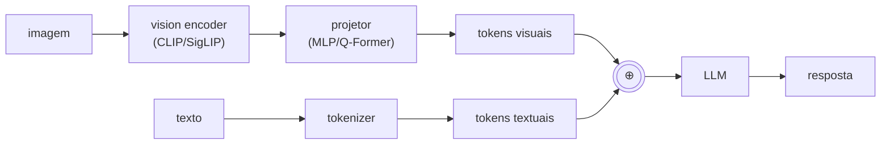

# Módulo 18 — Modelos Multimodais

> **Objetivo**: dominar modelos que combinam texto + imagem + áudio (+ vídeo). VLMs (LLaVA, Qwen-VL, InternVL), modelos de fala (Whisper, voice models), modelos visão-linguagem-ação, omni-modal.
>
> **Pré-requisitos**: Módulos [07](07_transformers.mdx), [08](08_llms_arquiteturas.md), [16](16_visao_computacional.md).
>
> **Tempo de referência**: 4–6 semanas.

## Objetivos de aprendizagem

Ao final deste módulo você deve ser capaz de:

- Explicar os 3 padrões arquiteturais multimodais (encoder+projetor, cross-attention, nativo) e o trade-off entre eles.
- Explicar o que um Q-Former faz e por que "comprimir" tokens visuais importa.
- Descrever o recipe do LLaVA e por que ele é tão barato de treinar comparado a um VLM do zero.
- Explicar por que ColPali pula OCR e embeda a página inteira como imagem.
- Escolher entre pipeline de VC clássico (OCR) e VLM end-to-end para uma tarefa de documento.

---

## Por que isso importa

A interface humana com IA está se tornando inerentemente multimodal: foto + pergunta, voz + tela, vídeo + comando. Os modelos de ponta de 2024–2025 (Claude, GPT-4o, Gemini, Qwen-VL, LLaVA-OneVision) são todos multimodais. Agentes profissionais leem screenshots, escutam comandos, processam documentos com diagramas. Sem este módulo, você está limitado a texto puro.

---

## 18.1 Padrões arquiteturais multimodais

### Encoders separados + projetor (padrão LLaVA-style)

Este é o padrão dominante: **encoder visual congelado** + **projetor treinado** para mapear features visuais ao espaço de embedding do LLM.

### Cross-attention layered (Flamingo-style)
LLM tem camadas extras de cross-attention que consultam features visuais. Mais complexo, melhor para vídeo longo.

### Native multimodal / unified tokenizer
Modelo treinado from scratch com tokens unificados (texto + imagem patches + áudio frames). Tendência atual:
- **Chameleon** (Meta). `Paper` https://arxiv.org/abs/2405.09818
- **Gemini** (treinamento conjunto desde o início).
- **GPT-4o** (omni-modal nativo).

### Mixture of Modality Experts
MoE onde experts se especializam por modalidade.

> **Intuição**: os três padrões trocam custo de treino por flexibilidade. Encoder+projetor (o diagrama acima) é o mais barato: pegue um LLM já pronto e um vision encoder já pronto (ambos congelados, mod. [04](04_ml_moderno.md#42-transfer-learning) — transfer learning puro), treine só uma pequena "ponte" (o projetor) que traduz features visuais para o espaço de embedding que o LLM já entende — é literalmente ensinar dois especialistas que já existem a se comunicar, sem retreinar nenhum dos dois. Cross-attention (Flamingo) dá ao LLM acesso mais rico às features visuais (consulta ativamente, camada por camada, em vez de só receber tokens visuais concatenados no início) — mais caro de treinar, mas lida melhor com sequências visuais longas (vídeo) onde "concatenar tudo no início" ficaria proibitivo. Nativo multimodal é o mais caro (treina tudo junto, do zero, sem aproveitar um LLM pré-existente) mas potencialmente o mais capaz, porque o modelo aprende a processar as modalidades de forma verdadeiramente integrada desde o início, em vez de "encaixar" visão num modelo que só conhecia texto.
>
> **Checkpoint**: sem olhar o texto, explique por que o padrão LLaVA-style (encoder+projetor) é tão mais barato de treinar que um modelo nativo multimodal.

### Referências
- `Paper` **Flamingo: a Visual Language Model for Few-Shot Learning** — Alayrac et al. (DeepMind, 2022). https://arxiv.org/abs/2204.14198
- `Paper` **A Survey on Multimodal Large Language Models**. https://arxiv.org/abs/2306.13549

---

## 18.2 CLIP e modelos contrastivos visão-texto

### CLIP
Treina encoder visual + encoder textual com **contrastive loss**: pares (imagem, caption) próximos no espaço; não-pares afastados.

`Paper` **Learning Transferable Visual Models From Natural Language Supervision (CLIP)** — Radford et al. (2021). https://arxiv.org/abs/2103.00020

> A intuição de CLIP (contrastive learning entre modalidades, criando um espaço de embedding compartilhado) já foi construída no mod. [16](16_visao_computacional.md#166-modelos-visão-linguagem-preview-do-mod-18) — aqui o foco é no papel de CLIP como *peça de infraestrutura* de praticamente todo VLM listado neste módulo, não só como classificador zero-shot.

### Por que CLIP foi um marco
- **Zero-shot classification**: classifique sem treinar — só descreva as classes em texto.
- **Embeddings universais**: imagem e texto no mesmo espaço.
- **Backbone para muitas coisas**: Stable Diffusion, LLaVA, etc.

### Variantes melhoradas
- **OpenCLIP** (LAION) — reproduções abertas em vários tamanhos. https://github.com/mlfoundations/open_clip
- **SigLIP / SigLIP 2** — sigmoid loss em vez de softmax, melhor escalabilidade. `Paper` https://arxiv.org/abs/2303.15343
- **EVA-CLIP** — escala maior. `Paper` https://arxiv.org/abs/2303.15389
- **Jina-CLIP** — multimodal embeddings unificados.

### Aplicações
- Image-text retrieval (em RAG multimodal).
- Zero-shot classification.
- Filtragem de datasets (LAION usou CLIP).
- Inicialização de VLMs.

---

## 18.3 BLIP, BLIP-2 e modelos de captioning

- `Paper` **BLIP** — Li et al. (2022). https://arxiv.org/abs/2201.12086
- `Paper` **BLIP-2** — uses Q-Former para conectar encoder visual congelado a LLM congelado, treinando só ponte. https://arxiv.org/abs/2301.12597
- `Paper` **InstructBLIP** — instruct-tuning do BLIP-2. https://arxiv.org/abs/2305.06500

### Q-Former
Módulo aprendível que extrai número fixo de "query tokens" do encoder visual, comprimindo informação para o LLM. Padrão em vários VLMs.

> **Intuição**: uma imagem em alta resolução processada por um vision encoder pode gerar centenas de tokens visuais (um por patch) — caro em termos de contexto do LLM, especialmente com múltiplas imagens ou vídeo. Q-Former resolve isso com um pequeno conjunto de "queries" aprendidas (ex.: 32) que fazem cross-attention sobre todos os tokens visuais e produzem uma representação comprimida de tamanho fixo — não importa se a imagem gerou 200 ou 2000 tokens visuais brutos, o Q-Former sempre entrega o mesmo número fixo e compacto de tokens ao LLM. É uma forma de compressão aprendida, análoga em espírito ao gargalo de um autoencoder (mod. [05](05_deep_learning.md#56-autoencoders-e-modelos-generativos-clássicos)) — forçar uma representação menor obriga o modelo a reter só a informação mais relevante.

---

## 18.4 LLaVA e a família de VLMs open

`Paper` **Visual Instruction Tuning (LLaVA)** — Liu et al. (2023). https://arxiv.org/abs/2304.08485

### LLaVA recipe
1. Pegue LLM forte (Vicuna/LLaMA).
2. Pegue vision encoder (CLIP).
3. Treine **só um projetor MLP** com pares (imagem, descrição).
4. Faça SFT com instruções visuais.

Resultado: VLM competitivo com fração do compute.

### Família LLaVA
- **LLaVA-1.5**, **LLaVA-NeXT** (high-res). https://llava-vl.github.io/
- **LLaVA-OneVision** — single-image, multi-image, vídeo. `Paper` https://arxiv.org/abs/2408.03326
- **LLaVA-CoT / LLaVA-o1** — reasoning visual.

### Outros VLMs open de 2024–2025
- **Qwen-VL / Qwen2-VL / Qwen2.5-VL** (Alibaba). `Paper` https://arxiv.org/abs/2409.12191
- **InternVL / InternVL 2 / InternVL 2.5** (OpenGVLab). `Paper` https://arxiv.org/abs/2312.14238
- **MiniCPM-V** (OpenBMB) — VLM eficiente para edge. `Paper` https://arxiv.org/abs/2408.01800
- **Pixtral** (Mistral). https://mistral.ai/news/pixtral-12b
- **Molmo** (Allen AI). `Paper` https://arxiv.org/abs/2409.17146
- **Phi-3.5-Vision / Phi-4 Multimodal** (Microsoft).
- **PaliGemma** (Google) — modelo educacional aberto, ótima base. https://github.com/google-research/big_vision
- **NVLM** (NVIDIA). `Paper` https://arxiv.org/abs/2409.11402
- **Idefics 2 / 3** (Hugging Face). https://arxiv.org/abs/2405.02246

---

## 18.5 Capacidades modernas de VLMs

### High-resolution / dynamic resolution
Modelos modernos (Qwen2-VL, InternVL 2.5) processam imagens em resolução nativa, sem downsampling agressivo. Crítico para OCR, leitura de documentos, UI.

### Multi-image e vídeo
- Múltiplas imagens em um prompt.
- Vídeo como sequência de frames com pos embeddings temporais.
- LLaVA-OneVision, Qwen2-VL, InternVL 2 cobrem.

### Document understanding
- **Donut**, **Pix2Struct**, **DocOwl**, **mPLUG-DocOwl**.
- VLMs modernos fazem OCR + layout + pergunta sobre documento end-to-end.

### Grounding e referring
- "Aponte onde está X na imagem" — modelo retorna bounding box.
- **Grounding DINO**, **Florence-2**, **Qwen2-VL** com grounding.

### Computer use / GUI agents
- Modelos especializados em ler screenshots e gerar ações (click, type).
- **CogAgent**, **ShowUI**, **Anthropic Claude Computer Use**, **OS-Copilot**.

### Referências
- `Paper` **Qwen2-VL Technical Report**. https://arxiv.org/abs/2409.12191
- `Paper` **CogAgent**. https://arxiv.org/abs/2312.08914

---

## 18.6 Modelos de áudio e fala

### ASR (Automatic Speech Recognition)
- `Paper` **Whisper** — Radford et al. (OpenAI, 2022). https://arxiv.org/abs/2212.04356
  - Aberto, multilíngue, robusto.
  - Variantes otimizadas: **faster-whisper** (CTranslate2), **whisper.cpp**, **Distil-Whisper**.
- **SeamlessM4T** (Meta) — speech-to-text + speech-to-speech multilíngue.
- **NVIDIA Parakeet, Canary** — alta precisão, otimizados.
- **wav2vec 2.0** — self-supervised foundation. `Paper` https://arxiv.org/abs/2006.11477

### TTS (Text-to-Speech)
- **XTTS / Coqui TTS** (descontinuado, mas códigos abertos). https://github.com/coqui-ai/TTS
- **Piper** — TTS local rápido. https://github.com/rhasspy/piper
- **F5-TTS**, **MeloTTS**, **StyleTTS 2**, **Kokoro TTS** (small-but-good 2024–2025).
- **Bark** — gerativo expressivo (Suno).
- **Tortoise TTS** — qualidade alta, lento.

### Modelos de áudio gerais (música, sons)
- **MusicGen** (Meta). https://arxiv.org/abs/2306.05284
- **Stable Audio**, **AudioLDM**.
- **CLAP** — CLIP para áudio.

### Speech-to-Speech / voice
- **GPT-4o** (proprietário).
- **Moshi** (Kyutai, open). https://arxiv.org/abs/2410.00037
- **VITA** (Tencent).
- **Mini-Omni**, **GLM-4-Voice**.

### Referências
- `Curso` **Hugging Face Audio Course**. https://huggingface.co/learn/audio-course

---

## 18.7 Modelos de vídeo

### Compreensão (video → text/answer)
- **VideoChat / VideoChat2**.
- **Video-LLaVA**, **LLaVA-NeXT-Video**.
- **InternVideo, InternVideo 2**. https://arxiv.org/abs/2403.15377
- **Qwen2-VL** com vídeos.
- **Gemini** (long-context vídeo até horas).

### Geração (text → vídeo)
- **Sora** (OpenAI, proprietário).
- **Veo** (Google).
- **Mochi 1** (Genmo, open). https://www.genmo.ai/play
- **CogVideoX** (open). https://github.com/THUDM/CogVideo
- **HunyuanVideo** (Tencent, open). https://arxiv.org/abs/2412.03603
- **LTX-Video** (Lightricks, open).
- **Stable Video Diffusion** (Stability AI).
- **AnimateDiff**.

### Referências
- `Paper` **Sora technical report** (OpenAI, 2024) — não há paper formal, mas blog post detalhado. https://openai.com/research/video-generation-models-as-world-simulators

---

## 18.8 Modelos visão-linguagem-ação (VLA)

Para robótica e agentes embodied.

- **RT-1, RT-2** (Google) — modelos que produzem ações de robô a partir de visão + instrução. `Paper` https://robotics-transformer2.github.io/
- **OpenVLA** (open). https://openvla.github.io/
- **π0** (Physical Intelligence). https://www.physicalintelligence.company/blog/pi0
- **Octo**.

---

## 18.9 Treinamento e fine-tuning de VLMs

### Estágios
1. **Pretrain do projetor**: dados (imagem, caption) — LAION, COYO, CC12M.
2. **SFT visual**: dados (imagem, instrução, resposta) — LLaVA-Instruct, ShareGPT4V, etc.
3. **(opcional) DPO/RLHF visual**.

### Fine-tuning
- **LoRA** sobre o LLM + projetor.
- **Hugging Face TRL** suporta SFT e DPO multimodal.
- **PaliGemma** é referência educacional (recipe completa pública).

> Esses três estágios espelham diretamente o pipeline de LLM do mod. [09](09_treinamento_e_alinhamento.mdx#91-pipeline-completo-de-uma-llm-moderna) (pré-treino → SFT → alinhamento por preferência) — só que o "pré-treino" aqui é focado especificamente em ensinar o projetor a traduzir entre espaços visual e textual, já que o LLM em si já vem pré-treinado.

### Datasets visuais úteis
- **LAION-2B / LAION-COCO**.
- **COYO-700M**.
- **DataComp**.
- **ShareGPT4V** — captions ricas geradas por GPT-4V.
- **ALLaVA**, **Cambrian-7M**.
- Documentos: **DocVQA**, **ChartQA**, **InfographicVQA**, **AI2D**.

### Referências práticas
- `Curso` **Hugging Face — Fine-tuning VLMs**. https://huggingface.co/learn/cookbook/fine_tuning_vlm_trl

---

## 18.10 Avaliação de multimodal

### Benchmarks
- **MMMU** — Massive Multi-discipline Multimodal Understanding. `Paper` https://arxiv.org/abs/2311.16502
- **MMBench** — checklists granulares. https://arxiv.org/abs/2307.06281
- **MM-Vet**. https://arxiv.org/abs/2308.02490
- **OCRBench**, **DocVQA**, **ChartQA**, **AI2D**.
- **MathVista**, **MathVerse** — raciocínio matemático visual.
- **POPE** — hallucination em VLMs.
- **VideoMME**, **MVBench** — vídeo.
- **Open VLM Leaderboard** (HF). https://huggingface.co/spaces/opencompass/open_vlm_leaderboard

### Métricas específicas
- **Hallucination rate** em imagens.
- **Grounding accuracy** (IoU de bounding boxes).
- **OCR accuracy** em documentos.

---

## 18.11 Multimodal RAG e embeddings

### RAG com imagens
- Embeddings unificados (CLIP, SigLIP, Jina-CLIP, **CLIP-Math**, **Cohere Multimodal**).
- Busca: query texto → recupera imagens; query imagem → recupera textos.
- **ColPali** — RAG sobre PDFs com layout via visão. `Paper` https://arxiv.org/abs/2407.01449

### Document RAG moderno
ColPali e variantes pulam OCR: embeddam **imagem da página** diretamente. Excelente para layouts complexos (finance, science, legal).

> **Intuição**: RAG tradicional sobre PDFs (mod. [12](12_rag.mdx)) depende de OCR extrair texto corretamente antes de fazer qualquer coisa — e OCR falha silenciosamente em layouts complexos (tabelas multi-coluna, gráficos com legendas, diagramas com texto embutido), perdendo estrutura que carrega significado. ColPali contorna isso tratando a página inteira como uma *imagem* e usando um modelo tipo ViT (mod. [16](16_visao_computacional.md#163-vision-transformer-vit-e-variantes)) para embeddar diretamente — preservando layout, posição relativa de elementos, e informação visual que uma etapa de OCR teria descartado. O trade-off: embeddings de imagem de página são mais pesados que embeddings de texto puro, mas a fidelidade em documentos visualmente complexos compensa.
>
> **Checkpoint**: sem olhar o texto, explique por que RAG tradicional (OCR + texto) pode falhar num documento com uma tabela complexa, e o que ColPali faz de diferente.

---

## Projetos práticos

### Projeto 18.1 — Zero-shot com CLIP
- Use OpenCLIP em Python e em TS (transformers.js).
- Tarefa: classificar imagens em categorias arbitrárias só com texto.
- Compare com SigLIP.

### Projeto 18.2 — VLM local rodando
- Rode Qwen2.5-VL 7B ou InternVL 2.5 8B via vLLM ou Ollama.
- Tarefa: análise de screenshots, OCR de PDFs, captioning.
- Compare com LLaVA-NeXT.

### Projeto 18.3 — RAG multimodal de fato
- Corpus: PDFs com diagramas (papers, relatórios).
- Use ColPali ou pipeline com VLM + embeddings de página.
- Compare com pipeline tradicional (OCR + texto-only RAG).

> **Variante guiada**: escolha deliberadamente alguns PDFs com tabelas ou diagramas complexos para o conjunto de teste — é onde a diferença entre os dois pipelines (OCR vs ColPali) deve aparecer mais claramente, validando a intuição da seção 18.11.

### Projeto 18.4 — Fine-tune mini-VLM
- Use PaliGemma-3B ou MiniCPM-V.
- Domínio próprio: classificação visual, descrição estilizada, ou Q&A sobre imagens específicas.
- Use HF TRL com LoRA.

### Projeto 18.5 — Pipeline de fala completo
- ASR (Whisper / faster-whisper).
- LLM (modelo local).
- TTS (Piper / Kokoro).
- Loop voz-para-voz local com latência baixa.

### Projeto 18.6 — Agente que vê tela
- Use Qwen2-VL ou Anthropic Computer Use.
- Tarefa: navegação simples em um app.
- Documente falhas e custos.

### Projeto 18.7 — Geração de vídeo
- Use CogVideoX ou Mochi 1 (open) localmente ou em cloud.
- Compare prompts e resultados.

---

## Erros comuns

- **Misturar tokenizer/processor errado**: VLMs têm processors específicos (image_processor + tokenizer); usar errado quebra silenciosamente.
- **Resolução errada**: forçar 224×224 em modelos high-res = qualidade despenca.
- **OCR delegado a VLM** sem fallback: VLM pode alucinar texto; valide com OCR clássico em paralelo.
- **Custo subestimado**: vídeo é **caro** (muitos tokens); planeje.
- **Eval só em inglês**: VLMs degradam visivelmente em PT-BR e em diagramas em PT.
- **Hallucination visual** silenciosa: modelo descreve algo que não está na imagem; valide com perguntas de "tem ou não tem".

---

## Conexão com outros módulos

| Conceito daqui | Aparece em |
|---|---|
| VLMs | Agentes computer-use (mod. [13](13_agentes_tools_protocolos.md)) |
| Multimodal embeddings | RAG (mod. [12](12_rag.mdx)) |
| Whisper / TTS | Aplicações de produção (mod. [15](15_engenharia_producao.mdx)) |
| Diffusion models | Tópicos avançados (mod. [19](19_topicos_avancados.md)) |
| Avaliação multimodal | Avaliação (mod. [14](14_avaliacao_e_seguranca.md)) |

---

## Checklist de saída

- [ ] Rodei pelo menos 3 VLMs open localmente, comparando-os.
- [ ] Construí pipeline de RAG multimodal (com ColPali ou equivalente).
- [ ] Fine-tunei um VLM pequeno em domínio próprio.
- [ ] Tenho pipeline voz→voz funcionando localmente.
- [ ] Avaliei VLMs em benchmark próprio em PT-BR.
- [ ] Sei distinguir modelos com encoder separado vs nativos multimodais.
