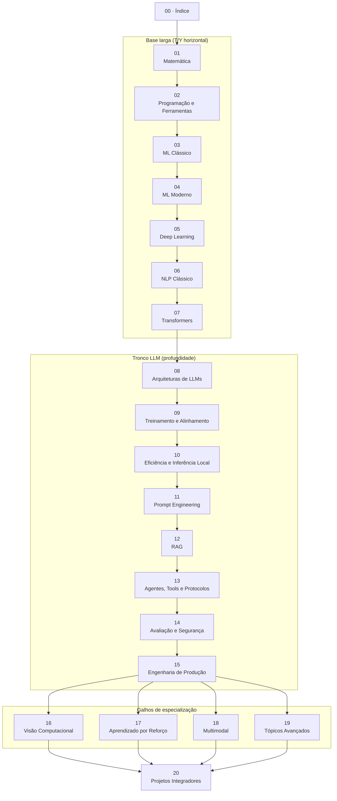

# Trilha de Estudo — LLM, IA e Engenharia de Sistemas Inteligentes

> Conteúdo acadêmico com prática de código, focado em ferramentas e conteúdo open-source. Usa Python e/ou TypeScript quando faz sentido. Este é o mapa da versão **Clássico** — o guia teórico da trilha, um arquivo por módulo.

Esta trilha existe em 3 versões: **v1** (conteúdo original, formato checklist), **v2** (mais teórica, Clássico — esta que você está lendo agora) e **v3** (mais prática, Acelerado). Troque entre elas pelo seletor de versão no topo do site; a seção "Como estudar", mais abaixo, explica cada uma em detalhe.

---

## Como esta versão funciona

Você percorre os módulos na ordem 01→20. Primeiro vem a base (módulos [1](01_matematica.md)–[7](07_transformers.mdx): matemática, programação, ML clássico e moderno, deep learning, NLP clássico) — sem ela, tudo que vem depois é caixa-preta. Depois o tronco principal (módulos [8](08_llms_arquiteturas.md)–[15](15_engenharia_producao.mdx)), onde você constrói o que faz um LLM funcionar: arquitetura, treinamento, alinhamento, eficiência, prompting, RAG, agentes, avaliação, produção. Dali saem os galhos de especialização (módulos [16](16_visao_computacional.md)–[19](19_topicos_avancados.md): visão computacional, aprendizado por reforço, multimodal, tópicos avançados), e a trilha fecha com projetos integradores (módulo [20](20_projetos_integradores.md)), que juntam tudo.

Uma regra vale a trilha inteira: todo conceito teórico precisa virar código pelo menos uma vez. Implementar do zero, mesmo que saia torto, ensina mais do que só reconhecer o conceito depois.

---

## Como estudar: Clássico, Acelerado ou Checklist

Esta trilha existe em três versões, trocáveis pelo seletor de versão no topo do site — não são seções dentro da mesma página, são jeitos inteiros diferentes de percorrer o mesmo material, para perfis de estudo diferentes.

### Versão Clássico (esta que você está lendo agora)

O caminho normal de aplicação: siga a numeração 01→20 na ordem. Cada módulo traz teoria completa — intuição, analogia, exemplo resolvido, aplicação real, checkpoint de autoverificação — **antes** da prática. É construção de baixo pra cima: você só chega no módulo 07 (Transformers) depois de já ter internalizado matemática, programação e deep learning o suficiente para que a arquitetura faça sentido, não só "funcione quando copiada". Recomendado para quem está construindo a base pela primeira vez, ou quer entender *por que* as coisas funcionam, não só *como* usá-las.

### Versão Acelerado

Para quem já tem bagagem técnica e quer ir direto para implementação e projetos, buscando fundamentos teóricos só quando um passo específico exigir. A ordem de navegação se inverte: começa no módulo 08 (Arquiteturas de LLMs) e segue até o 20 (Projetos Integradores), depois desce aos módulos de fundamento em ordem decrescente, do 07 (Transformers) até o 01 (Matemática). A teoria mantém a mesma profundidade desta versão Clássico; o que muda é que cada "Projetos práticos" vira implementação completa (pré-requisitos + código rodável), e nenhum módulo cobra uma habilidade que um módulo anterior *naquela ordem* ainda não tenha ensinado. Acesse a [raiz da versão Acelerado](/trilha-llm/).

### Versão Checklist (v1)

A versão original e mais enxuta: tópicos organizados e referências de leitura, sem explicação aprofundada nem projetos guiados com código. Útil como mapa de consulta rápida depois de já ter estudado o conteúdo numa das outras duas versões. Acesse a [raiz da v1](/trilha-llm/v1/).

---

## Mapa dos módulos

---

## Como usar

1. **Leia o `Objetivos` e `Pré-requisitos`** de cada módulo antes de começar. Se o pré-requisito não está consolidado, volte.
2. **Não pule a matemática.** Os módulos [1](01_matematica.md)–[2](02_programacao_ferramentas.md) não são opcionais.
3. **Cada módulo tem três partes**:
   - **Obrigatório**: o mínimo para dominar o tópico.
   - **Opcional/Aprofundamento**: para quem quer ir além.
   - **Projeto prático**: curto, focado, valida a teoria.
4. **Referências são curadas**: papers originais, livros canônicos, cursos universitários públicos. Sem blogposts genéricos, sem fórum.
5. **Sem prazo.** Avance quando o módulo atual estiver consolidado, não pelo calendário.

---

## Convenções

- **Python**: ferramenta principal para pesquisa, treinamento, fine-tuning.
- **TypeScript**: ferramenta principal para aplicações, agentes em produção, integrações web.
- **Paper**: artigo acadêmico (com link arXiv ou venue).
- **Livro**: livro canônico, geralmente com versão pública gratuita.
- **Curso**: curso universitário público (Stanford, MIT, CMU, Berkeley, etc.).
- **Ferramenta**: framework ou biblioteca relevante.
- **Projeto**: projeto prático curto.
- **Crítico**: ponto onde a maioria erra.

---

## Quando Python é incontornável (e o que buscar em TS)

| Tarefa | Python | Equivalente/Caminho em TS |
|---|---|---|
| Treinamento from scratch | PyTorch, JAX | Não há equivalente sério → use Python |
| Fine-tuning (LoRA, QLoRA) | `peft`, `trl` | Não há equivalente → use Python |
| Pesquisa/papers | Padrão da área | Idem |
| Inferência client-side | — | `transformers.js`, ONNX Runtime Web |
| Aplicações com LLM | LangChain, LlamaIndex | `langchain.js`, `llamaindex` (TS), Vercel AI SDK |
| RAG em produção | LlamaIndex, LangChain | LlamaIndex.TS, LangChain.js |
| Agentes | LangGraph, CrewAI | LangGraph.js, Mastra |
| Vector DBs | Todos têm SDK Python | Quase todos têm SDK TS (Pinecone, Weaviate, Qdrant, Chroma) |
| Inferência local (servir) | vLLM, Ollama | Ollama tem cliente TS |
| MCP (Model Context Protocol) | SDK oficial Python | SDK oficial TS |

**Regra prática**: para **treinar/pesquisar**, Python. Para **integrar/servir/agentes em produção web**, TS é viável e às vezes superior (DX, deploy serverless, edge).

---

## Referências transversais (válidas para a trilha inteira)

### Livros canônicos (versões públicas gratuitas marcadas com `Gratuito`)

- `Gratuito` **"Mathematics for Machine Learning"** — Deisenroth, Faisal, Ong. https://mml-book.github.io/
- `Gratuito` **"Deep Learning"** — Goodfellow, Bengio, Courville. https://www.deeplearningbook.org/
- `Gratuito` **"Dive into Deep Learning"** — Zhang, Lipton, Li, Smola. https://d2l.ai/ (com código em PyTorch, MXNet, JAX, TF)
- `Gratuito` **"The Elements of Statistical Learning"** — Hastie, Tibshirani, Friedman. https://hastie.su.domains/ElemStatLearn/
- `Gratuito` **"Pattern Recognition and Machine Learning"** — Bishop. PDF oficial liberado pela Microsoft Research.
- `Gratuito` **"Speech and Language Processing"** (3ª ed., draft) — Jurafsky & Martin. https://web.stanford.edu/~jurafsky/slp3/
- `Gratuito` **"Reinforcement Learning: An Introduction"** — Sutton & Barto. http://incompleteideas.net/book/the-book-2nd.html

### Cursos universitários públicos (todos com vídeos no YouTube/site oficial)

- `Curso` **MIT 18.06 — Linear Algebra** (Gilbert Strang). https://ocw.mit.edu/courses/18-06-linear-algebra-spring-2010/
- `Curso` **Stanford CS229 — Machine Learning** (Andrew Ng). https://cs229.stanford.edu/
- `Curso` **Stanford CS230 — Deep Learning**. https://cs230.stanford.edu/
- `Curso` **Stanford CS224N — NLP with Deep Learning** (Manning). https://web.stanford.edu/class/cs224n/
- `Curso` **Stanford CS231N — CNNs for Visual Recognition**. http://cs231n.stanford.edu/
- `Curso` **Stanford CS25 — Transformers United**. https://web.stanford.edu/class/cs25/
- `Curso` **Stanford CS336 — Language Modeling from Scratch** (2024+). https://stanford-cs336.github.io/
- `Curso` **MIT 6.S191 — Introduction to Deep Learning**. http://introtodeeplearning.com/
- `Curso` **DeepMind x UCL — Reinforcement Learning Course** (David Silver). https://www.davidsilver.uk/teaching/
- `Curso` **CMU 11-747 — Neural Networks for NLP**. http://phontron.com/class/nn4nlp/
- `Curso` **3Blue1Brown — Essence of Linear Algebra / Calculus / Neural Networks**. https://www.3blue1brown.com/

### Hubs de papers e benchmarks

- **arXiv** (cs.CL, cs.LG, cs.AI, stat.ML). https://arxiv.org/
- **Papers with Code**. https://paperswithcode.com/
- **Hugging Face Papers** (curadoria diária). https://huggingface.co/papers
- **Distill.pub** (visualizações didáticas, arquivado mas excelente). https://distill.pub/

---

## Próximo passo

Comece pelo [`01_matematica.md`](01_matematica.md). Não pule, mesmo que ache que sabe.
